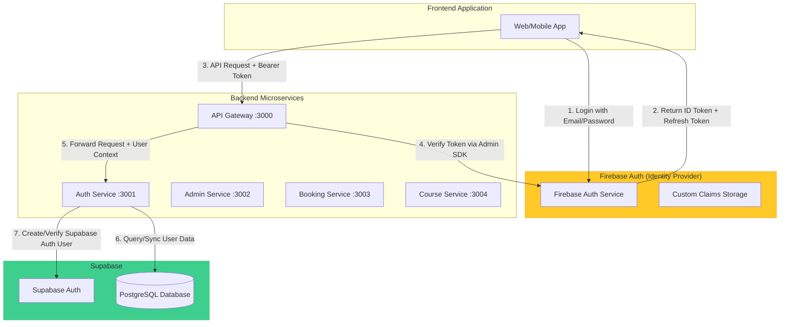
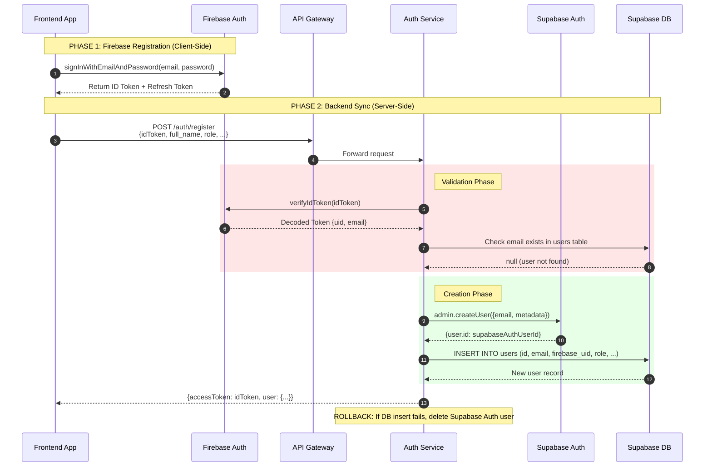
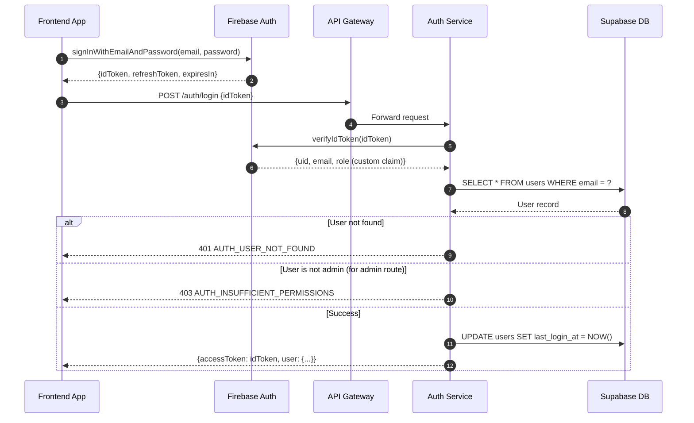
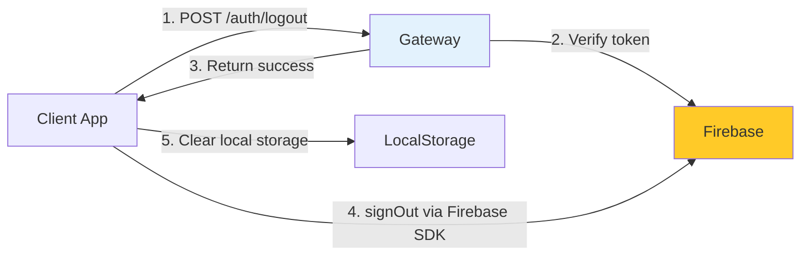
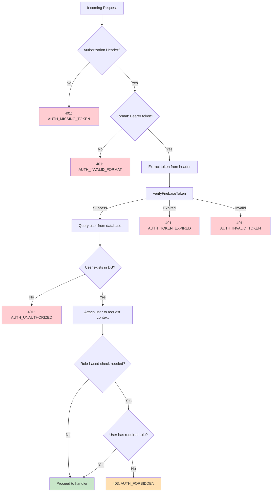
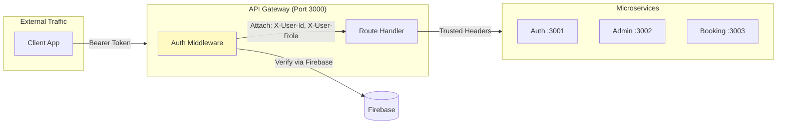
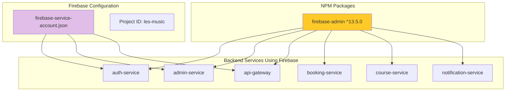
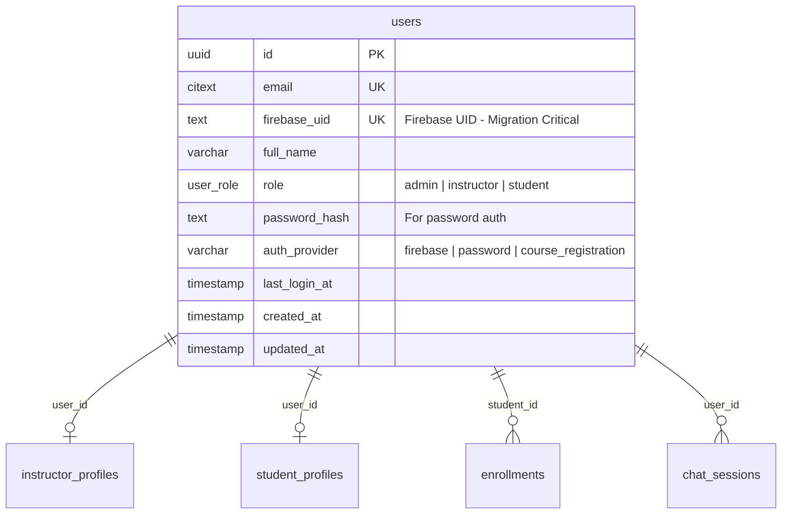
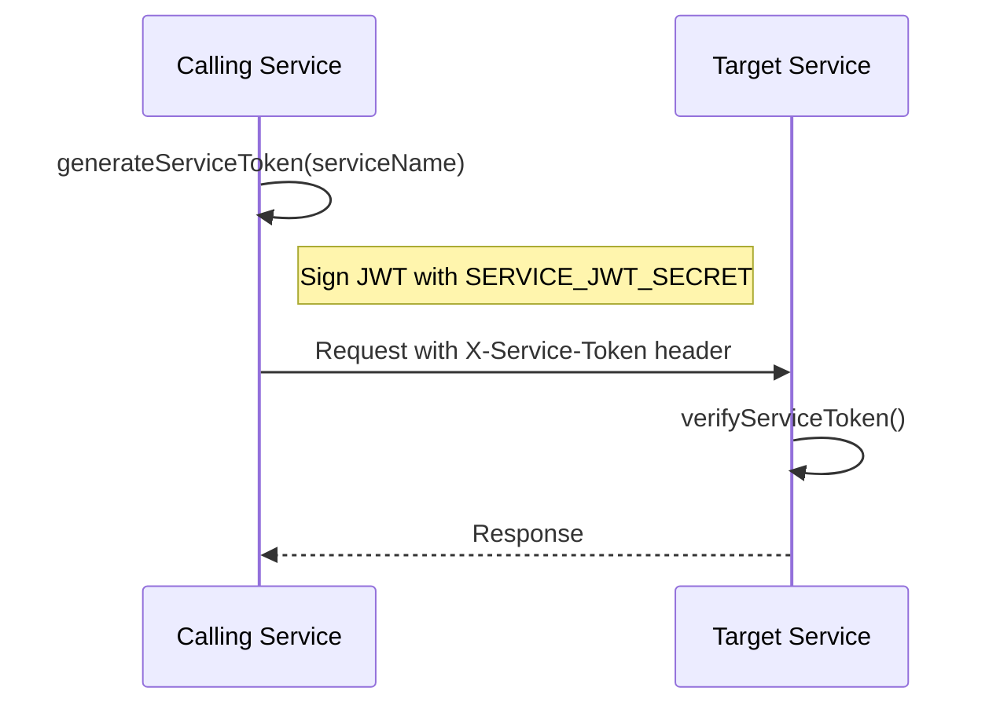

# Firebase Auth Architecture & Migration Reference

**Document Version:** 1.0  
**Date:** 2025-12-20  
**Target Audience:** Engineering Team (Migration Readiness)  
**Current Provider:** Firebase Authentication  
**Target Provider (Example):** Supabase Auth

---

## 1. System Overview

### Current Authentication Architecture

Sistem autentikasi saat ini menggunakan **arsitektur hybrid** yang menggabungkan:

1. **Firebase Authentication** - Sebagai primary identity provider (IdP)
2. **Supabase Auth** - Sebagai secondary auth system untuk internal user management
3. **Supabase Database** - Sebagai persistent storage untuk user data dan enriched profile



### Key Architectural Decisions

| Aspek                 | Keputusan                  | Alasan                                                           |
| --------------------- | -------------------------- | ---------------------------------------------------------------- |
| **Primary IdP**       | Firebase                   | Mature OAuth flows, multi-provider support, client SDK ecosystem |
| **Token Type**        | Firebase ID Token (JWT)    | Standardized JWT format, verifiable via Admin SDK                |
| **User Data Storage** | Supabase PostgreSQL        | Flexible schema, RLS policies, real-time subscriptions           |
| **Admin Auth**        | Firebase-only              | Security requirement: admin harus memiliki `firebase_uid`        |
| **Token Refresh**     | Client-side (Firebase SDK) | Firebase SDK handles automatic token refresh                     |

---

## 2. Authentication Flows (Detailed)

### 2.1 Supported Authentication Providers

| Provider           | Status             | Use Case                         | Implementation              |
| ------------------ | ------------------ | -------------------------------- | --------------------------- |
| **Email/Password** | ✅ Active          | Primary method for admin/student | Firebase Auth               |
| **Google OAuth**   | 🟡 Configurable    | Social login for students        | Firebase Auth (client-side) |
| **Phone Auth**     | ❌ Not Implemented | -                                | -                           |
| **Magic Link**     | ❌ Not Implemented | -                                | -                           |

### 2.2 User Registration Flow (Critical Path)

Alur registrasi user baru melibatkan **dua fase utama**: autentikasi di Firebase dan sinkronisasi ke database Supabase.



> [!IMPORTANT] > **Post-Creation Trigger**  
> Sistem saat ini **TIDAK** menggunakan Cloud Functions atau Database Triggers untuk sinkronisasi otomatis. Sinkronisasi dilakukan **secara synchronous** di dalam endpoint `/register`. Ini berarti:
>
> - ✅ Konsistensi data terjamin dalam satu transaksi
> - ❌ Tidak ada event yang dipublish ke message broker (RabbitMQ) saat user registered

**Data Synchronization Logic:**

1. **Firebase → Supabase Auth**: User email dan metadata disalin ke Supabase Auth via Admin API
2. **Firebase UID → Database**: `firebase_uid` disimpan sebagai foreign key untuk lookup
3. **User ID**: Menggunakan Supabase Auth `user.id` sebagai primary key di tabel `users`

### 2.3 User Login Flow



**Login Flow Characteristics:**

| Aspect                 | Current Behavior                            |
| ---------------------- | ------------------------------------------- |
| Token returned         | Firebase ID Token (original)                |
| Custom JWT generation  | ❌ Not used - Firebase token passed through |
| Refresh token handling | Client-side via Firebase SDK                |
| Session storage        | Client responsibility (localStorage/cookie) |

### 2.4 Logout Flow



> [!NOTE] > **Logout Behavior**  
> Backend **TIDAK** melakukan token blacklisting. Logout adalah operasi client-side:
>
> - Firebase SDK `signOut()` invalidates refresh token
> - ID Token masih valid sampai expired (~1 jam)

---

## 3. Token Strategy & Custom Claims (Critical for Migration)

### 3.1 Firebase ID Token Anatomy

Firebase ID Token adalah **JWT (JSON Web Token)** yang di-sign oleh Google's private key.

**Token Structure (Decoded):**

```
Header:
{
  "alg": "RS256",
  "typ": "JWT",
  "kid": "[Key ID from Google's public keys]"
}

Payload:
{
  // Standard JWT Claims
  "iss": "https://securetoken.google.com/les-music",
  "aud": "les-music",
  "iat": 1734567890,          // Issued at timestamp
  "exp": 1734571490,          // Expires in 1 hour
  "sub": "firebase-uid-here", // Subject (Firebase UID)

  // Firebase-specific Claims
  "auth_time": 1734567890,
  "user_id": "firebase-uid-here",
  "email": "user@example.com",
  "email_verified": true,
  "firebase": {
    "identities": {
      "email": ["user@example.com"]
    },
    "sign_in_provider": "password"  // or "google.com", etc.
  },

  // CUSTOM CLAIMS (Business Logic)
  "role": "admin"  // Injected via Admin SDK
}

Signature:
[RS256 signature verified against Google's public keys]
```

### 3.2 Custom Claims Implementation

Sistem menggunakan **Firebase Custom Claims** untuk menyimpan role user langsung di dalam token.

**Claim Injection Point:**

Custom claims di-set saat user creation melalui Admin SDK:

```
PSEUDOCODE:
Function createFirebaseUser(email, password, displayName, role):
    1. Create user via Firebase Admin: auth.createUser({email, password, displayName})
    2. Inject custom claims: auth.setCustomUserClaims(userRecord.uid, { role: role })
    3. Generate email verification link (optional)
    4. Return user record with role
```

**Available Custom Claims:**

| Claim Key | Type   | Possible Values                  | Purpose                   |
| --------- | ------ | -------------------------------- | ------------------------- |
| `role`    | string | `admin`, `instructor`, `student` | Role-Based Access Control |

> [!WARNING] > **Custom Claims Limitation**  
> Firebase custom claims memiliki limit **1000 bytes**. Jangan menyimpan data besar di claims. Untuk data kompleks seperti `subscription_level` atau `permissions`, gunakan database lookup.

### 3.3 Token Verification Logic

Backend memverifikasi token menggunakan Firebase Admin SDK:

```
PSEUDOCODE:
Function verifyFirebaseToken(idToken):
    TRY:
        decodedToken = firebaseAuth.verifyIdToken(idToken)

        RETURN {
            uid: decodedToken.uid,
            email: decodedToken.email,
            emailVerified: decodedToken.email_verified,
            role: decodedToken.role,        // Custom claim
            provider: decodedToken.firebase.sign_in_provider
        }
    CATCH error:
        IF error.code == 'auth/id-token-expired':
            THROW 'AUTH_FIREBASE_TOKEN_EXPIRED'
        ELSE IF error.code == 'auth/argument-error':
            THROW 'AUTH_FIREBASE_TOKEN_INVALID'
        ELSE:
            THROW 'AUTH_FIREBASE_TOKEN_VERIFICATION_FAILED'
```

**Token States:**

| State   | Error Code                                | HTTP Status | Meaning                                |
| ------- | ----------------------------------------- | ----------- | -------------------------------------- |
| Valid   | -                                         | 200         | Token valid dan dapat diproses         |
| Expired | `AUTH_FIREBASE_TOKEN_EXPIRED`             | 401         | Token expired, client harus refresh    |
| Invalid | `AUTH_FIREBASE_TOKEN_INVALID`             | 401         | Token malformed atau signature invalid |
| Revoked | `AUTH_FIREBASE_TOKEN_VERIFICATION_FAILED` | 401         | Token di-revoke secara manual          |

---

## 4. Backend Verification Logic

### 4.1 Authentication Middleware Flow



### 4.2 Role-Based Access Control (RBAC)

Sistem mengimplementasikan RBAC dengan 3 level role:

| Role         | Hierarchy | Access Level                    |
| ------------ | --------- | ------------------------------- |
| `admin`      | Highest   | Full access to all endpoints    |
| `instructor` | Middle    | Manage schedules, view bookings |
| `student`    | Lowest    | Self-service only               |

**RBAC Verification Logic:**

```
PSEUDOCODE:
Function requireRole(allowedRoles: Array<string>):
    RETURN Middleware(context, next):
        userRole = context.get('userRole')

        IF userRole IS NULL:
            RETURN 401: AUTH_UNAUTHORIZED

        IF userRole NOT IN allowedRoles:
            RETURN 403: AUTH_FORBIDDEN with message
                "Access denied. Required roles: {allowedRoles.join(', ')}"

        CALL next()
```

### 4.3 API Gateway Authentication Pattern

API Gateway bertindak sebagai **central authentication point**:



**Gateway-to-Service Trust:**

Untuk service-to-service communication, backend menggunakan header `X-Gateway-Request: true` untuk bypass Firebase verification di downstream services.

---

## 5. External Dependencies Map

### 5.1 Firebase SDK Dependencies



### 5.2 Tightly Coupled Components

| Component                                | Firebase Coupling Level | Dependencies                                                |
| ---------------------------------------- | ----------------------- | ----------------------------------------------------------- |
| `auth/src/config/firebase.ts`            | 🔴 High                 | Admin SDK initialization, token verification, user creation |
| `auth/src/middleware/authMiddleware.ts`  | 🔴 High                 | `verifyFirebaseToken()` call                                |
| `api-gateway/src/middleware/auth.ts`     | 🔴 High                 | `verifyFirebaseToken()` call                                |
| `booking/shared/config/firebase.ts`      | 🔴 High                 | Token verification for direct calls                         |
| `auth/src/controllers/authController.ts` | 🟠 Medium               | Uses Firebase token as access token                         |
| `supabase/migrations/*.sql`              | 🟡 Low                  | `firebase_uid` column references                            |

### 5.3 Database Schema Dependencies



**Firebase-Related Columns:**

| Table   | Column          | Type        | Constraint                                               |
| ------- | --------------- | ----------- | -------------------------------------------------------- |
| `users` | `firebase_uid`  | text        | UNIQUE, nullable                                         |
| `users` | `auth_provider` | varchar(20) | CHECK: 'firebase' \| 'password' \| 'course_registration' |

**Database Constraints:**

```sql
-- Admin users MUST have firebase_uid OR password_hash
CONSTRAINT chk_admin_requires_firebase CHECK (
    (role <> 'admin') OR
    (firebase_uid IS NOT NULL) OR
    (password_hash IS NOT NULL AND auth_provider = 'password')
)

-- Auth method consistency
CONSTRAINT chk_auth_method CHECK (
    (firebase_uid IS NOT NULL AND auth_provider = 'firebase') OR
    (password_hash IS NOT NULL AND auth_provider = 'password') OR
    (auth_provider = 'course_registration')
)
```

---

## 6. Migration Requirements Checklist

### 6.1 Authentication Features to Replicate

| #   | Feature                | Current (Firebase)              | Required in New System                           | Priority    |
| --- | ---------------------- | ------------------------------- | ------------------------------------------------ | ----------- |
| 1   | Email/Password Sign-Up | ✅ Firebase Auth                | Email/Password auth with secure password hashing | 🔴 Critical |
| 2   | Email/Password Sign-In | ✅ Firebase Auth                | Session creation with JWT                        | 🔴 Critical |
| 3   | ID Token Generation    | ✅ Firebase ID Token (JWT)      | Custom JWT dengan struktur claims yang sama      | 🔴 Critical |
| 4   | Token Verification     | ✅ Admin SDK `verifyIdToken()`  | JWT verification dengan public/private key       | 🔴 Critical |
| 5   | Token Refresh          | ✅ Firebase SDK (client-side)   | Refresh token rotation dengan secure storage     | 🔴 Critical |
| 6   | Custom Claims (Role)   | ✅ `setCustomUserClaims()`      | JWT claims atau database lookup                  | 🔴 Critical |
| 7   | Email Verification     | ✅ Firebase email verification  | Magic link atau verification code                | 🟡 Medium   |
| 8   | Password Reset         | ✅ Firebase password reset link | Self-service password reset flow                 | 🟡 Medium   |
| 9   | User Deletion          | ✅ Admin SDK `deleteUser()`     | Cascade delete across auth + database            | 🟡 Medium   |
| 10  | Social OAuth (Google)  | 🟡 Configurable                 | OAuth 2.0 provider integration                   | 🟢 Low      |

### 6.2 Database Migration Requirements

```mermaid
flowchart LR
    subgraph Current["Current State"]
        FBAuth[(Firebase Auth)]
        SBDB[(Supabase DB)]
        FBAuth -.->|firebase_uid| SBDB
    end

    subgraph Target["Target State (Supabase Auth)"]
        SBAuth[(Supabase Auth)]
        SBDB2[(Supabase DB)]
        SBAuth -->|auth.uid() = id| SBDB2
    end

    Current -->|Migration| Target

    style FBAuth fill:#FFCA28
    style SBAuth fill:#3ECF8E
```

**Schema Changes Required:**

1. **Column Update**: `firebase_uid` → `auth_user_id` (atau gunakan `id` sebagai FK ke `auth.users`)
2. **Constraint Update**: Remove `chk_admin_requires_firebase`, create new auth validation
3. **Index Update**: Update index pada `firebase_uid` ke kolom baru

### 6.3 API Endpoint Migration

| Endpoint              | Current Behavior                               | Migration Requirement                         |
| --------------------- | ---------------------------------------------- | --------------------------------------------- |
| `POST /auth/register` | Accept Firebase ID Token, create Supabase user | Accept email/password, create user directly   |
| `POST /auth/login`    | Verify Firebase Token, return same token       | Create session, return access + refresh token |
| `POST /auth/refresh`  | Deprecated (client-side)                       | Implement server-side token refresh           |
| `POST /auth/logout`   | Client-side only                               | Invalidate refresh token server-side          |
| `GET /auth/me`        | Verify token, return user                      | Same pattern with new token                   |

### 6.4 Trigger/Webhook Requirements

> [!CAUTION] > **Critical Migration Requirement**  
> Sistem baru HARUS mendukung trigger `on_auth_user_created` untuk sinkronisasi database, ATAU implementasi harus synchronous seperti saat ini.

**Recommended Approach for Supabase:**

```
PSEUDOCODE:
-- Database Trigger Option
CREATE FUNCTION sync_user_on_signup()
RETURNS TRIGGER AS $$
BEGIN
    INSERT INTO public.users (id, email, full_name, role, ...)
    VALUES (NEW.id, NEW.email, NEW.raw_user_meta_data->>'full_name', ...);
    RETURN NEW;
END;
$$ LANGUAGE plpgsql;

CREATE TRIGGER on_auth_user_created
    AFTER INSERT ON auth.users
    FOR EACH ROW EXECUTE FUNCTION sync_user_on_signup();
```

### 6.5 Client-Side Migration Checklist

| Task                | Current SDK                          | New SDK                              |
| ------------------- | ------------------------------------ | ------------------------------------ |
| Initialize Auth     | `firebase/auth`                      | `@supabase/supabase-js`              |
| Sign Up             | `createUserWithEmailAndPassword()`   | `supabase.auth.signUp()`             |
| Sign In             | `signInWithEmailAndPassword()`       | `supabase.auth.signInWithPassword()` |
| Get Session         | `getAuth().currentUser.getIdToken()` | `supabase.auth.getSession()`         |
| Sign Out            | `signOut()`                          | `supabase.auth.signOut()`            |
| Auth State Listener | `onAuthStateChanged()`               | `supabase.auth.onAuthStateChange()`  |

### 6.6 Security Considerations

| Security Aspect      | Current Implementation    | Migration Notes                                         |
| -------------------- | ------------------------- | ------------------------------------------------------- |
| Token Expiry         | 1 hour (Firebase default) | Configurable di Supabase, recommend 1 hour              |
| Refresh Token Expiry | 30 days (Firebase)        | Configurable, recommend same or shorter                 |
| Token Storage        | Client responsibility     | Implement secure storage (httpOnly cookies recommended) |
| CSRF Protection      | Not implemented           | Consider implementing with Supabase cookie-based auth   |
| Rate Limiting        | Firebase built-in         | Implement via middleware or Supabase settings           |

---

## Appendix A: Service-to-Service Authentication

Untuk komunikasi antar microservice, sistem menggunakan JWT service token yang terpisah dari user authentication:



**Service Token Format:**

```json
{
  "type": "service-to-service",
  "service": "auth-service",
  "iat": 1734567890,
  "exp": 1734571490
}
```

---

## Appendix B: Error Code Reference

| Error Code                                | HTTP Status | Description                              |
| ----------------------------------------- | ----------- | ---------------------------------------- |
| `AUTH_MISSING_TOKEN`                      | 401         | Authorization header tidak ada           |
| `AUTH_INVALID_FORMAT`                     | 401         | Format header bukan "Bearer \<token\>"   |
| `AUTH_FIREBASE_TOKEN_EXPIRED`             | 401         | Firebase ID Token expired                |
| `AUTH_FIREBASE_TOKEN_INVALID`             | 401         | Token malformed atau signature invalid   |
| `AUTH_FIREBASE_TOKEN_VERIFICATION_FAILED` | 401         | Token verification failed (generic)      |
| `AUTH_USER_NOT_FOUND`                     | 401         | User tidak ditemukan di database         |
| `AUTH_UNAUTHORIZED`                       | 401         | Autentikasi gagal (generic)              |
| `AUTH_INSUFFICIENT_PERMISSIONS`           | 403         | User tidak memiliki role yang dibutuhkan |
| `AUTH_FORBIDDEN`                          | 403         | Akses ditolak berdasarkan role           |

---

_Document generated for migration readiness. Last updated: 2025-12-20_
