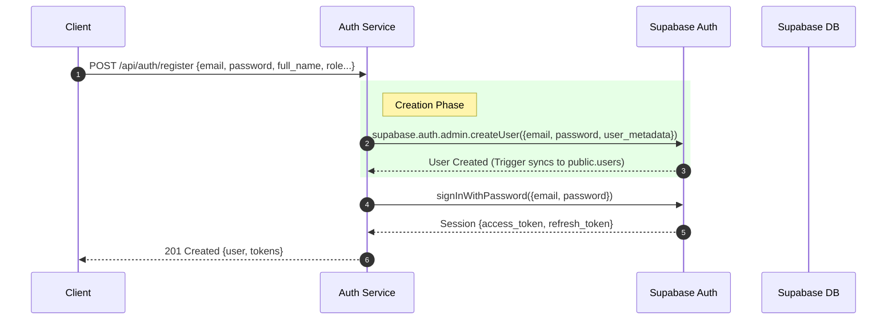
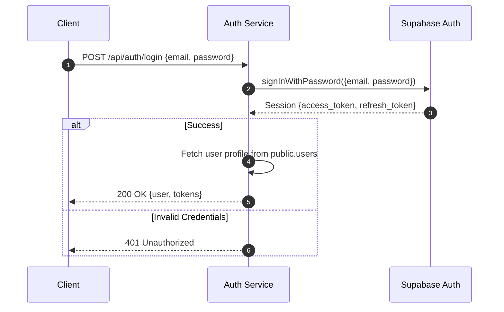

# Supabase Native Auth Architecture Reference

**Document Version:** 2.0 (Post-Migration)
**Date:** 2024-12-20
**Current Provider:** Supabase Auth (Native)
**Previous Provider:** Firebase Authentication (Migrated)

---

## 1. System Overview

### Authentication Architecture

The system now uses **Supabase Native Auth** as the sole identity provider and user management system.

1.  **Supabase Auth** - Primary Identity Provider (IdP) handling Registration, Login, Session Management, and Token Generation.
2.  **Supabase Database** - Persistent storage for user profiles (`public.users` table synced via Triggers).

```mermaid
flowchart TB
    subgraph Client["Frontend Application"]
        FE[Web/Mobile App]
    end

    subgraph Backend["Backend Microservices"]
        GW[API Gateway :3000]
        AUTH[Auth Service :3001]
        ADMIN[Admin Service :3002]
        BOOKING[Booking Service :3003]
        COURSE[Course Service :3004]
    end

    subgraph Supabase["Supabase"]
        SBAuth[Supabase Auth Service]
        SBDB[(PostgreSQL Database)]
    end

    FE -->|1. Login/Register (Email/Pass)| SBAuth
    SBAuth -->|2. Return Access + Refresh Token| FE
    FE -->|3. API Request + Bearer Token| GW
    GW -->|4. Verify Token (Supabase SDK or JWT)| SBAuth
    GW -->|5. Forward Request + User Context| AUTH
    AUTH -->|6. Query User Profile| SBDB
```

### Key Architectural Decisions

| Aspect          | Decision                    | Reason                                                                  |
| :-------------- | :-------------------------- | :---------------------------------------------------------------------- |
| **Primary IdP** | Supabase Auth               | Native integration with PostgreSQL, RLS policies, and simplified stack. |
| **Token Type**  | Supabase Access Token (JWT) | Standard JWT, verifiable via Supabase SDK or JWT libraries.             |
| **User Data**   | `public.users` table        | Full control over user schema, foreign key support for other tables.    |
| **User Sync**   | Database Triggers           | Automatic synchronization between `auth.users` and `public.users`.      |

---

## 2. Authentication Flows

### 2.1 Supported Methods

| Method             | Status          | Implementation                              |
| :----------------- | :-------------- | :------------------------------------------ |
| **Email/Password** | ✅ Active       | Primary method. Handled by Supabase Auth.   |
| **Social Login**   | 🟡 Configurable | Google, GitHub, etc. supported by Supabase. |

### 2.2 User Registration Flow

User registration can happen via Client SDK (Direct) or Backend Proxy.

**Current Implementation (Backend Proxy):**



> **Note:** A Database Trigger (`on_auth_user_created`) automatically copies the new user from `auth.users` to `public.users`.

### 2.3 User Login Flow



---

## 3. Token Strategy

### 3.1 Token Format

Supabase uses standard JWTs signed with the project's JWT Secret.

**Payload Structure:**

```json
{
  "aud": "authenticated",
  "exp": 1734571490,
  "sub": "user-uuid-here",
  "email": "user@example.com",
  "phone": "",
  "app_metadata": {
    "provider": "email",
    "providers": ["email"]
  },
  "user_metadata": {
    "full_name": "John Doe",
    "role": "admin"
  },
  "role": "authenticated"
}
```

### 3.2 Verification

Backend services use the `@supabase/supabase-js` SDK to verify tokens:

```typescript
const {
  data: { user },
  error,
} = await supabase.auth.getUser(token);
if (error || !user) throw new UnauthorizedError();
```

---

## 4. Migration Status

**Status: COMPLETED**

- [x] Firebase Admin SDK removed.
- [x] `firebase_uid` column removed/deprecated in favor of Supabase `id`.
- [x] API endpoints refactored to accept email/password directly.
- [x] Integration tests updated to test Supabase Auth flows.

---

## 5. Security & Roles

### 5.1 Role-Based Access Control (RBAC)

Roles are stored in `public.users` (or `user_metadata` in JWT for quick checks).

| Role         | Access Level                 |
| :----------- | :--------------------------- |
| `admin`      | Full System Access           |
| `instructor` | Course & Schedule Management |
| `student`    | Course Enrollment & Booking  |

### 5.2 RLS Policies (Row Level Security)

If Client SDK is used directly, RLS policies on `public.users` and other tables enforce security based on `auth.uid()`.
