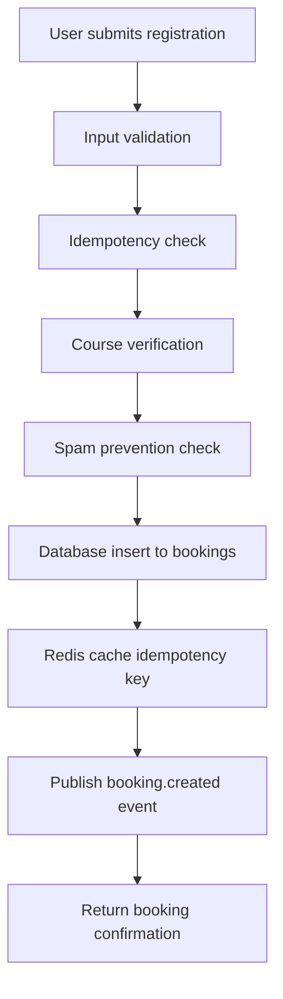
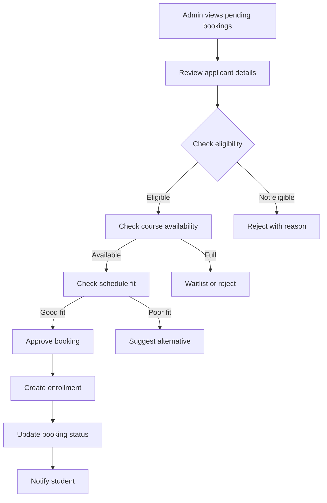

# Course Registration to Completion Flow Report

**Date:** October 14, 2025
**Report Type:** Business Process Flow Analysis
**Status:** ✅ Completed

## Executive Summary

This report provides a comprehensive analysis of the complete course registration flow from initial user registration through to course completion. The flow involves multiple services (Booking, Course, Admin) and spans from public registration to attendance tracking. The process is designed to handle both anonymous registrations and authenticated users, with admin approval workflows and comprehensive status tracking.

## Overview of Registration Flow

The course registration system follows a **4-stage process**:

1. **Registration Stage** - User submits course registration
2. **Approval Stage** - Admin reviews and approves/rejects
3. **Enrollment Stage** - Approved registrations become enrollments
4. **Attendance Stage** - Students attend classes and completion tracking

### Key System Characteristics

- **Anonymous Registration:** No user account required for initial registration
- **Admin Approval:** All registrations start as 'pending' status
- **Standalone Bookings:** Registrations stored independently from user accounts
- **Multi-Service Integration:** Booking → Course → Admin service coordination
- **Status Tracking:** Complete audit trail from registration to completion

---

## Flow Perspective 1: User Registration Journey

### Stage 1: Course Registration (Public Access)

**Endpoint:** `POST /api/booking/register-course`
**Service:** Booking Service (Port 3004)
**Access Level:** Public (No authentication required)

#### User Actions:
1. **Browse Available Courses**
   - User visits course catalog (`GET /api/courses`)
   - Views course details and schedules (`GET /api/courses/:id`)
   - Checks available schedules (`GET /api/schedules/available`)

2. **Submit Registration Form**
   - Fills registration form with personal information
   - Selects preferred course and schedule options
   - Includes guardian information for minors
   - Accepts terms and conditions

#### System Processing:



#### Data Captured:
```json
{
  "course_id": "uuid",
  "full_name": "Budi Santoso",
  "wa_number": "+6281234567890",
  "email": "budi@example.com",
  "experience_level": "beginner",
  "preferred_days": ["monday", "wednesday"],
  "preferred_time_range": {
    "start": "09:00",
    "end": "17:00"
  },
  "guardian": {
    "name": "Parent Name",
    "wa_number": "+6281234567891"
  },
  "consent": true,
  "idempotency_key": "uuid"
}
```

#### Database Impact:
- **INSERT** into `bookings` table with `status = 'pending'`
- Applicant data stored in dedicated fields (applicant_*, no user_id)
- Expires automatically after 72 hours if not processed

#### User Experience:
- Immediate confirmation with registration number
- Email notification sent (if email service configured)
- Status tracking available via booking ID

---

### Stage 2: Waiting for Admin Approval

**Status:** `pending`
**Duration:** Up to 72 hours (system auto-reject after expiry)

#### User Actions:
- Receives confirmation email with booking details
- Can check status (if status endpoint available)
- Cannot modify registration once submitted

#### System State:
- Booking record exists with `status = 'pending'`
- Idempotency key prevents duplicate submissions
- Admin notification triggered via Redis event

---

### Stage 3: Admin Approval/Rejection

**Status Transition:** `pending` → `confirmed` or `rejected`

#### If Approved:
- Status changes to `confirmed`
- Enrollment record created automatically
- Student gains access to course materials (if available)

#### If Rejected:
- Status changes to `rejected`
- User notified of rejection
- Can re-register for different course/schedule

---

### Stage 4: Enrollment and Course Access

**Status:** `confirmed` + Enrollment created

#### User Benefits:
- Official enrollment record created
- Access to course schedules and materials
- Attendance tracking begins
- Progress monitoring available

---

### Stage 5: Course Attendance and Completion

**Service:** Course Service (Port 3003)
**Tracking:** Via `schedule_attendees` table

#### Attendance Flow:
1. **Schedule Assignment:** Admin/Instructor assigns student to specific class schedules
2. **Attendance Recording:** Instructor marks attendance for each session
3. **Progress Tracking:** System tracks attendance percentage
4. **Completion Criteria:** Based on attendance threshold (e.g., 80% minimum)

#### Completion Status:
- **Active:** Currently enrolled, attending classes
- **Completed:** Finished course with sufficient attendance
- **Dropped:** Withdrawn from course
- **Failed:** Did not meet attendance requirements

---

## Flow Perspective 2: Admin Management Journey

### Stage 1: Monitoring Pending Registrations

**Endpoint:** `GET /api/booking/pending`
**Service:** Booking Service (Port 3004)
**Access Level:** Admin Only

#### Admin Dashboard Actions:
1. **View Pending Bookings**
   - Access admin dashboard
   - Review pending registrations queue
   - Filter by course, date, priority

2. **Review Applicant Details**
   - Full applicant information available
   - Contact details for verification calls
   - Experience level and preferences
   - Guardian information for minors

#### Admin Decision Process:



---

### Stage 2: Approval Process

**Endpoint:** `POST /api/bookings/:id/confirm`
**Service:** Booking Service (Port 3004)

#### Approval Actions:
1. **Confirm Booking**
   - Change status from `pending` to `confirmed`
   - Create enrollment record automatically
   - Link booking to enrollment

2. **Enrollment Creation**
   - **Endpoint:** `POST /api/booking/enrollments`
   - Creates student-course relationship
   - Sets initial status as `active`

#### Database Transactions:
```sql
-- Update booking status
UPDATE bookings SET status = 'confirmed', updated_at = NOW() WHERE id = :booking_id;

-- Create enrollment
INSERT INTO enrollments (student_id, course_id, status, enrolled_at)
VALUES (:student_id, :course_id, 'active', NOW());
```

---

### Stage 3: Schedule Assignment

**Service:** Course Service (Port 3003)
**Admin Actions:** Assign enrolled students to class schedules

#### Process:
1. **Create Class Schedules** (`POST /api/schedules`)
2. **Assign Students** to specific schedule slots
3. **Update Room Capacities** and availability

---

### Stage 4: Attendance Management

**Service:** Course Service (Port 3003)
**Endpoints:** Various attendance tracking endpoints

#### Instructor/Admin Actions:
1. **Record Attendance** (`POST /api/attendance`)
   - Mark students present/absent for each session
   - Update attendance counters

2. **Monitor Progress** (`GET /api/attendance/schedule/:scheduleId`)
   - Track individual student attendance
   - Calculate attendance percentages

3. **Update Attendance Status** (`PUT /api/attendance/:scheduleId/:bookingId`)
   - Correct attendance records if needed
   - Handle special cases (excused absences, etc.)

---

### Stage 5: Completion Tracking

**Admin Responsibilities:**
1. **Monitor Course Completion**
   - Track attendance percentages
   - Identify at-risk students
   - Send progress notifications

2. **Handle Course Completion**
   - Mark courses as completed
   - Generate completion certificates (if applicable)
   - Update student records

3. **Performance Analytics**
   - Course completion rates
   - Attendance patterns
   - Student satisfaction metrics

---

## Technical Implementation Details

### Database Schema Relationships

```sql
-- Core relationship flow
bookings (status: pending→confirmed)
    ↓
enrollments (status: active→completed)
    ↓
schedule_attendees (attendance records)
    ↓
class_schedules (course sessions)
```

### Key Tables Involved

| Table | Primary Service | Purpose | Key Fields |
|-------|----------------|---------|------------|
| `bookings` | Booking Service | Registration records | status, applicant_*, course_id, created_at |
| `enrollments` | Booking Service | Student-course links | student_id, course_id, status, enrolled_at |
| `class_schedules` | Course Service | Session schedules | course_id, instructor_id, start_time, max_attendees |
| `schedule_attendees` | Course Service | Attendance records | schedule_id, booking_id, status, attended_at |
| `courses` | Course Service | Course catalog | title, level, price_per_session, is_active |
| `users` | Admin Service | User accounts | email, role, firebase_uid |

### Status Flow Diagram

```
Registration Flow:
pending → confirmed → enrolled → attending → completed

Detailed Statuses:
┌─────────────────────────────────────────────────────────────┐
│ Booking Status: pending → confirmed/rejected               │
│ Enrollment Status: active → completed/dropped/failed       │
│ Attendance Status: present/absent/excused/not_recorded      │
│ Course Status: active → completed/inactive                  │
└─────────────────────────────────────────────────────────────┘
```

---

## Business Rules and Validation

### Registration Rules
- **Anonymous Access:** No account required for registration
- **Idempotency:** Same registration cannot be submitted twice within 24 hours
- **Spam Prevention:** Max 3 pending bookings per email
- **Data Validation:** All required fields must be provided
- **Course Availability:** Only active courses can be registered for

### Admin Approval Rules
- **Time Limit:** 72-hour window for admin decision
- **Eligibility Check:** Age, experience level, course prerequisites
- **Capacity Check:** Available slots in selected schedules
- **Duplicate Prevention:** Same person cannot enroll in same course twice

### Attendance Rules
- **Minimum Attendance:** Typically 80% for course completion
- **Recording Deadline:** Attendance must be recorded within 24 hours of session
- **Excused Absences:** Special handling for valid reasons
- **Make-up Sessions:** Policy for missed classes

---

## Error Handling and Edge Cases

### Common Error Scenarios

1. **Duplicate Registration**
   - **Detection:** Idempotency key check
   - **Response:** Return existing booking details

2. **Course Full**
   - **Detection:** Capacity check during approval
   - **Response:** Suggest alternative schedules or waitlist

3. **Expired Booking**
   - **Detection:** 72-hour timer
   - **Action:** Auto-reject expired pending bookings

4. **Invalid Schedule Selection**
   - **Detection:** Schedule availability validation
   - **Response:** Suggest available alternatives

### Recovery Mechanisms

1. **Booking Recovery:** Users can re-register if booking expires
2. **Status Correction:** Admins can update booking/enrollment statuses
3. **Attendance Correction:** Instructors can modify attendance records
4. **Data Synchronization:** Services sync data via Redis events

---

## Performance and Scalability Considerations

### High-Traffic Scenarios
- **Peak Registration Times:** Handle multiple concurrent registrations
- **Admin Dashboard Load:** Efficient pending booking queries
- **Attendance Recording:** Batch attendance updates for large classes

### Caching Strategy
- **Idempotency Keys:** Redis cache for duplicate prevention
- **User Data:** Cached user profiles for performance
- **Course Data:** Cached course information

### Monitoring Points
- **Registration Volume:** Track daily/weekly registration rates
- **Approval Times:** Monitor admin response times
- **Attendance Rates:** Track course completion metrics
- **System Performance:** Database query performance

---

## Recommendations

### Process Improvements
1. **Automated Notifications:** Email/SMS notifications at each stage
2. **Progress Dashboard:** Student portal for tracking progress
3. **Waitlist System:** Automatic enrollment when spots open
4. **Bulk Operations:** Admin tools for batch approvals

### Technical Enhancements
1. **Real-time Updates:** WebSocket notifications for status changes
2. **Advanced Filtering:** Better admin tools for managing registrations
3. **Analytics Dashboard:** Comprehensive reporting on registration flows
4. **Mobile Optimization:** Responsive interfaces for all user types

### Business Intelligence
1. **Conversion Tracking:** Registration to enrollment conversion rates
2. **Course Performance:** Completion rates by course and instructor
3. **Student Success:** Attendance correlation with learning outcomes
4. **Operational Metrics:** Admin efficiency and response times

---

## Conclusion

The course registration to completion flow is a comprehensive, multi-stage process that handles anonymous registrations, admin approvals, enrollment management, and attendance tracking. The system successfully separates concerns across services while maintaining data integrity and providing clear status tracking throughout the entire student journey.

**Key Success Factors:**
- **Anonymous Access:** Lowers barrier to registration
- **Admin Control:** Quality assurance through approval process
- **Complete Tracking:** Full audit trail from registration to completion
- **Scalable Architecture:** Service-based design supports growth

**Process Metrics:**
- **Total Stages:** 5 (Registration → Approval → Enrollment → Attendance → Completion)
- **Services Involved:** 3 (Booking, Course, Admin)
- **Database Tables:** 6 primary tables with complex relationships
- **Status States:** 10+ possible status combinations
- **Integration Points:** Redis events, service-to-service calls

This flow ensures a smooth, trackable experience for both students and administrators while maintaining data integrity and operational efficiency.</content>
<parameter name="filePath">d:\Tugas\RPL\New folder\Backend\docs\COURSE_REGISTRATION_TO_COMPLETION_FLOW_REPORT.md