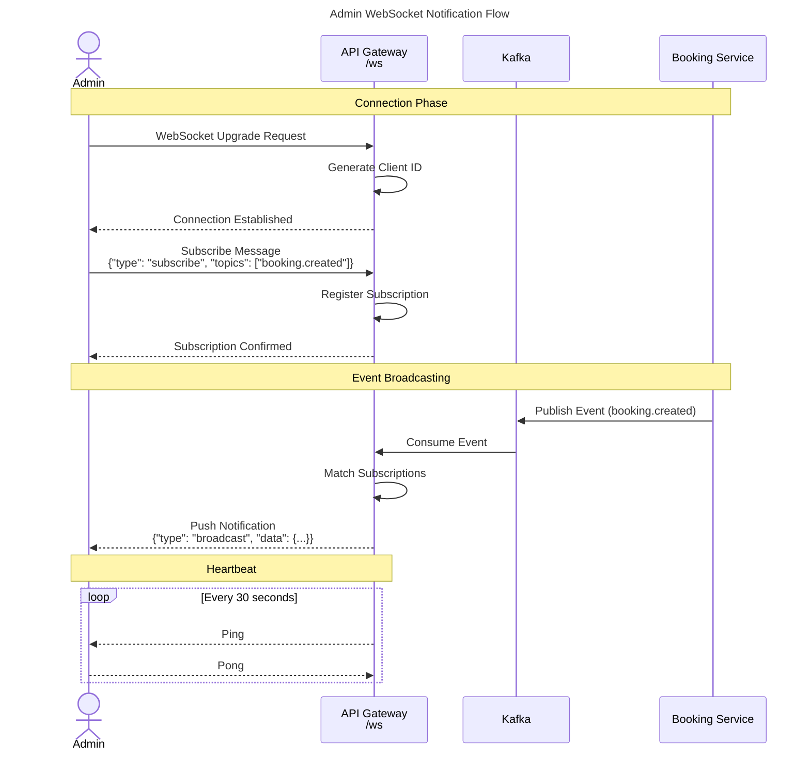

# Sequence Diagram - API Gateway Service

## 1. Gambaran Umum

API Gateway adalah single entry point untuk semua request dari client ke sistem backend Shema Music. Service ini berjalan pada Port 3000 dan bertanggung jawab untuk:

- **Routing**: Mengarahkan request ke microservice yang sesuai
- **Authentication**: Memvalidasi Firebase ID Token sebelum meneruskan ke service yang membutuhkan autentikasi
- **Load Balancing**: Mendistribusikan request ke service yang tersedia
- **WebSocket Handling**: Mengelola koneksi WebSocket untuk notifikasi real-time

## 2. Arsitektur Routing

API Gateway menggunakan pattern proxy untuk meneruskan request ke microservice yang sesuai. Setiap route memiliki konfigurasi service URL target dan middleware yang diperlukan.

### 2.1 Service URLs

| Service | URL Internal | Deskripsi |
|---------|--------------|-----------|
| Auth Service | http://auth:3001 | Autentikasi admin |
| Admin Service | http://admin:3002 | Manajemen admin |
| Course Service | http://course:3003 | Manajemen kursus |
| Booking Service | http://booking:3008 | Registrasi dan booking |
| Recommendation Service | http://recommendation:3005 | Rekomendasi AI |
| Notification Service | http://notification:3009 | Notifikasi real-time |

## 3. Sequence Diagram - Request Routing Flow

### 3.1 Public Route Flow (Tanpa Autentikasi)

Diagram ini menunjukkan alur request untuk endpoint publik yang tidak memerlukan autentikasi.

#### PlantUML


#### Mermaid


### 3.2 Protected Route Flow (Dengan Autentikasi)

Diagram ini menunjukkan alur request untuk endpoint yang memerlukan autentikasi Firebase.

#### PlantUML


#### Mermaid


## 4. Sequence Diagram - WebSocket Connection Flow

### 4.1 Admin WebSocket Notification

Diagram ini menunjukkan alur koneksi WebSocket untuk notifikasi admin secara real-time.

#### PlantUML


#### Mermaid



### 4.2 Availability WebSocket

Diagram ini menunjukkan alur koneksi WebSocket untuk update ketersediaan jadwal secara real-time.

#### PlantUML


#### Mermaid


## 5. Sequence Diagram - Health Check Flow

### 5.1 Service Health Aggregation

Diagram ini menunjukkan alur pengecekan kesehatan semua microservice.

#### PlantUML

```plantuml
@startuml Health_Check
title Service Health Check Flow

actor Client
participant "API Gateway" as Gateway
participant "Auth Service" as Auth
participant "Course Service" as Course
participant "Booking Service" as Booking
participant "Recommendation Service" as Recommend

Client -> Gateway: GET /services/health
activate Gateway

par Parallel Health Checks
    Gateway -> Auth: GET /health
    activate Auth
    Auth --> Gateway: {status: "healthy"}
    deactivate Auth
and
    Gateway -> Course: GET /health
    activate Course
    Course --> Gateway: {status: "healthy"}
    deactivate Course
and
    Gateway -> Booking: GET /health
    activate Booking
    Booking --> Gateway: {status: "healthy"}
    deactivate Booking
and
    Gateway -> Recommend: GET /health
    activate Recommend
    Recommend --> Gateway: {status: "healthy"}
    deactivate Recommend
end

Gateway -> Gateway: Aggregate Results
Gateway --> Client: {\n  overall_health: "healthy",\n  services: [...]\n}
deactivate Gateway

@enduml
```

#### Mermaid


## 6. Sequence Diagram - Error Handling Flow

### 6.1 Service Unavailable Handling

Diagram ini menunjukkan alur penanganan error ketika service tidak tersedia.

#### PlantUML


#### Mermaid


## 7. Endpoint Summary

### 7.1 Auth Routes (Public)
- `POST /auth/register` - Registrasi admin baru
- `POST /auth/login` - Login admin
- `POST /auth/firebase/register` - Registrasi via Firebase
- `POST /auth/firebase/login` - Login via Firebase

### 7.2 Admin Routes (Protected - Admin Only)
- `GET /admin/dashboard` - Dashboard statistik
- `GET /admin/users` - Daftar semua user
- `GET /admin/instructor` - Daftar instructor
- `GET /admin/students` - Daftar siswa
- `GET /admin/rooms` - Daftar ruangan
- `GET /admin/schedules` - Daftar jadwal

### 7.3 Course Routes (Mixed)
- `GET /courses` - Daftar kursus (Public)
- `POST /courses` - Buat kursus (Protected)
- `PUT /courses/:id` - Update kursus (Protected)
- `DELETE /courses/:id` - Hapus kursus (Protected)

### 7.4 Booking Routes (Mixed)
- `POST /booking/register-course` - Registrasi kursus (Public)
- `GET /booking/available-instructors` - Daftar instructor (Public)
- `GET /booking/bookings` - Semua booking (Protected)
- `POST /booking/:id/confirm` - Konfirmasi booking (Protected)

### 7.5 Recommendation Routes (Session-based)
- `POST /assessment` - Submit assessment
- `GET /results` - Ambil hasil rekomendasi

### 7.6 WebSocket Endpoints
- `/ws` - Admin notifications
- `/ws/availability` - Availability updates
