# Sequence Diagram - Admin Service

## 1. Gambaran Umum

Admin Service adalah layanan untuk mengelola operasi administratif sistem Shema Music. Service ini berjalan pada Port 3002 dan bertanggung jawab untuk:

- **Dashboard Statistics**: Menampilkan statistik keseluruhan sistem
- **User Management**: Mengelola data user (CRUD)
- **Student Management**: Mengelola data siswa
- **Instructor Management**: Mengelola data instructor
- **Room Management**: Mengelola data ruangan
- **Schedule Management**: Mengelola jadwal kelas

## 2. Arsitektur Service

Admin Service terhubung langsung ke Supabase untuk operasi database. Semua endpoint memerlukan autentikasi dan role admin.

### 2.1 Struktur Endpoint

| Prefix | Deskripsi |
|--------|-----------|
| /admin/dashboard | Dashboard statistics |
| /admin/users | User management |
| /admin/students | Student management |
| /admin/instructor | Instructor management |
| /admin/rooms | Room management |
| /admin/schedules | Schedule management |

## 3. Sequence Diagram - Dashboard Statistics

### 3.1 Get Dashboard Stats Flow

Diagram ini menunjukkan alur pengambilan statistik dashboard admin.

#### PlantUML

```plantuml
@startuml Dashboard_Stats
title Admin Dashboard Statistics Flow

actor Admin
participant "API Gateway" as Gateway
participant "Admin Service\n(Port 3002)" as AdminSvc
database "Supabase" as DB

Admin -> Gateway: GET /admin/dashboard\n(Authorization: Bearer token)
Gateway -> Gateway: Verify Token & Role

Gateway -> AdminSvc: Forward Request\n(X-User-Role: admin)
activate AdminSvc

par Parallel Queries
    AdminSvc -> DB: SELECT COUNT(*) FROM users
    activate DB
    DB --> AdminSvc: totalUsers
    deactivate DB
and
    AdminSvc -> DB: SELECT COUNT(*) FROM courses
    activate DB
    DB --> AdminSvc: totalCourses
    deactivate DB
and
    AdminSvc -> DB: SELECT COUNT(*) FROM bookings
    activate DB
    DB --> AdminSvc: totalBookings
    deactivate DB
end

AdminSvc -> DB: SELECT * FROM bookings\nORDER BY created_at DESC\nLIMIT 10
activate DB
DB --> AdminSvc: recentBookings
deactivate DB

loop For each booking
    AdminSvc -> DB: Get user details
    AdminSvc -> DB: Get course details
end

AdminSvc -> AdminSvc: Aggregate Results

AdminSvc --> Gateway: {\n  userStats: {totalUsers},\n  courseStats: {totalCourses},\n  bookingStats: {totalBookings},\n  recentBookings: [...]\n}
deactivate AdminSvc

Gateway --> Admin: Dashboard Data

@enduml
```

#### Mermaid

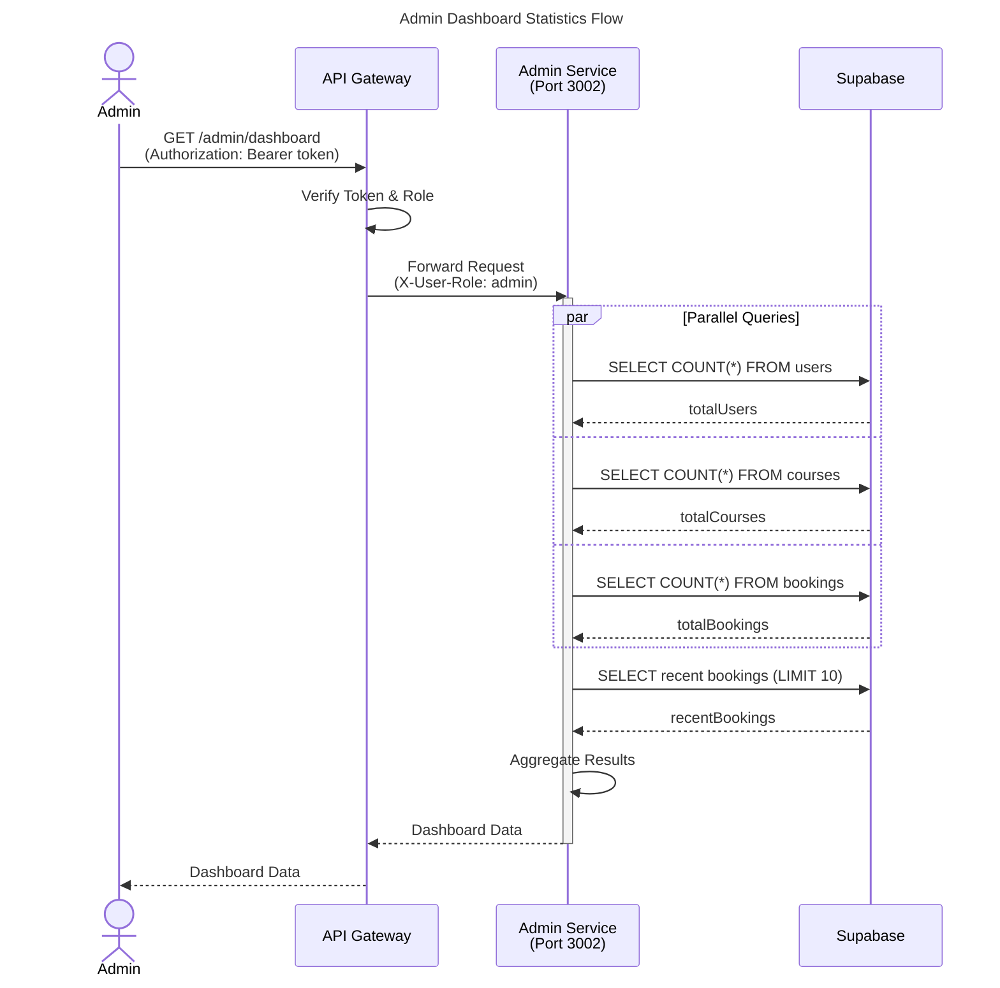
```mermaid
sequenceDiagram
    title Admin Dashboard Statistics Flow
    
    actor Admin
    participant Gateway as API Gateway
    participant AdminSvc as Admin Service<br/>(Port 3002)
    participant DB as Supabase
    
    Admin->>Gateway: GET /admin/dashboard<br/>(Authorization: Bearer token)
    Gateway->>Gateway: Verify Token & Role
    
    Gateway->>AdminSvc: Forward Request<br/>(X-User-Role: admin)
    activate AdminSvc
    
    par Parallel Queries
        AdminSvc->>DB: SELECT COUNT(*) FROM users
        DB-->>AdminSvc: totalUsers
    and
        AdminSvc->>DB: SELECT COUNT(*) FROM courses
        DB-->>AdminSvc: totalCourses
    and
        AdminSvc->>DB: SELECT COUNT(*) FROM bookings
        DB-->>AdminSvc: totalBookings
    end
    
    AdminSvc->>DB: SELECT recent bookings (LIMIT 10)
    DB-->>AdminSvc: recentBookings
    
    AdminSvc->>AdminSvc: Aggregate Results
    
    AdminSvc-->>Gateway: Dashboard Data
    deactivate AdminSvc
    
    Gateway-->>Admin: Dashboard Data
```

## 4. Sequence Diagram - User Management

### 4.1 Get Users List Flow

Diagram ini menunjukkan alur pengambilan daftar user dengan pagination.

#### PlantUML

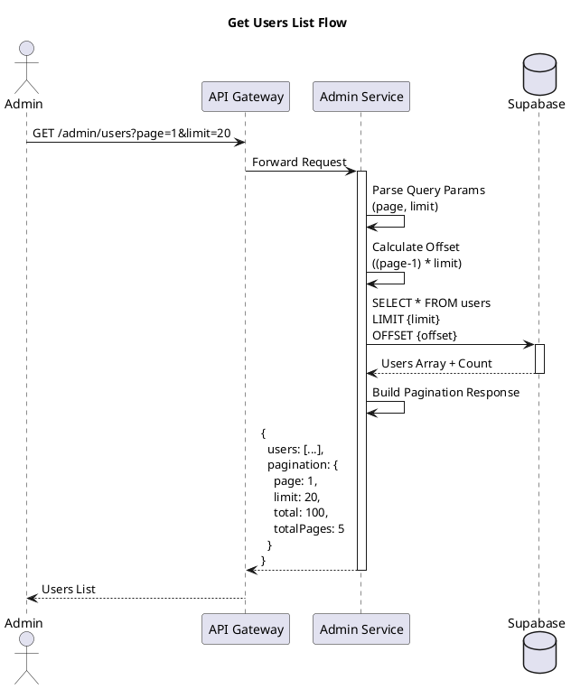
```plantuml
@startuml Get_Users
title Get Users List Flow

actor Admin
participant "API Gateway" as Gateway
participant "Admin Service" as AdminSvc
database "Supabase" as DB

Admin -> Gateway: GET /admin/users?page=1&limit=20
Gateway -> AdminSvc: Forward Request
activate AdminSvc

AdminSvc -> AdminSvc: Parse Query Params\n(page, limit)
AdminSvc -> AdminSvc: Calculate Offset\n((page-1) * limit)

AdminSvc -> DB: SELECT * FROM users\nLIMIT {limit}\nOFFSET {offset}
activate DB
DB --> AdminSvc: Users Array + Count
deactivate DB

AdminSvc -> AdminSvc: Build Pagination Response

AdminSvc --> Gateway: {\n  users: [...],\n  pagination: {\n    page: 1,\n    limit: 20,\n    total: 100,\n    totalPages: 5\n  }\n}
deactivate AdminSvc

Gateway --> Admin: Users List

@enduml
```

#### Mermaid

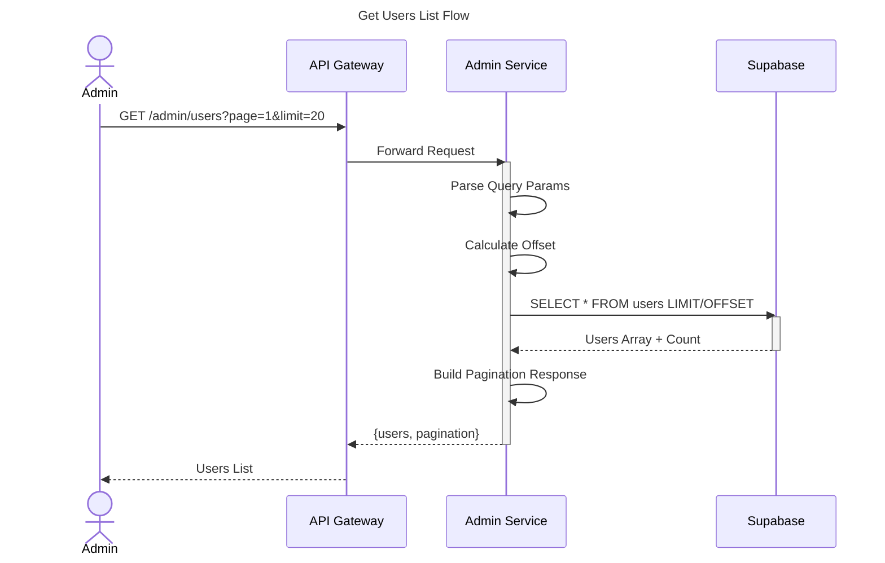
```mermaid
sequenceDiagram
    title Get Users List Flow
    
    actor Admin
    participant Gateway as API Gateway
    participant AdminSvc as Admin Service
    participant DB as Supabase
    
    Admin->>Gateway: GET /admin/users?page=1&limit=20
    Gateway->>AdminSvc: Forward Request
    activate AdminSvc
    
    AdminSvc->>AdminSvc: Parse Query Params
    AdminSvc->>AdminSvc: Calculate Offset
    
    AdminSvc->>DB: SELECT * FROM users LIMIT/OFFSET
    activate DB
    DB-->>AdminSvc: Users Array + Count
    deactivate DB
    
    AdminSvc->>AdminSvc: Build Pagination Response
    
    AdminSvc-->>Gateway: {users, pagination}
    deactivate AdminSvc
    
    Gateway-->>Admin: Users List
```

### 4.2 Update User Flow

Diagram ini menunjukkan alur update data user.

#### PlantUML

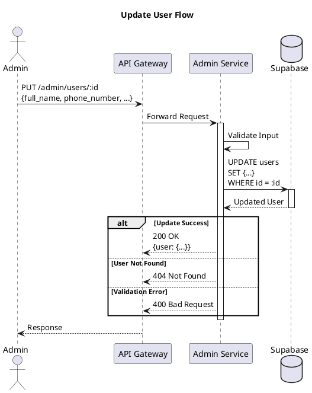
```plantuml
@startuml Update_User
title Update User Flow

actor Admin
participant "API Gateway" as Gateway
participant "Admin Service" as AdminSvc
database "Supabase" as DB

Admin -> Gateway: PUT /admin/users/:id\n{full_name, phone_number, ...}
Gateway -> AdminSvc: Forward Request
activate AdminSvc

AdminSvc -> AdminSvc: Validate Input

AdminSvc -> DB: UPDATE users\nSET {...}\nWHERE id = :id
activate DB
DB --> AdminSvc: Updated User
deactivate DB

alt Update Success
    AdminSvc --> Gateway: 200 OK\n{user: {...}}
else User Not Found
    AdminSvc --> Gateway: 404 Not Found
else Validation Error
    AdminSvc --> Gateway: 400 Bad Request
end

deactivate AdminSvc

Gateway --> Admin: Response

@enduml
```

#### Mermaid

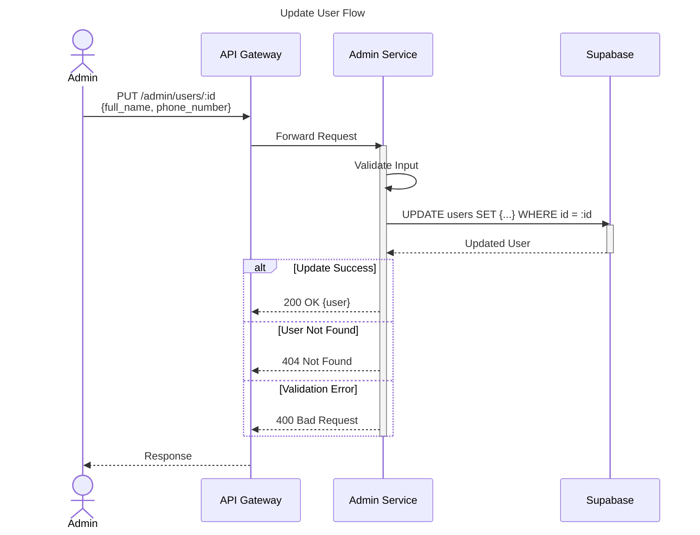
```mermaid
sequenceDiagram
    title Update User Flow
    
    actor Admin
    participant Gateway as API Gateway
    participant AdminSvc as Admin Service
    participant DB as Supabase
    
    Admin->>Gateway: PUT /admin/users/:id<br/>{full_name, phone_number}
    Gateway->>AdminSvc: Forward Request
    activate AdminSvc
    
    AdminSvc->>AdminSvc: Validate Input
    
    AdminSvc->>DB: UPDATE users SET {...} WHERE id = :id
    activate DB
    DB-->>AdminSvc: Updated User
    deactivate DB
    
    alt Update Success
        AdminSvc-->>Gateway: 200 OK {user}
    else User Not Found
        AdminSvc-->>Gateway: 404 Not Found
    else Validation Error
        AdminSvc-->>Gateway: 400 Bad Request
    end
    
    deactivate AdminSvc
    
    Gateway-->>Admin: Response
```

## 5. Sequence Diagram - Student Management

### 5.1 Create Student Flow

Diagram ini menunjukkan alur pembuatan data siswa baru.

#### PlantUML

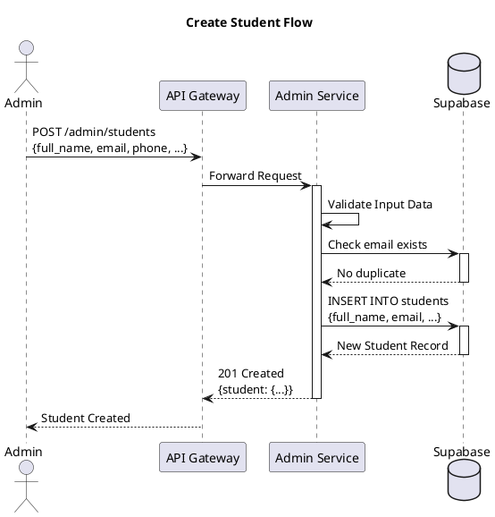
```plantuml
@startuml Create_Student
title Create Student Flow

actor Admin
participant "API Gateway" as Gateway
participant "Admin Service" as AdminSvc
database "Supabase" as DB

Admin -> Gateway: POST /admin/students\n{full_name, email, phone, ...}
Gateway -> AdminSvc: Forward Request
activate AdminSvc

AdminSvc -> AdminSvc: Validate Input Data

AdminSvc -> DB: Check email exists
activate DB
DB --> AdminSvc: No duplicate
deactivate DB

AdminSvc -> DB: INSERT INTO students\n{full_name, email, ...}
activate DB
DB --> AdminSvc: New Student Record
deactivate DB

AdminSvc --> Gateway: 201 Created\n{student: {...}}
deactivate AdminSvc

Gateway --> Admin: Student Created

@enduml
```

#### Mermaid

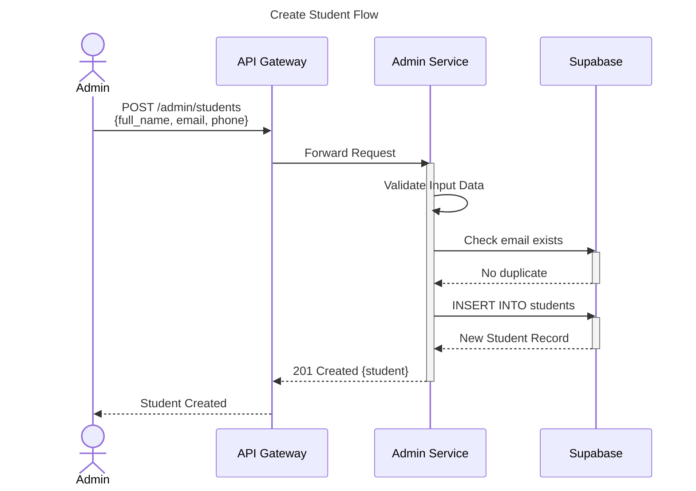
```mermaid
sequenceDiagram
    title Create Student Flow
    
    actor Admin
    participant Gateway as API Gateway
    participant AdminSvc as Admin Service
    participant DB as Supabase
    
    Admin->>Gateway: POST /admin/students<br/>{full_name, email, phone}
    Gateway->>AdminSvc: Forward Request
    activate AdminSvc
    
    AdminSvc->>AdminSvc: Validate Input Data
    
    AdminSvc->>DB: Check email exists
    activate DB
    DB-->>AdminSvc: No duplicate
    deactivate DB
    
    AdminSvc->>DB: INSERT INTO students
    activate DB
    DB-->>AdminSvc: New Student Record
    deactivate DB
    
    AdminSvc-->>Gateway: 201 Created {student}
    deactivate AdminSvc
    
    Gateway-->>Admin: Student Created
```

## 6. Sequence Diagram - Instructor Management

### 6.1 Create Instructor Flow

Diagram ini menunjukkan alur pembuatan instructor baru dengan pembuatan user dan profile.

#### PlantUML

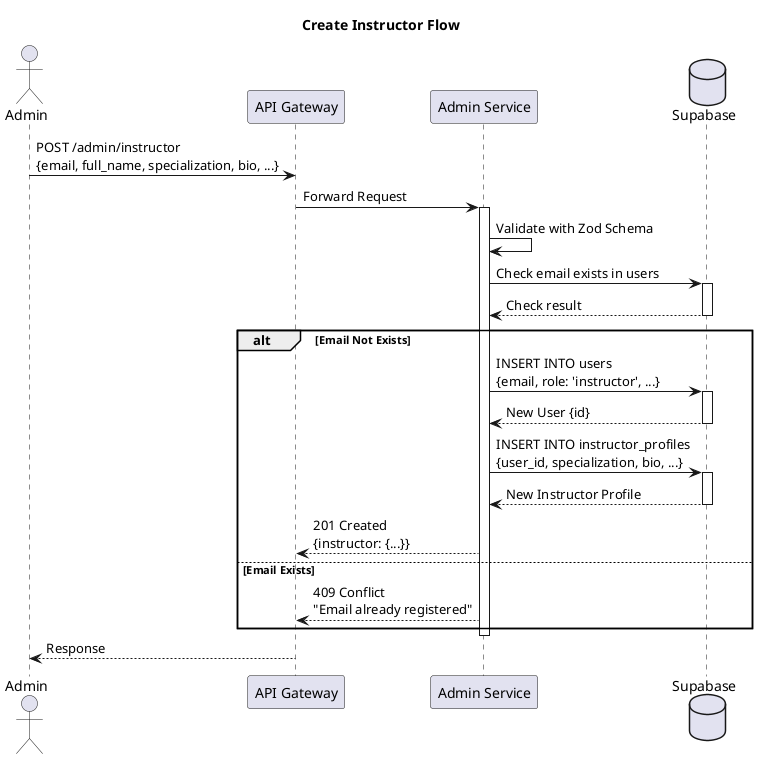
```plantuml
@startuml Create_Instructor
title Create Instructor Flow

actor Admin
participant "API Gateway" as Gateway
participant "Admin Service" as AdminSvc
database "Supabase" as DB

Admin -> Gateway: POST /admin/instructor\n{email, full_name, specialization, bio, ...}
Gateway -> AdminSvc: Forward Request
activate AdminSvc

AdminSvc -> AdminSvc: Validate with Zod Schema

AdminSvc -> DB: Check email exists in users
activate DB
DB --> AdminSvc: Check result
deactivate DB

alt Email Not Exists
    AdminSvc -> DB: INSERT INTO users\n{email, role: 'instructor', ...}
    activate DB
    DB --> AdminSvc: New User {id}
    deactivate DB
    
    AdminSvc -> DB: INSERT INTO instructor_profiles\n{user_id, specialization, bio, ...}
    activate DB
    DB --> AdminSvc: New Instructor Profile
    deactivate DB
    
    AdminSvc --> Gateway: 201 Created\n{instructor: {...}}
else Email Exists
    AdminSvc --> Gateway: 409 Conflict\n"Email already registered"
end

deactivate AdminSvc

Gateway --> Admin: Response

@enduml
```

#### Mermaid

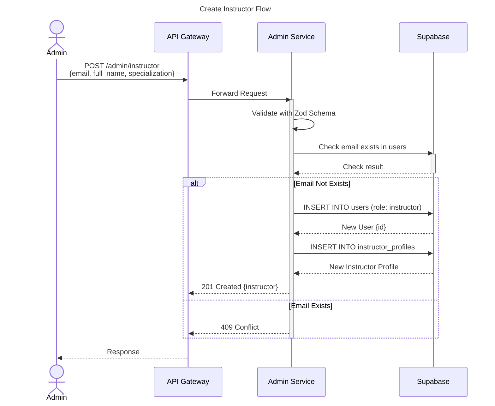
```mermaid
sequenceDiagram
    title Create Instructor Flow
    
    actor Admin
    participant Gateway as API Gateway
    participant AdminSvc as Admin Service
    participant DB as Supabase
    
    Admin->>Gateway: POST /admin/instructor<br/>{email, full_name, specialization}
    Gateway->>AdminSvc: Forward Request
    activate AdminSvc
    
    AdminSvc->>AdminSvc: Validate with Zod Schema
    
    AdminSvc->>DB: Check email exists in users
    activate DB
    DB-->>AdminSvc: Check result
    deactivate DB
    
    alt Email Not Exists
        AdminSvc->>DB: INSERT INTO users (role: instructor)
        DB-->>AdminSvc: New User {id}
        
        AdminSvc->>DB: INSERT INTO instructor_profiles
        DB-->>AdminSvc: New Instructor Profile
        
        AdminSvc-->>Gateway: 201 Created {instructor}
    else Email Exists
        AdminSvc-->>Gateway: 409 Conflict
    end
    
    deactivate AdminSvc
    
    Gateway-->>Admin: Response
```

### 6.2 Get Instructor Detail Flow

Diagram ini menunjukkan alur pengambilan detail instructor.

#### PlantUML

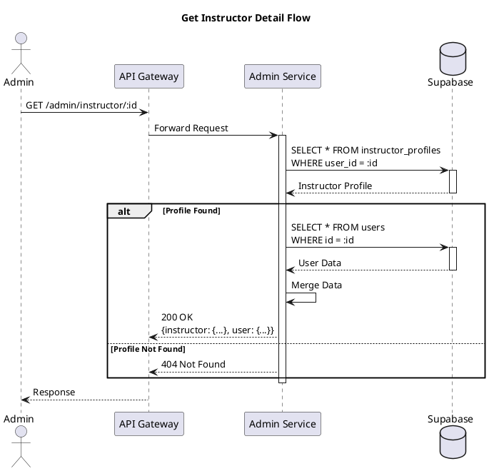
```plantuml
@startuml Get_Instructor
title Get Instructor Detail Flow

actor Admin
participant "API Gateway" as Gateway
participant "Admin Service" as AdminSvc
database "Supabase" as DB

Admin -> Gateway: GET /admin/instructor/:id
Gateway -> AdminSvc: Forward Request
activate AdminSvc

AdminSvc -> DB: SELECT * FROM instructor_profiles\nWHERE user_id = :id
activate DB
DB --> AdminSvc: Instructor Profile
deactivate DB

alt Profile Found
    AdminSvc -> DB: SELECT * FROM users\nWHERE id = :id
    activate DB
    DB --> AdminSvc: User Data
    deactivate DB
    
    AdminSvc -> AdminSvc: Merge Data
    
    AdminSvc --> Gateway: 200 OK\n{instructor: {...}, user: {...}}
else Profile Not Found
    AdminSvc --> Gateway: 404 Not Found
end

deactivate AdminSvc

Gateway --> Admin: Response

@enduml
```

#### Mermaid

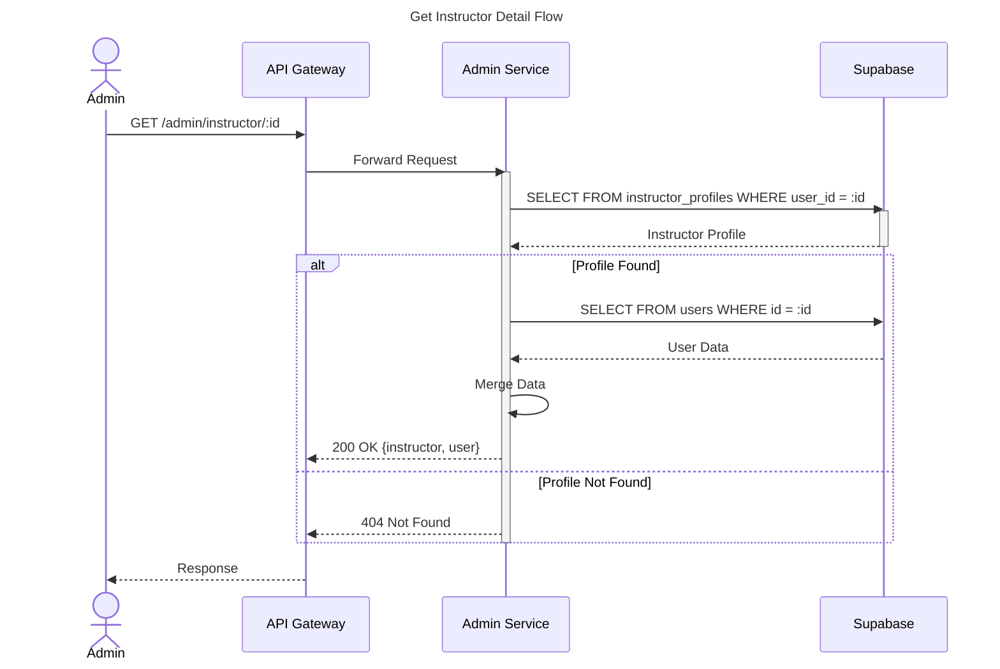
```mermaid
sequenceDiagram
    title Get Instructor Detail Flow
    
    actor Admin
    participant Gateway as API Gateway
    participant AdminSvc as Admin Service
    participant DB as Supabase
    
    Admin->>Gateway: GET /admin/instructor/:id
    Gateway->>AdminSvc: Forward Request
    activate AdminSvc
    
    AdminSvc->>DB: SELECT FROM instructor_profiles WHERE user_id = :id
    activate DB
    DB-->>AdminSvc: Instructor Profile
    deactivate DB
    
    alt Profile Found
        AdminSvc->>DB: SELECT FROM users WHERE id = :id
        DB-->>AdminSvc: User Data
        
        AdminSvc->>AdminSvc: Merge Data
        
        AdminSvc-->>Gateway: 200 OK {instructor, user}
    else Profile Not Found
        AdminSvc-->>Gateway: 404 Not Found
    end
    
    deactivate AdminSvc
    
    Gateway-->>Admin: Response
```

## 7. Sequence Diagram - Room Management

### 7.1 Create Room Flow

Diagram ini menunjukkan alur pembuatan ruangan baru.

#### PlantUML

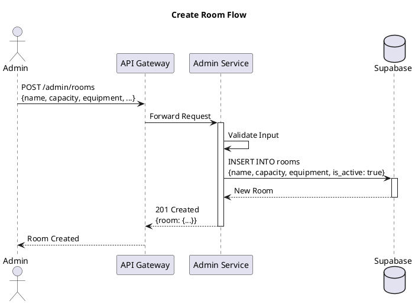
```plantuml
@startuml Create_Room
title Create Room Flow

actor Admin
participant "API Gateway" as Gateway
participant "Admin Service" as AdminSvc
database "Supabase" as DB

Admin -> Gateway: POST /admin/rooms\n{name, capacity, equipment, ...}
Gateway -> AdminSvc: Forward Request
activate AdminSvc

AdminSvc -> AdminSvc: Validate Input

AdminSvc -> DB: INSERT INTO rooms\n{name, capacity, equipment, is_active: true}
activate DB
DB --> AdminSvc: New Room
deactivate DB

AdminSvc --> Gateway: 201 Created\n{room: {...}}
deactivate AdminSvc

Gateway --> Admin: Room Created

@enduml
```

#### Mermaid

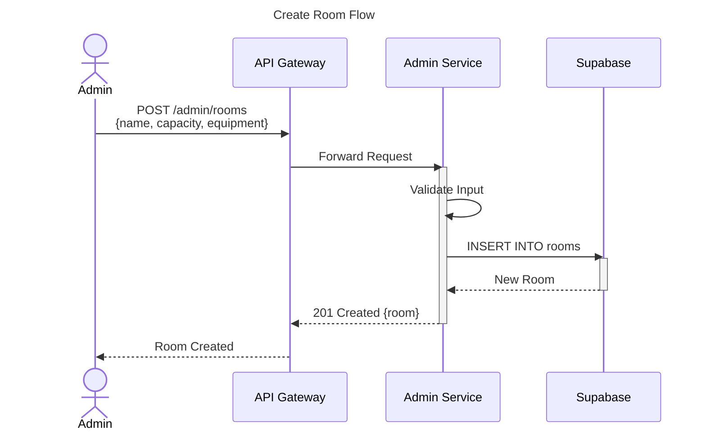
```mermaid
sequenceDiagram
    title Create Room Flow
    
    actor Admin
    participant Gateway as API Gateway
    participant AdminSvc as Admin Service
    participant DB as Supabase
    
    Admin->>Gateway: POST /admin/rooms<br/>{name, capacity, equipment}
    Gateway->>AdminSvc: Forward Request
    activate AdminSvc
    
    AdminSvc->>AdminSvc: Validate Input
    
    AdminSvc->>DB: INSERT INTO rooms
    activate DB
    DB-->>AdminSvc: New Room
    deactivate DB
    
    AdminSvc-->>Gateway: 201 Created {room}
    deactivate AdminSvc
    
    Gateway-->>Admin: Room Created
```

### 7.2 Set Room Availability Flow

Diagram ini menunjukkan alur pengaturan ketersediaan ruangan.

#### PlantUML

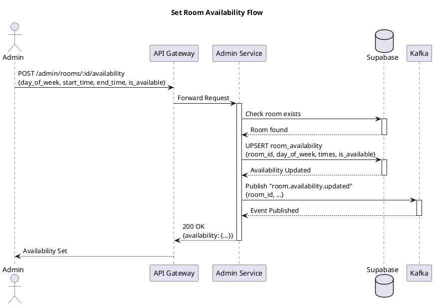
```plantuml
@startuml Room_Availability
title Set Room Availability Flow

actor Admin
participant "API Gateway" as Gateway
participant "Admin Service" as AdminSvc
database "Supabase" as DB
participant "Kafka" as Kafka

Admin -> Gateway: POST /admin/rooms/:id/availability\n{day_of_week, start_time, end_time, is_available}
Gateway -> AdminSvc: Forward Request
activate AdminSvc

AdminSvc -> DB: Check room exists
activate DB
DB --> AdminSvc: Room found
deactivate DB

AdminSvc -> DB: UPSERT room_availability\n{room_id, day_of_week, times, is_available}
activate DB
DB --> AdminSvc: Availability Updated
deactivate DB

AdminSvc -> Kafka: Publish "room.availability.updated"\n{room_id, ...}
activate Kafka
Kafka --> AdminSvc: Event Published
deactivate Kafka

AdminSvc --> Gateway: 200 OK\n{availability: {...}}
deactivate AdminSvc

Gateway --> Admin: Availability Set

@enduml
```

#### Mermaid

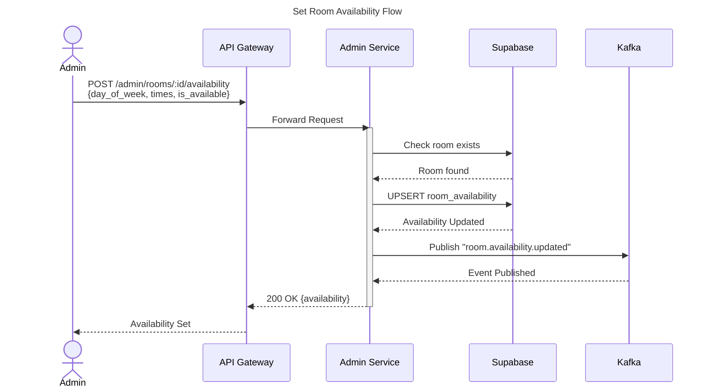
```mermaid
sequenceDiagram
    title Set Room Availability Flow
    
    actor Admin
    participant Gateway as API Gateway
    participant AdminSvc as Admin Service
    participant DB as Supabase
    participant Kafka as Kafka
    
    Admin->>Gateway: POST /admin/rooms/:id/availability<br/>{day_of_week, times, is_available}
    Gateway->>AdminSvc: Forward Request
    activate AdminSvc
    
    AdminSvc->>DB: Check room exists
    DB-->>AdminSvc: Room found
    
    AdminSvc->>DB: UPSERT room_availability
    DB-->>AdminSvc: Availability Updated
    
    AdminSvc->>Kafka: Publish "room.availability.updated"
    Kafka-->>AdminSvc: Event Published
    
    AdminSvc-->>Gateway: 200 OK {availability}
    deactivate AdminSvc
    
    Gateway-->>Admin: Availability Set
```

## 8. Sequence Diagram - Schedule Management

### 8.1 Create Schedule Flow

Diagram ini menunjukkan alur pembuatan jadwal kelas baru.

#### PlantUML

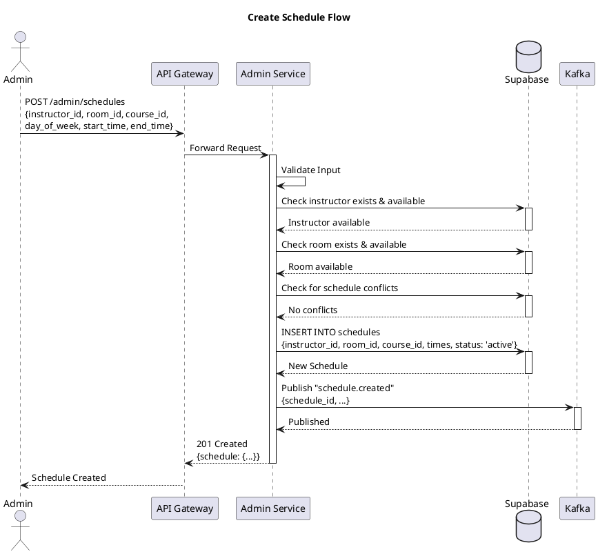
```plantuml
@startuml Create_Schedule
title Create Schedule Flow

actor Admin
participant "API Gateway" as Gateway
participant "Admin Service" as AdminSvc
database "Supabase" as DB
participant "Kafka" as Kafka

Admin -> Gateway: POST /admin/schedules\n{instructor_id, room_id, course_id,\nday_of_week, start_time, end_time}
Gateway -> AdminSvc: Forward Request
activate AdminSvc

AdminSvc -> AdminSvc: Validate Input

AdminSvc -> DB: Check instructor exists & available
activate DB
DB --> AdminSvc: Instructor available
deactivate DB

AdminSvc -> DB: Check room exists & available
activate DB
DB --> AdminSvc: Room available
deactivate DB

AdminSvc -> DB: Check for schedule conflicts
activate DB
DB --> AdminSvc: No conflicts
deactivate DB

AdminSvc -> DB: INSERT INTO schedules\n{instructor_id, room_id, course_id, times, status: 'active'}
activate DB
DB --> AdminSvc: New Schedule
deactivate DB

AdminSvc -> Kafka: Publish "schedule.created"\n{schedule_id, ...}
activate Kafka
Kafka --> AdminSvc: Published
deactivate Kafka

AdminSvc --> Gateway: 201 Created\n{schedule: {...}}
deactivate AdminSvc

Gateway --> Admin: Schedule Created

@enduml
```

#### Mermaid

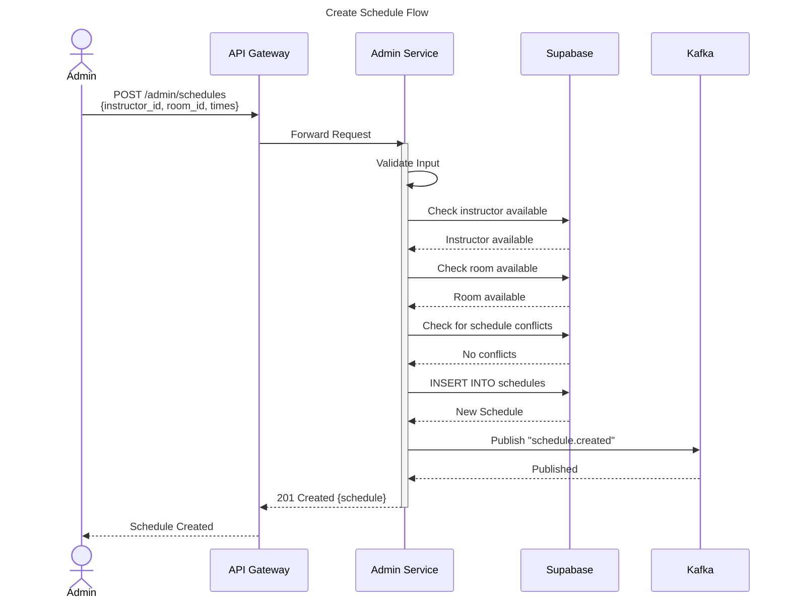
```mermaid
sequenceDiagram
    title Create Schedule Flow
    
    actor Admin
    participant Gateway as API Gateway
    participant AdminSvc as Admin Service
    participant DB as Supabase
    participant Kafka as Kafka
    
    Admin->>Gateway: POST /admin/schedules<br/>{instructor_id, room_id, times}
    Gateway->>AdminSvc: Forward Request
    activate AdminSvc
    
    AdminSvc->>AdminSvc: Validate Input
    
    AdminSvc->>DB: Check instructor available
    DB-->>AdminSvc: Instructor available
    
    AdminSvc->>DB: Check room available
    DB-->>AdminSvc: Room available
    
    AdminSvc->>DB: Check for schedule conflicts
    DB-->>AdminSvc: No conflicts
    
    AdminSvc->>DB: INSERT INTO schedules
    DB-->>AdminSvc: New Schedule
    
    AdminSvc->>Kafka: Publish "schedule.created"
    Kafka-->>AdminSvc: Published
    
    AdminSvc-->>Gateway: 201 Created {schedule}
    deactivate AdminSvc
    
    Gateway-->>Admin: Schedule Created
```

### 8.2 Update Schedule Flow

Diagram ini menunjukkan alur update jadwal dengan validasi konflik.

#### PlantUML

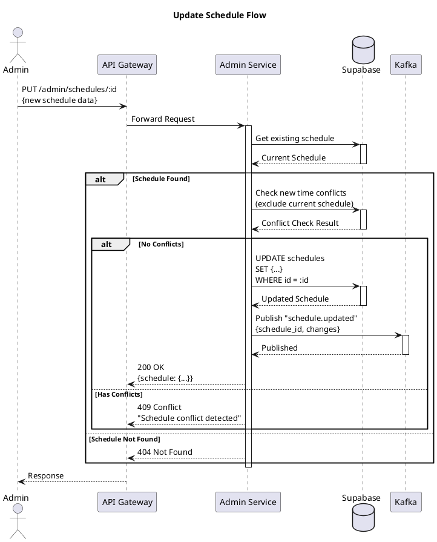
```plantuml
@startuml Update_Schedule
title Update Schedule Flow

actor Admin
participant "API Gateway" as Gateway
participant "Admin Service" as AdminSvc
database "Supabase" as DB
participant "Kafka" as Kafka

Admin -> Gateway: PUT /admin/schedules/:id\n{new schedule data}
Gateway -> AdminSvc: Forward Request
activate AdminSvc

AdminSvc -> DB: Get existing schedule
activate DB
DB --> AdminSvc: Current Schedule
deactivate DB

alt Schedule Found
    AdminSvc -> DB: Check new time conflicts\n(exclude current schedule)
    activate DB
    DB --> AdminSvc: Conflict Check Result
    deactivate DB
    
    alt No Conflicts
        AdminSvc -> DB: UPDATE schedules\nSET {...}\nWHERE id = :id
        activate DB
        DB --> AdminSvc: Updated Schedule
        deactivate DB
        
        AdminSvc -> Kafka: Publish "schedule.updated"\n{schedule_id, changes}
        activate Kafka
        Kafka --> AdminSvc: Published
        deactivate Kafka
        
        AdminSvc --> Gateway: 200 OK\n{schedule: {...}}
    else Has Conflicts
        AdminSvc --> Gateway: 409 Conflict\n"Schedule conflict detected"
    end
else Schedule Not Found
    AdminSvc --> Gateway: 404 Not Found
end

deactivate AdminSvc

Gateway --> Admin: Response

@enduml
```

#### Mermaid

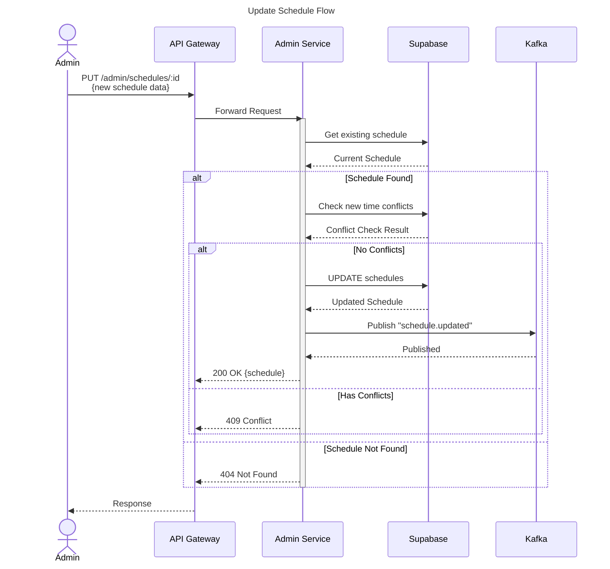
```mermaid
sequenceDiagram
    title Update Schedule Flow
    
    actor Admin
    participant Gateway as API Gateway
    participant AdminSvc as Admin Service
    participant DB as Supabase
    participant Kafka as Kafka
    
    Admin->>Gateway: PUT /admin/schedules/:id<br/>{new schedule data}
    Gateway->>AdminSvc: Forward Request
    activate AdminSvc
    
    AdminSvc->>DB: Get existing schedule
    DB-->>AdminSvc: Current Schedule
    
    alt Schedule Found
        AdminSvc->>DB: Check new time conflicts
        DB-->>AdminSvc: Conflict Check Result
        
        alt No Conflicts
            AdminSvc->>DB: UPDATE schedules
            DB-->>AdminSvc: Updated Schedule
            
            AdminSvc->>Kafka: Publish "schedule.updated"
            Kafka-->>AdminSvc: Published
            
            AdminSvc-->>Gateway: 200 OK {schedule}
        else Has Conflicts
            AdminSvc-->>Gateway: 409 Conflict
        end
    else Schedule Not Found
        AdminSvc-->>Gateway: 404 Not Found
    end
    
    deactivate AdminSvc
    
    Gateway-->>Admin: Response
```

## 9. Endpoint Summary

### 9.1 Dashboard Endpoints

| Method | Endpoint | Deskripsi |
|--------|----------|-----------|
| GET | /admin/dashboard | Get dashboard statistics |

### 9.2 User Management Endpoints

| Method | Endpoint | Deskripsi |
|--------|----------|-----------|
| GET | /admin/users | List all users |
| GET | /admin/users/:id | Get user by ID |
| PUT | /admin/users/:id | Update user |
| DELETE | /admin/users/:id | Delete user |

### 9.3 Student Management Endpoints

| Method | Endpoint | Deskripsi |
|--------|----------|-----------|
| GET | /admin/students | List all students |
| GET | /admin/students/:id | Get student by ID |
| POST | /admin/students | Create student |
| PUT | /admin/students/:id | Update student |
| DELETE | /admin/students/:id | Delete student |

### 9.4 Instructor Management Endpoints

| Method | Endpoint | Deskripsi |
|--------|----------|-----------|
| GET | /admin/instructor | List all instructors |
| GET | /admin/instructor/:id | Get instructor by ID |
| POST | /admin/instructor | Create instructor |
| PUT | /admin/instructor/:id | Update instructor |
| DELETE | /admin/instructor/:id | Delete instructor |

### 9.5 Room Management Endpoints

| Method | Endpoint | Deskripsi |
|--------|----------|-----------|
| GET | /admin/rooms | List all rooms |
| POST | /admin/rooms | Create room |
| POST | /admin/rooms/:id/availability | Set room availability |

### 9.6 Schedule Management Endpoints

| Method | Endpoint | Deskripsi |
|--------|----------|-----------|
| GET | /admin/schedules | List all schedules |
| POST | /admin/schedules | Create schedule |
| PUT | /admin/schedules/:id | Update schedule |
