# Sequence Diagram - Auth Service

## 1. Gambaran Umum

Auth Service adalah layanan autentikasi untuk admin sistem Shema Music. Service ini berjalan pada Port 3001 dan bertanggung jawab untuk:

- **Admin Registration**: Registrasi akun admin baru dengan validasi Firebase
- **Admin Login**: Autentikasi admin menggunakan Firebase ID Token
- **Session Management**: Pengelolaan session dan logout
- **Password Reset**: Reset password melalui Firebase

**Catatan Penting**: Auth Service hanya digunakan untuk admin. Siswa tidak memerlukan autentikasi untuk mendaftar kursus.

## 2. Arsitektur Autentikasi

Auth Service menggunakan Firebase sebagai identity provider dan Supabase sebagai database untuk menyimpan data user. Alur autentikasi menggunakan Firebase ID Token yang diverifikasi oleh backend.

### 2.1 Komponen Integrasi

| Komponen | Fungsi |
|----------|--------|
| Firebase Auth | Identity provider, token generation |
| Supabase Auth | User management di database |
| Supabase DB | Penyimpanan data user |
| Redis | Session cache (optional) |
| Kafka | Event publishing |

## 3. Sequence Diagram - Admin Registration

### 3.1 Firebase Registration Flow

Diagram ini menunjukkan alur registrasi admin baru menggunakan Firebase.

#### PlantUML

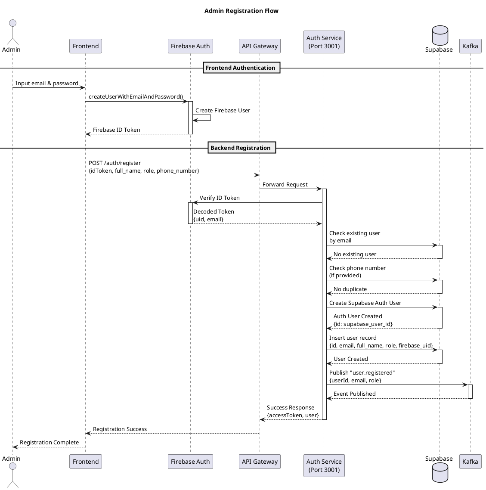

#### Mermaid

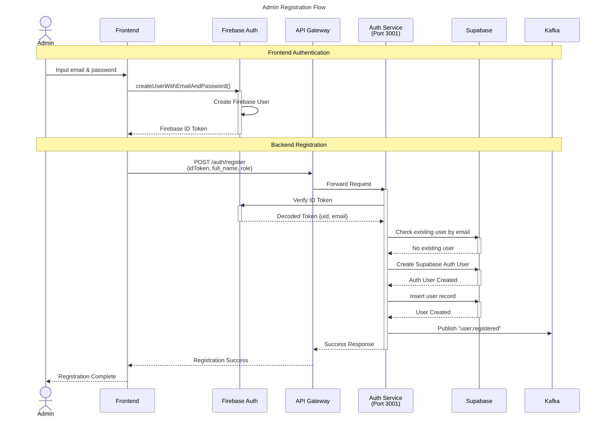

## 4. Sequence Diagram - Admin Login

### 4.1 Firebase Login Flow

Diagram ini menunjukkan alur login admin menggunakan Firebase ID Token.

#### PlantUML

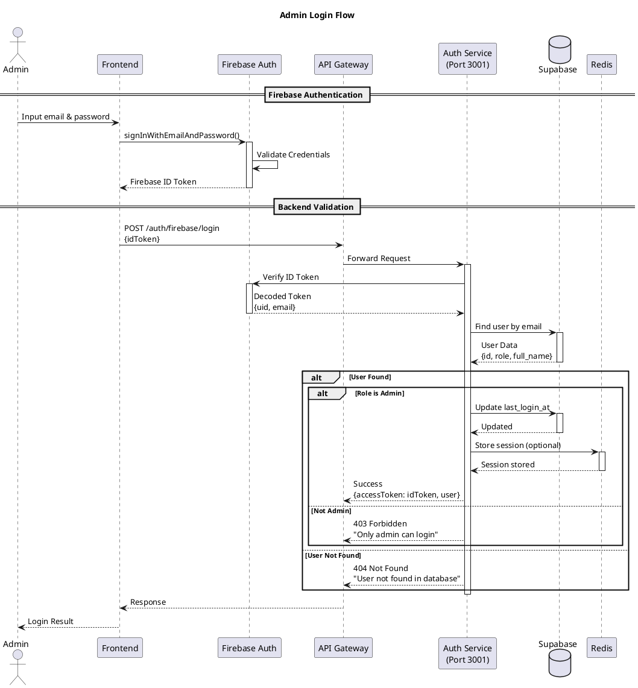

#### Mermaid

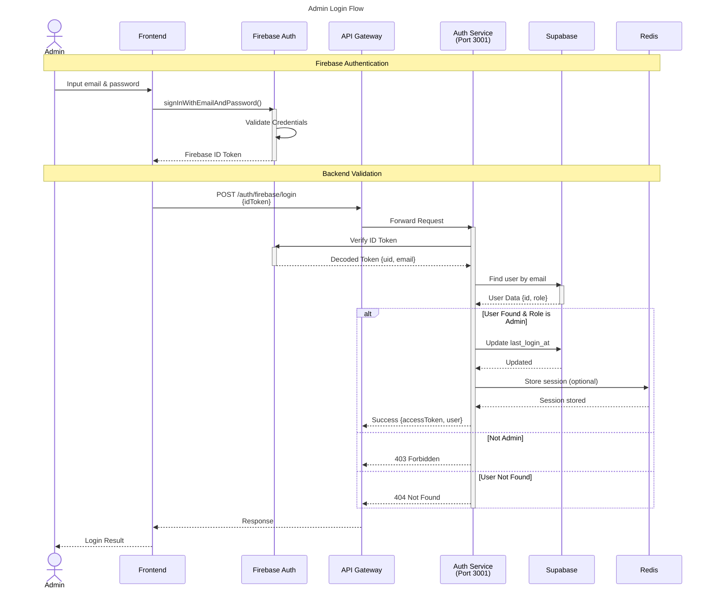

## 5. Sequence Diagram - Get Current User

### 5.1 Get Me Flow

Diagram ini menunjukkan alur untuk mendapatkan informasi user yang sedang login.

#### PlantUML

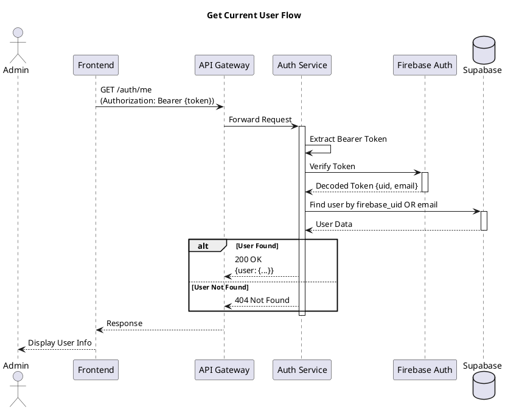

#### Mermaid

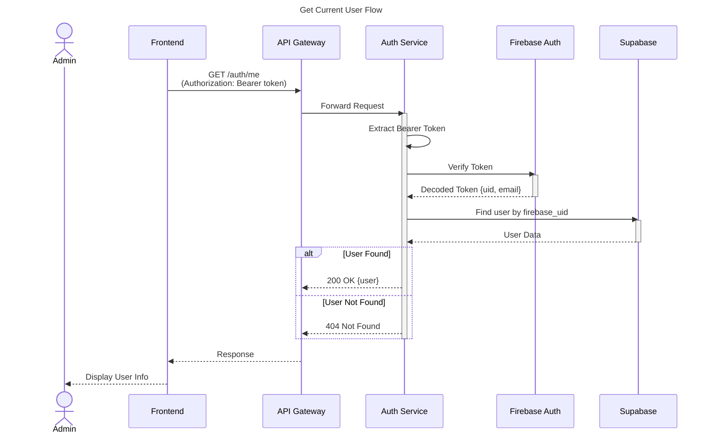

## 6. Sequence Diagram - Logout

### 6.1 Logout Flow

Diagram ini menunjukkan alur logout admin.

#### PlantUML

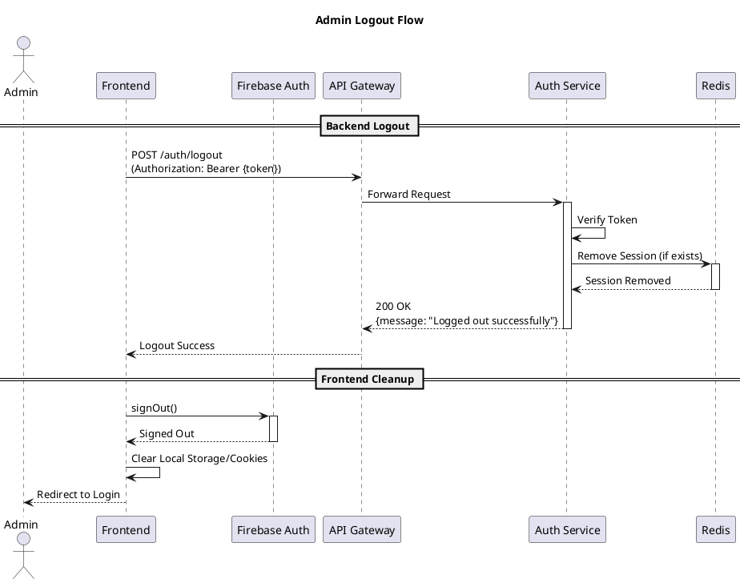

#### Mermaid

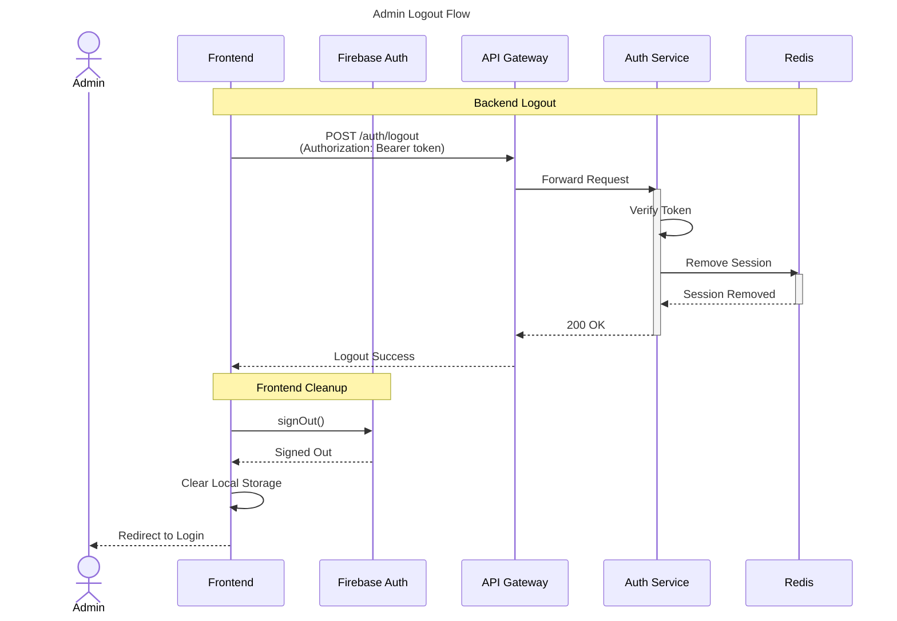

## 7. Sequence Diagram - Password Reset

### 7.1 Password Reset Flow

Diagram ini menunjukkan alur reset password melalui Firebase.

#### PlantUML

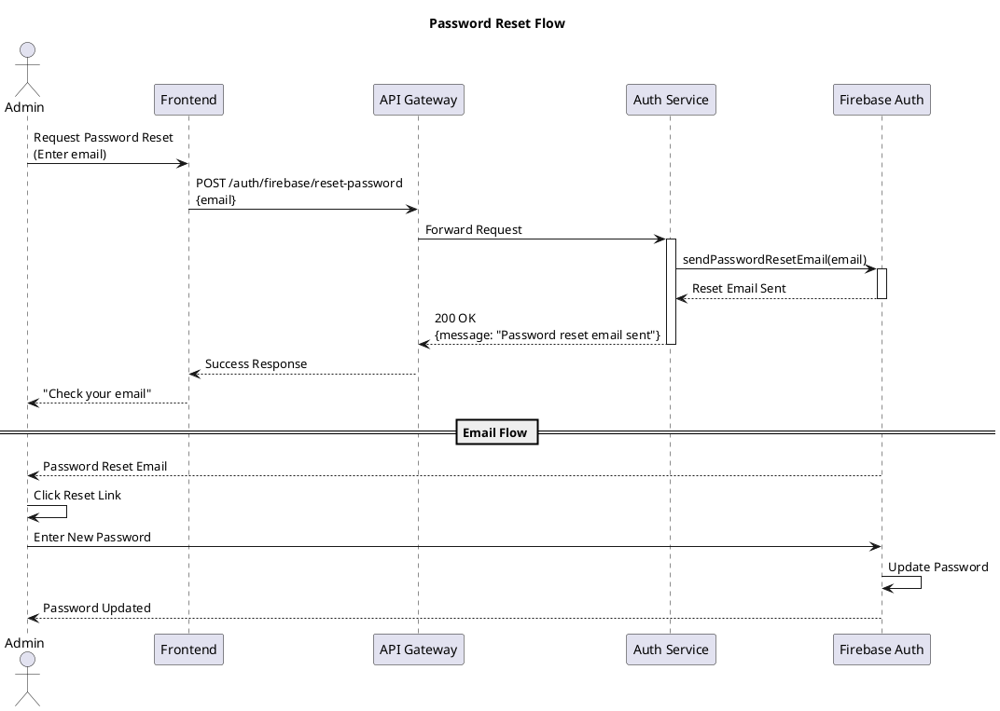

#### Mermaid

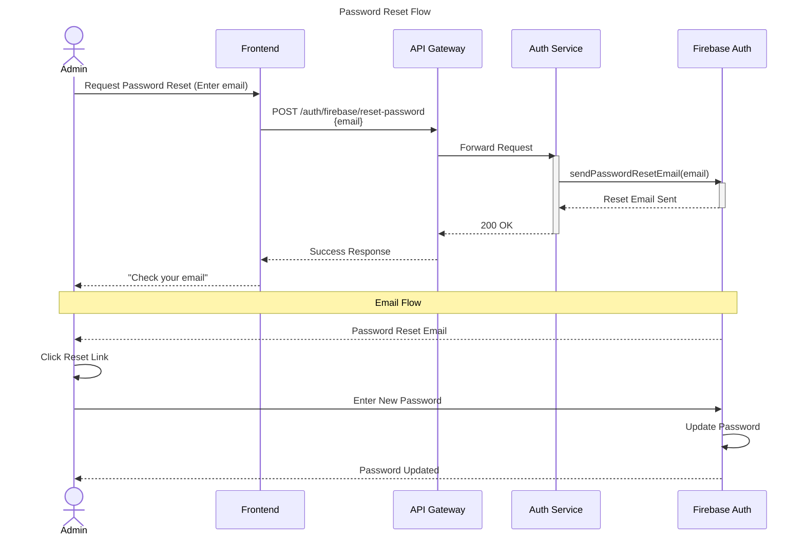

## 8. Error Handling

### 8.1 Authentication Error Flow

Diagram ini menunjukkan penanganan error saat autentikasi.

#### PlantUML

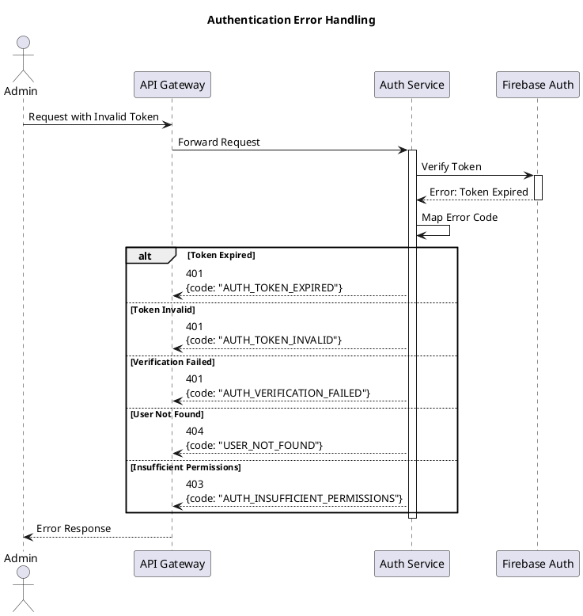

#### Mermaid

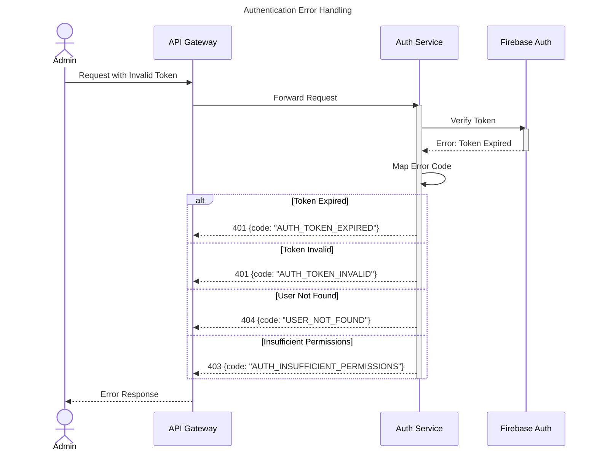

## 9. Endpoint Summary

### 9.1 Public Endpoints

| Method | Endpoint | Deskripsi |
|--------|----------|-----------|
| POST | /auth/register | Registrasi admin baru |
| POST | /auth/login | Login admin |
| POST | /auth/firebase/register | Registrasi via Firebase |
| POST | /auth/firebase/login | Login via Firebase |
| POST | /auth/firebase/reset-password | Request reset password |

### 9.2 Protected Endpoints

| Method | Endpoint | Deskripsi |
|--------|----------|-----------|
| GET | /auth/me | Get current user info |
| POST | /auth/logout | Logout user |

## 10. Data Flow Summary

```
Frontend → Firebase Auth → ID Token
     ↓
API Gateway → Auth Service → Firebase Verification
     ↓
Supabase (User Database) → User Data
     ↓
Response with Access Token
```
