# Sequence Diagram - Booking Service

## 1. Gambaran Umum

Booking Service adalah layanan untuk mengelola registrasi kursus dan booking jadwal di sistem Shema Music. Service ini berjalan pada Port 3008 dan bertanggung jawab untuk:

- **Course Registration**: Registrasi kursus oleh siswa (tanpa login)
- **Booking Management**: Pengelolaan booking (CRUD)
- **Availability Display**: Menampilkan ketersediaan instructor dan ruangan
- **Admin Booking Operations**: Konfirmasi, assign slot, dan pembatalan booking

## 2. Arsitektur Service

Booking Service menggunakan Supabase untuk database, Redis untuk idempotency check, dan Kafka untuk event publishing.

### 2.1 Access Control

| Endpoint | Access | Role Required |
|----------|--------|---------------|
| POST /register-course | Public | - |
| GET /available-instructors | Public | - |
| POST /validate-preferences | Public | - |
| GET /availability/* | Public | - |
| GET /bookings | Protected | Admin |
| POST /:id/confirm | Protected | Admin |
| POST /:id/cancel | Protected | User/Admin |
| GET /admin/bookings/pending | Protected | Admin |
| POST /admin/bookings/:id/assign-slot | Protected | Admin |

## 3. Sequence Diagram - Course Registration

### 3.1 Student Course Registration Flow

Diagram ini menunjukkan alur lengkap registrasi kursus oleh siswa (tanpa login).

#### PlantUML

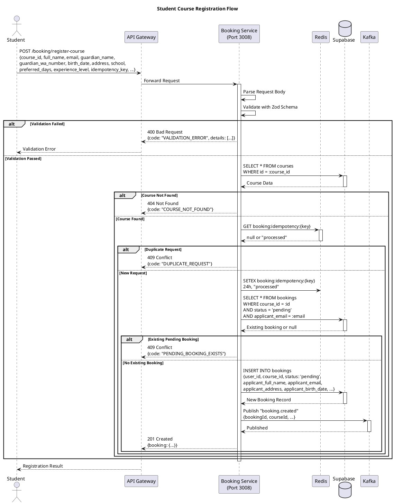
```plantuml
@startuml Course_Registration
title Student Course Registration Flow

actor Student
participant "API Gateway" as Gateway
participant "Booking Service\n(Port 3008)" as BookingSvc
participant "Redis" as Redis
database "Supabase" as DB
participant "Kafka" as Kafka

Student -> Gateway: POST /booking/register-course\n{course_id, full_name, email, guardian_name,\nguardian_wa_number, birth_date, address, school,\npreferred_days, experience_level, idempotency_key, ...}

Gateway -> BookingSvc: Forward Request
activate BookingSvc

BookingSvc -> BookingSvc: Parse Request Body

BookingSvc -> BookingSvc: Validate with Zod Schema

alt Validation Failed
    BookingSvc --> Gateway: 400 Bad Request\n{code: "VALIDATION_ERROR", details: [...]}
    Gateway --> Student: Validation Error
else Validation Passed

    BookingSvc -> DB: SELECT * FROM courses\nWHERE id = :course_id
    activate DB
    DB --> BookingSvc: Course Data
    deactivate DB
    
    alt Course Not Found
        BookingSvc --> Gateway: 404 Not Found\n{code: "COURSE_NOT_FOUND"}
    else Course Found
    
        BookingSvc -> Redis: GET booking:idempotency:{key}
        activate Redis
        Redis --> BookingSvc: null or "processed"
        deactivate Redis
        
        alt Duplicate Request
            BookingSvc --> Gateway: 409 Conflict\n{code: "DUPLICATE_REQUEST"}
        else New Request
        
            BookingSvc -> Redis: SETEX booking:idempotency:{key}\n24h, "processed"
            
            BookingSvc -> DB: SELECT * FROM bookings\nWHERE course_id = :id\nAND status = 'pending'\nAND applicant_email = :email
            activate DB
            DB --> BookingSvc: Existing booking or null
            deactivate DB
            
            alt Existing Pending Booking
                BookingSvc --> Gateway: 409 Conflict\n{code: "PENDING_BOOKING_EXISTS"}
            else No Existing Booking
            
                BookingSvc -> DB: INSERT INTO bookings\n{user_id, course_id, status: 'pending',\napplicant_full_name, applicant_email,\napplicant_address, applicant_birth_date, ...}
                activate DB
                DB --> BookingSvc: New Booking Record
                deactivate DB
                
                BookingSvc -> Kafka: Publish "booking.created"\n{bookingId, courseId, ...}
                activate Kafka
                Kafka --> BookingSvc: Published
                deactivate Kafka
                
                BookingSvc --> Gateway: 201 Created\n{booking: {...}}
            end
        end
    end
end

deactivate BookingSvc

Gateway --> Student: Registration Result

@enduml
```

#### Mermaid

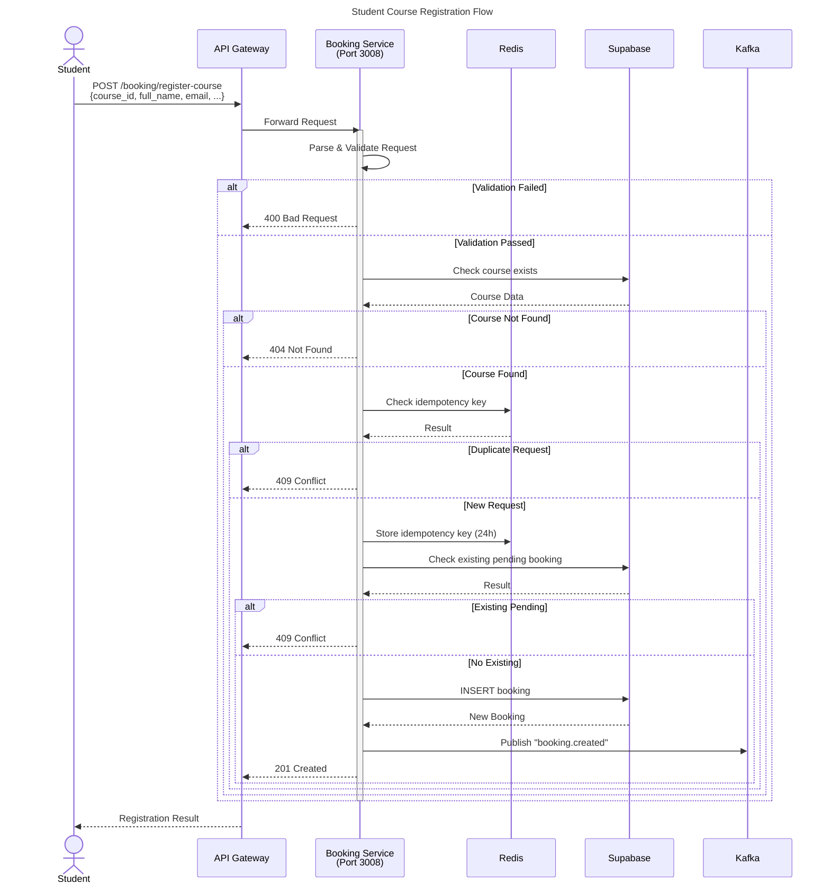
```mermaid
sequenceDiagram
    title Student Course Registration Flow
    
    actor Student
    participant Gateway as API Gateway
    participant BookingSvc as Booking Service<br/>(Port 3008)
    participant Redis as Redis
    participant DB as Supabase
    participant Kafka as Kafka
    
    Student->>Gateway: POST /booking/register-course<br/>{course_id, full_name, email, ...}
    
    Gateway->>BookingSvc: Forward Request
    activate BookingSvc
    
    BookingSvc->>BookingSvc: Parse & Validate Request
    
    alt Validation Failed
        BookingSvc-->>Gateway: 400 Bad Request
    else Validation Passed
        BookingSvc->>DB: Check course exists
        DB-->>BookingSvc: Course Data
        
        alt Course Not Found
            BookingSvc-->>Gateway: 404 Not Found
        else Course Found
            BookingSvc->>Redis: Check idempotency key
            Redis-->>BookingSvc: Result
            
            alt Duplicate Request
                BookingSvc-->>Gateway: 409 Conflict
            else New Request
                BookingSvc->>Redis: Store idempotency key (24h)
                
                BookingSvc->>DB: Check existing pending booking
                DB-->>BookingSvc: Result
                
                alt Existing Pending
                    BookingSvc-->>Gateway: 409 Conflict
                else No Existing
                    BookingSvc->>DB: INSERT booking
                    DB-->>BookingSvc: New Booking
                    
                    BookingSvc->>Kafka: Publish "booking.created"
                    
                    BookingSvc-->>Gateway: 201 Created
                end
            end
        end
    end
    
    deactivate BookingSvc
    
    Gateway-->>Student: Registration Result
```

## 4. Sequence Diagram - Get Bookings

### 4.1 Get All Bookings Flow (Admin)

Diagram ini menunjukkan alur pengambilan semua booking oleh admin.

#### PlantUML

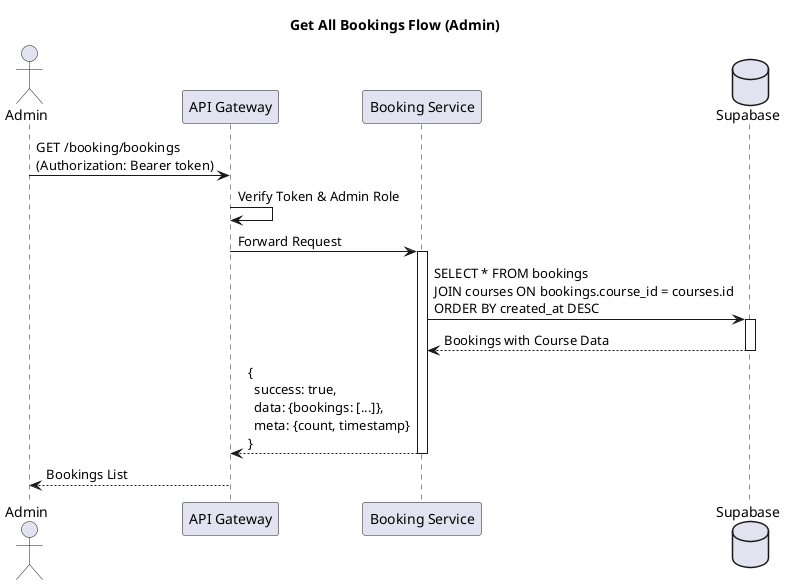
```plantuml
@startuml Get_Bookings
title Get All Bookings Flow (Admin)

actor Admin
participant "API Gateway" as Gateway
participant "Booking Service" as BookingSvc
database "Supabase" as DB

Admin -> Gateway: GET /booking/bookings\n(Authorization: Bearer token)
Gateway -> Gateway: Verify Token & Admin Role
Gateway -> BookingSvc: Forward Request
activate BookingSvc

BookingSvc -> DB: SELECT * FROM bookings\nJOIN courses ON bookings.course_id = courses.id\nORDER BY created_at DESC
activate DB
DB --> BookingSvc: Bookings with Course Data
deactivate DB

BookingSvc --> Gateway: {\n  success: true,\n  data: {bookings: [...]},\n  meta: {count, timestamp}\n}
deactivate BookingSvc

Gateway --> Admin: Bookings List

@enduml
```

#### Mermaid

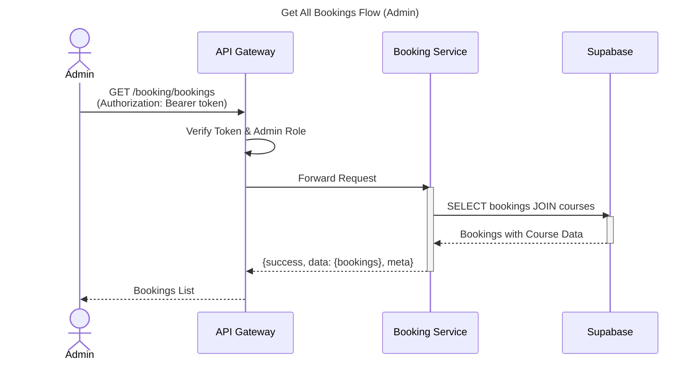
```mermaid
sequenceDiagram
    title Get All Bookings Flow (Admin)
    
    actor Admin
    participant Gateway as API Gateway
    participant BookingSvc as Booking Service
    participant DB as Supabase
    
    Admin->>Gateway: GET /booking/bookings<br/>(Authorization: Bearer token)
    Gateway->>Gateway: Verify Token & Admin Role
    Gateway->>BookingSvc: Forward Request
    activate BookingSvc
    
    BookingSvc->>DB: SELECT bookings JOIN courses
    activate DB
    DB-->>BookingSvc: Bookings with Course Data
    deactivate DB
    
    BookingSvc-->>Gateway: {success, data: {bookings}, meta}
    deactivate BookingSvc
    
    Gateway-->>Admin: Bookings List
```

### 4.2 Get User Bookings Flow

Diagram ini menunjukkan alur pengambilan booking untuk user tertentu.

#### PlantUML

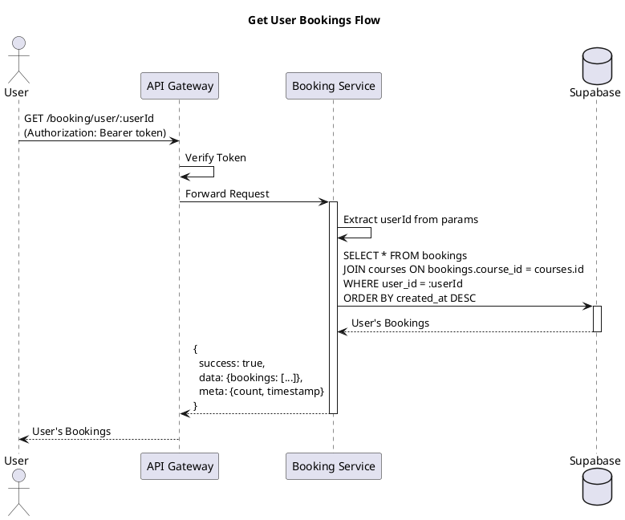
```plantuml
@startuml Get_User_Bookings
title Get User Bookings Flow

actor User
participant "API Gateway" as Gateway
participant "Booking Service" as BookingSvc
database "Supabase" as DB

User -> Gateway: GET /booking/user/:userId\n(Authorization: Bearer token)
Gateway -> Gateway: Verify Token
Gateway -> BookingSvc: Forward Request
activate BookingSvc

BookingSvc -> BookingSvc: Extract userId from params

BookingSvc -> DB: SELECT * FROM bookings\nJOIN courses ON bookings.course_id = courses.id\nWHERE user_id = :userId\nORDER BY created_at DESC
activate DB
DB --> BookingSvc: User's Bookings
deactivate DB

BookingSvc --> Gateway: {\n  success: true,\n  data: {bookings: [...]},\n  meta: {count, timestamp}\n}
deactivate BookingSvc

Gateway --> User: User's Bookings

@enduml
```

#### Mermaid

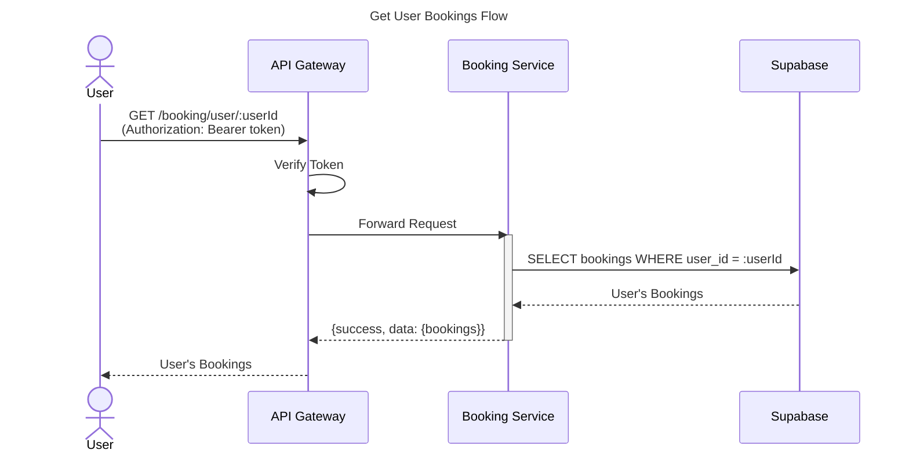
```mermaid
sequenceDiagram
    title Get User Bookings Flow
    
    actor User
    participant Gateway as API Gateway
    participant BookingSvc as Booking Service
    participant DB as Supabase
    
    User->>Gateway: GET /booking/user/:userId<br/>(Authorization: Bearer token)
    Gateway->>Gateway: Verify Token
    Gateway->>BookingSvc: Forward Request
    activate BookingSvc
    
    BookingSvc->>DB: SELECT bookings WHERE user_id = :userId
    DB-->>BookingSvc: User's Bookings
    
    BookingSvc-->>Gateway: {success, data: {bookings}}
    deactivate BookingSvc
    
    Gateway-->>User: User's Bookings
```

## 5. Sequence Diagram - Confirm Booking

### 5.1 Confirm Booking Flow (Admin)

Diagram ini menunjukkan alur konfirmasi booking oleh admin.

#### PlantUML

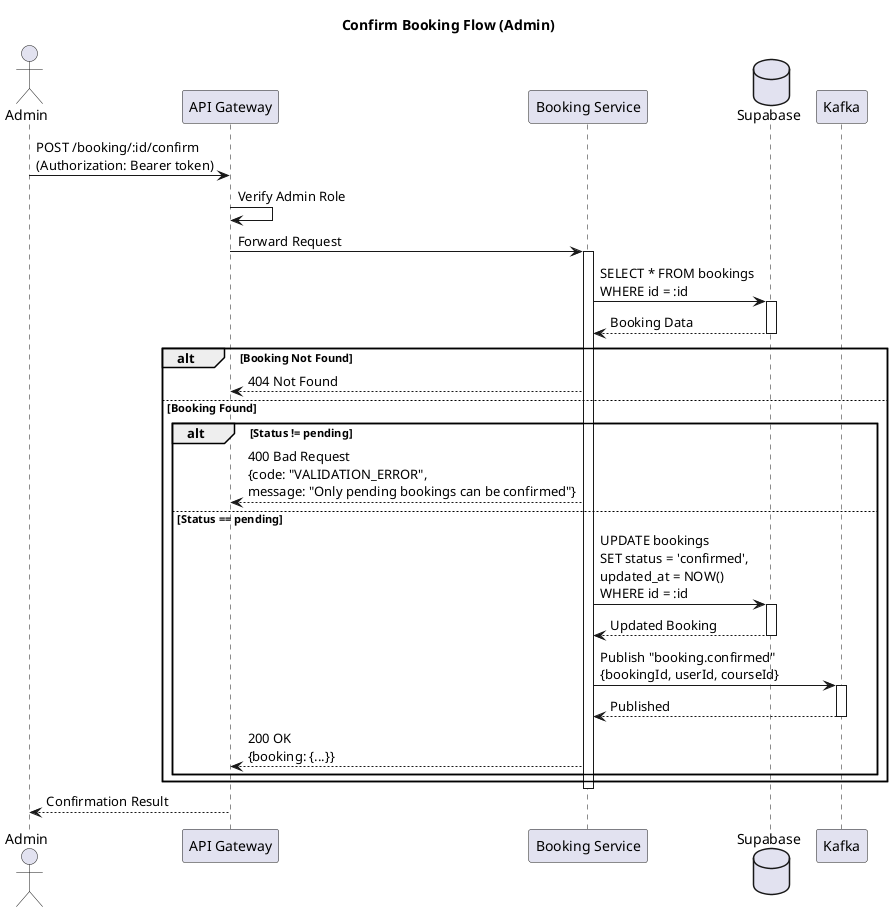
```plantuml
@startuml Confirm_Booking
title Confirm Booking Flow (Admin)

actor Admin
participant "API Gateway" as Gateway
participant "Booking Service" as BookingSvc
database "Supabase" as DB
participant "Kafka" as Kafka

Admin -> Gateway: POST /booking/:id/confirm\n(Authorization: Bearer token)
Gateway -> Gateway: Verify Admin Role
Gateway -> BookingSvc: Forward Request
activate BookingSvc

BookingSvc -> DB: SELECT * FROM bookings\nWHERE id = :id
activate DB
DB --> BookingSvc: Booking Data
deactivate DB

alt Booking Not Found
    BookingSvc --> Gateway: 404 Not Found
else Booking Found
    alt Status != pending
        BookingSvc --> Gateway: 400 Bad Request\n{code: "VALIDATION_ERROR",\nmessage: "Only pending bookings can be confirmed"}
    else Status == pending
        BookingSvc -> DB: UPDATE bookings\nSET status = 'confirmed',\nupdated_at = NOW()\nWHERE id = :id
        activate DB
        DB --> BookingSvc: Updated Booking
        deactivate DB
        
        BookingSvc -> Kafka: Publish "booking.confirmed"\n{bookingId, userId, courseId}
        activate Kafka
        Kafka --> BookingSvc: Published
        deactivate Kafka
        
        BookingSvc --> Gateway: 200 OK\n{booking: {...}}
    end
end

deactivate BookingSvc

Gateway --> Admin: Confirmation Result

@enduml
```

#### Mermaid

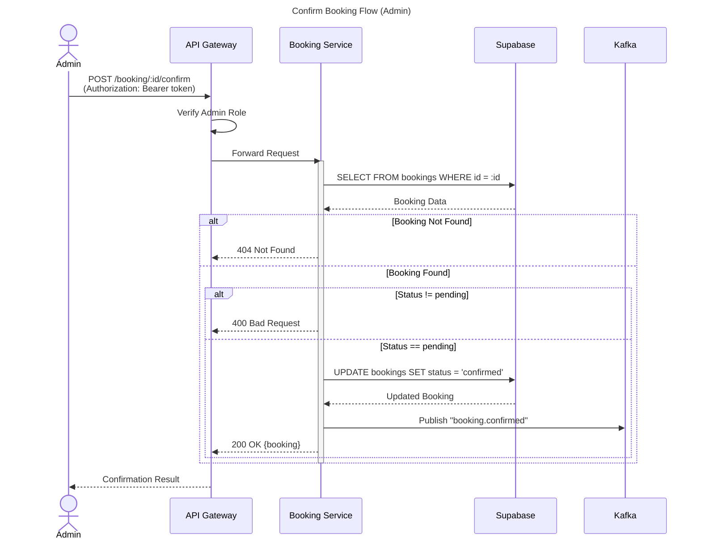
```mermaid
sequenceDiagram
    title Confirm Booking Flow (Admin)
    
    actor Admin
    participant Gateway as API Gateway
    participant BookingSvc as Booking Service
    participant DB as Supabase
    participant Kafka as Kafka
    
    Admin->>Gateway: POST /booking/:id/confirm<br/>(Authorization: Bearer token)
    Gateway->>Gateway: Verify Admin Role
    Gateway->>BookingSvc: Forward Request
    activate BookingSvc
    
    BookingSvc->>DB: SELECT FROM bookings WHERE id = :id
    DB-->>BookingSvc: Booking Data
    
    alt Booking Not Found
        BookingSvc-->>Gateway: 404 Not Found
    else Booking Found
        alt Status != pending
            BookingSvc-->>Gateway: 400 Bad Request
        else Status == pending
            BookingSvc->>DB: UPDATE bookings SET status = 'confirmed'
            DB-->>BookingSvc: Updated Booking
            
            BookingSvc->>Kafka: Publish "booking.confirmed"
            
            BookingSvc-->>Gateway: 200 OK {booking}
        end
    end
    
    deactivate BookingSvc
    
    Gateway-->>Admin: Confirmation Result
```

## 6. Sequence Diagram - Cancel Booking

### 6.1 Cancel Booking Flow (User/Admin)

Diagram ini menunjukkan alur pembatalan booking dengan validasi permission.

#### PlantUML

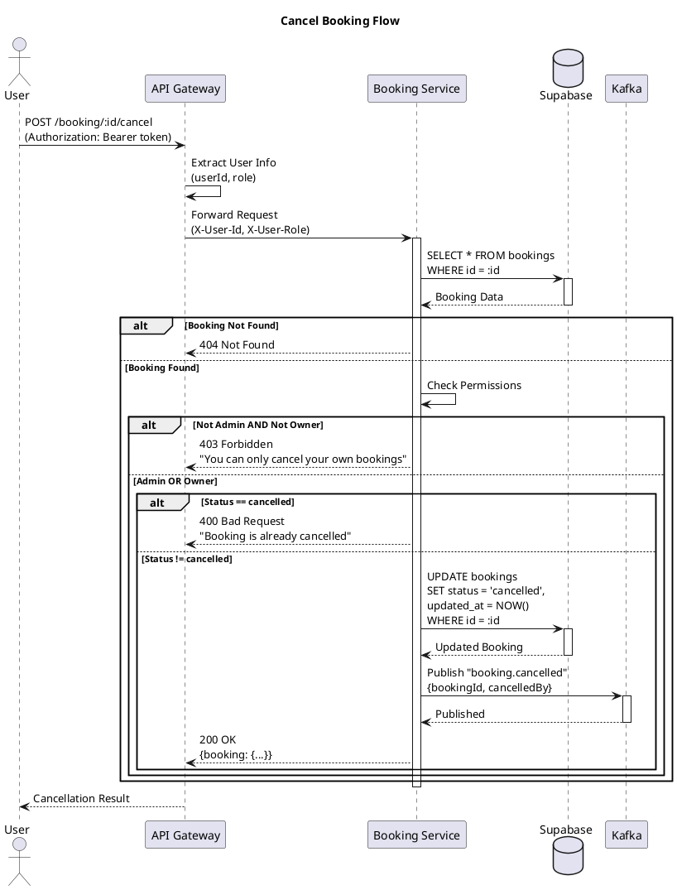
```plantuml
@startuml Cancel_Booking
title Cancel Booking Flow

actor User
participant "API Gateway" as Gateway
participant "Booking Service" as BookingSvc
database "Supabase" as DB
participant "Kafka" as Kafka

User -> Gateway: POST /booking/:id/cancel\n(Authorization: Bearer token)
Gateway -> Gateway: Extract User Info\n(userId, role)
Gateway -> BookingSvc: Forward Request\n(X-User-Id, X-User-Role)
activate BookingSvc

BookingSvc -> DB: SELECT * FROM bookings\nWHERE id = :id
activate DB
DB --> BookingSvc: Booking Data
deactivate DB

alt Booking Not Found
    BookingSvc --> Gateway: 404 Not Found
else Booking Found
    BookingSvc -> BookingSvc: Check Permissions
    
    alt Not Admin AND Not Owner
        BookingSvc --> Gateway: 403 Forbidden\n"You can only cancel your own bookings"
    else Admin OR Owner
        alt Status == cancelled
            BookingSvc --> Gateway: 400 Bad Request\n"Booking is already cancelled"
        else Status != cancelled
            BookingSvc -> DB: UPDATE bookings\nSET status = 'cancelled',\nupdated_at = NOW()\nWHERE id = :id
            activate DB
            DB --> BookingSvc: Updated Booking
            deactivate DB
            
            BookingSvc -> Kafka: Publish "booking.cancelled"\n{bookingId, cancelledBy}
            activate Kafka
            Kafka --> BookingSvc: Published
            deactivate Kafka
            
            BookingSvc --> Gateway: 200 OK\n{booking: {...}}
        end
    end
end

deactivate BookingSvc

Gateway --> User: Cancellation Result

@enduml
```

#### Mermaid

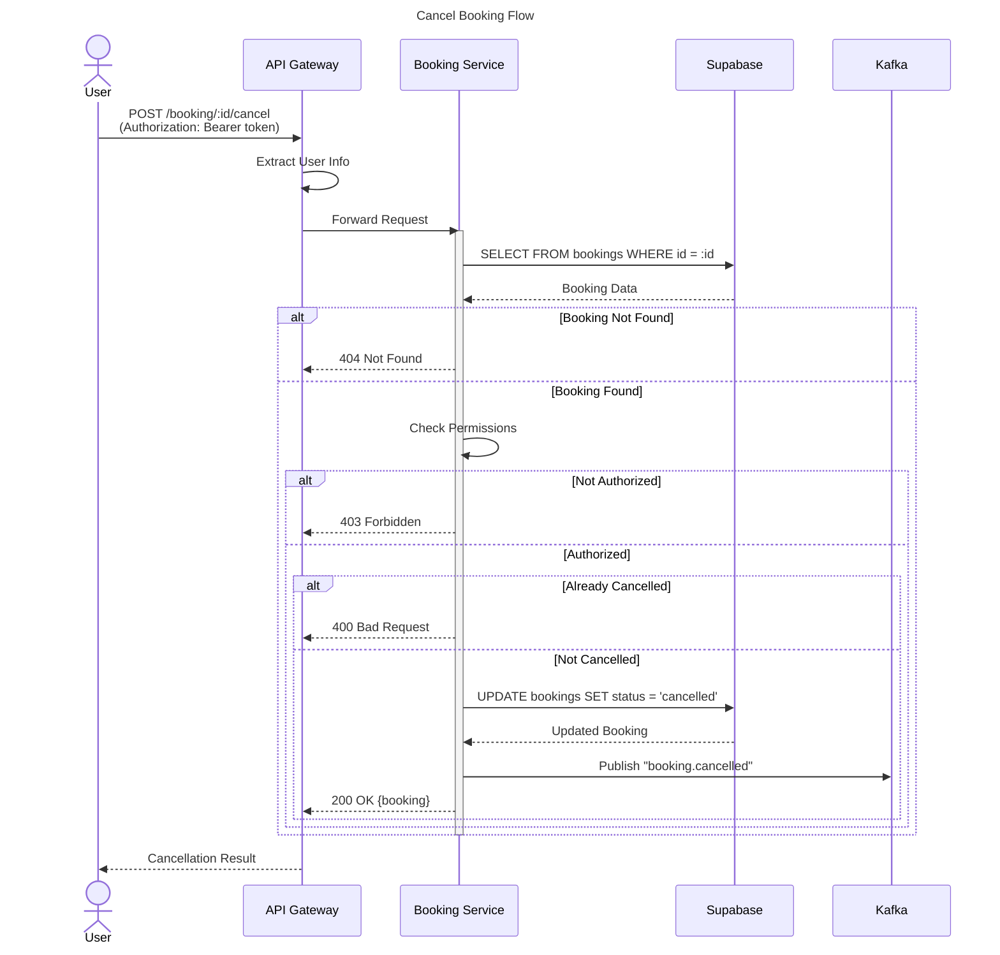
```mermaid
sequenceDiagram
    title Cancel Booking Flow
    
    actor User
    participant Gateway as API Gateway
    participant BookingSvc as Booking Service
    participant DB as Supabase
    participant Kafka as Kafka
    
    User->>Gateway: POST /booking/:id/cancel<br/>(Authorization: Bearer token)
    Gateway->>Gateway: Extract User Info
    Gateway->>BookingSvc: Forward Request
    activate BookingSvc
    
    BookingSvc->>DB: SELECT FROM bookings WHERE id = :id
    DB-->>BookingSvc: Booking Data
    
    alt Booking Not Found
        BookingSvc-->>Gateway: 404 Not Found
    else Booking Found
        BookingSvc->>BookingSvc: Check Permissions
        
        alt Not Authorized
            BookingSvc-->>Gateway: 403 Forbidden
        else Authorized
            alt Already Cancelled
                BookingSvc-->>Gateway: 400 Bad Request
            else Not Cancelled
                BookingSvc->>DB: UPDATE bookings SET status = 'cancelled'
                DB-->>BookingSvc: Updated Booking
                
                BookingSvc->>Kafka: Publish "booking.cancelled"
                
                BookingSvc-->>Gateway: 200 OK {booking}
            end
        end
    end
    
    deactivate BookingSvc
    
    Gateway-->>User: Cancellation Result
```

## 7. Sequence Diagram - Admin Assign Slot

### 7.1 Assign Time Slot Flow

Diagram ini menunjukkan alur penugasan slot jadwal ke booking oleh admin.

#### PlantUML

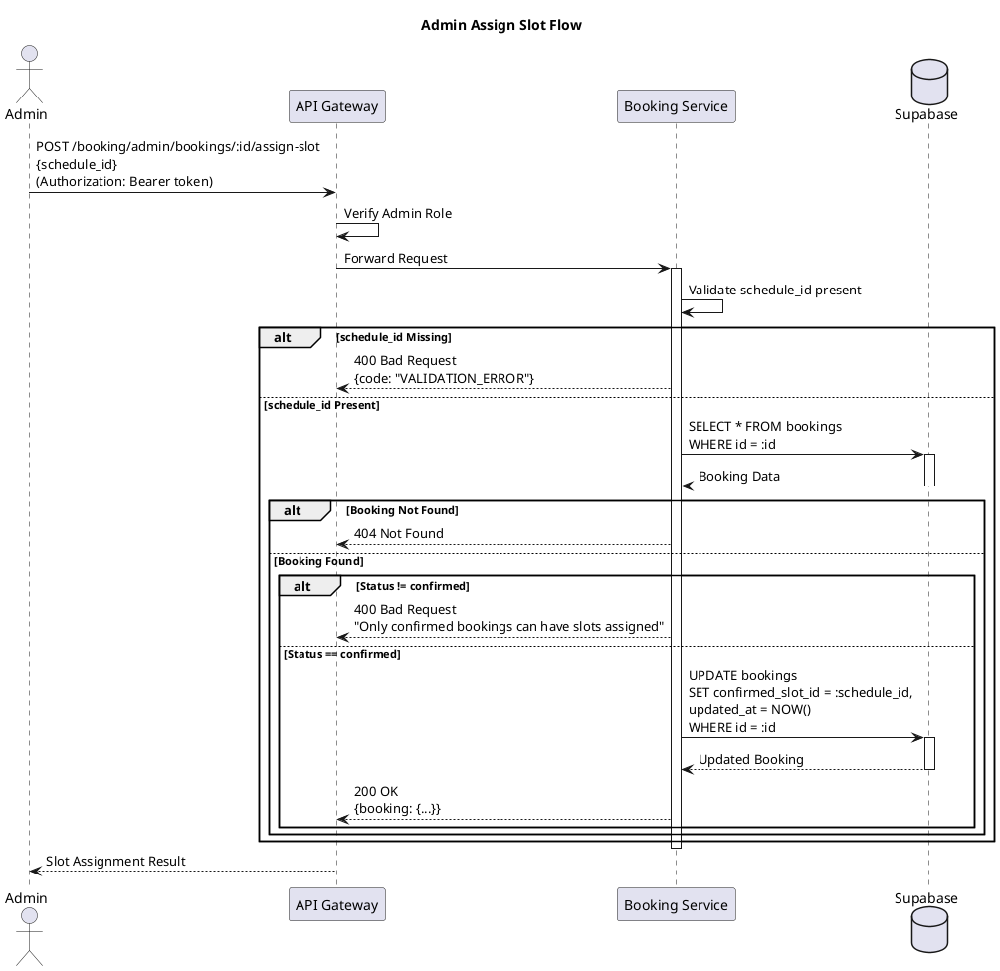
```plantuml
@startuml Assign_Slot
title Admin Assign Slot Flow

actor Admin
participant "API Gateway" as Gateway
participant "Booking Service" as BookingSvc
database "Supabase" as DB

Admin -> Gateway: POST /booking/admin/bookings/:id/assign-slot\n{schedule_id}\n(Authorization: Bearer token)
Gateway -> Gateway: Verify Admin Role
Gateway -> BookingSvc: Forward Request
activate BookingSvc

BookingSvc -> BookingSvc: Validate schedule_id present

alt schedule_id Missing
    BookingSvc --> Gateway: 400 Bad Request\n{code: "VALIDATION_ERROR"}
else schedule_id Present

    BookingSvc -> DB: SELECT * FROM bookings\nWHERE id = :id
    activate DB
    DB --> BookingSvc: Booking Data
    deactivate DB
    
    alt Booking Not Found
        BookingSvc --> Gateway: 404 Not Found
    else Booking Found
        alt Status != confirmed
            BookingSvc --> Gateway: 400 Bad Request\n"Only confirmed bookings can have slots assigned"
        else Status == confirmed
            BookingSvc -> DB: UPDATE bookings\nSET confirmed_slot_id = :schedule_id,\nupdated_at = NOW()\nWHERE id = :id
            activate DB
            DB --> BookingSvc: Updated Booking
            deactivate DB
            
            BookingSvc --> Gateway: 200 OK\n{booking: {...}}
        end
    end
end

deactivate BookingSvc

Gateway --> Admin: Slot Assignment Result

@enduml
```

#### Mermaid

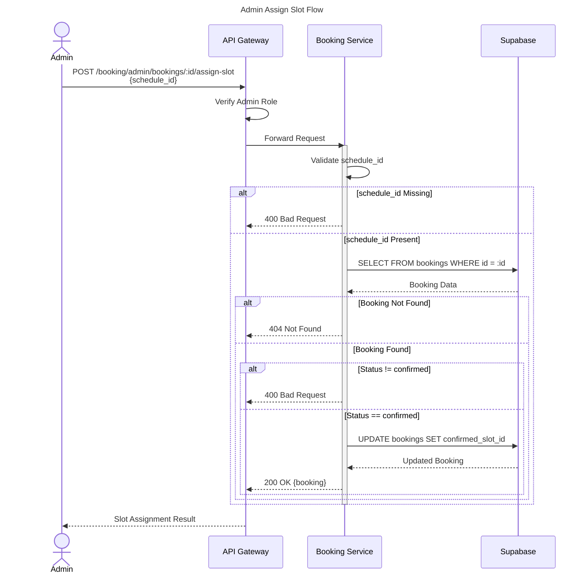
```mermaid
sequenceDiagram
    title Admin Assign Slot Flow
    
    actor Admin
    participant Gateway as API Gateway
    participant BookingSvc as Booking Service
    participant DB as Supabase
    
    Admin->>Gateway: POST /booking/admin/bookings/:id/assign-slot<br/>{schedule_id}
    Gateway->>Gateway: Verify Admin Role
    Gateway->>BookingSvc: Forward Request
    activate BookingSvc
    
    BookingSvc->>BookingSvc: Validate schedule_id
    
    alt schedule_id Missing
        BookingSvc-->>Gateway: 400 Bad Request
    else schedule_id Present
        BookingSvc->>DB: SELECT FROM bookings WHERE id = :id
        DB-->>BookingSvc: Booking Data
        
        alt Booking Not Found
            BookingSvc-->>Gateway: 404 Not Found
        else Booking Found
            alt Status != confirmed
                BookingSvc-->>Gateway: 400 Bad Request
            else Status == confirmed
                BookingSvc->>DB: UPDATE bookings SET confirmed_slot_id
                DB-->>BookingSvc: Updated Booking
                BookingSvc-->>Gateway: 200 OK {booking}
            end
        end
    end
    
    deactivate BookingSvc
    
    Gateway-->>Admin: Slot Assignment Result
```

## 8. Sequence Diagram - Get Available Instructors

### 8.1 Get Available Instructors Flow

Diagram ini menunjukkan alur pengambilan daftar instructor yang tersedia.

#### PlantUML

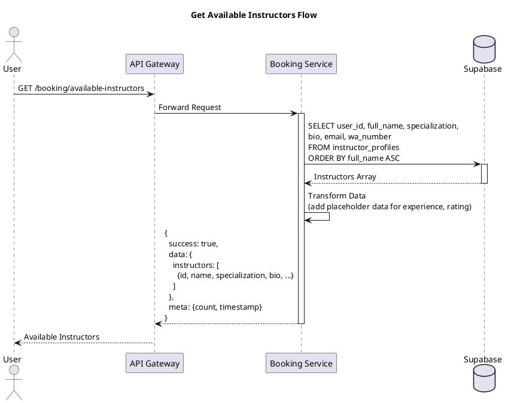
```plantuml
@startuml Get_Available_Instructors
title Get Available Instructors Flow

actor User
participant "API Gateway" as Gateway
participant "Booking Service" as BookingSvc
database "Supabase" as DB

User -> Gateway: GET /booking/available-instructors
Gateway -> BookingSvc: Forward Request
activate BookingSvc

BookingSvc -> DB: SELECT user_id, full_name, specialization,\nbio, email, wa_number\nFROM instructor_profiles\nORDER BY full_name ASC
activate DB
DB --> BookingSvc: Instructors Array
deactivate DB

BookingSvc -> BookingSvc: Transform Data\n(add placeholder data for experience, rating)

BookingSvc --> Gateway: {\n  success: true,\n  data: {\n    instructors: [\n      {id, name, specialization, bio, ...}\n    ]\n  },\n  meta: {count, timestamp}\n}
deactivate BookingSvc

Gateway --> User: Available Instructors

@enduml
```

#### Mermaid

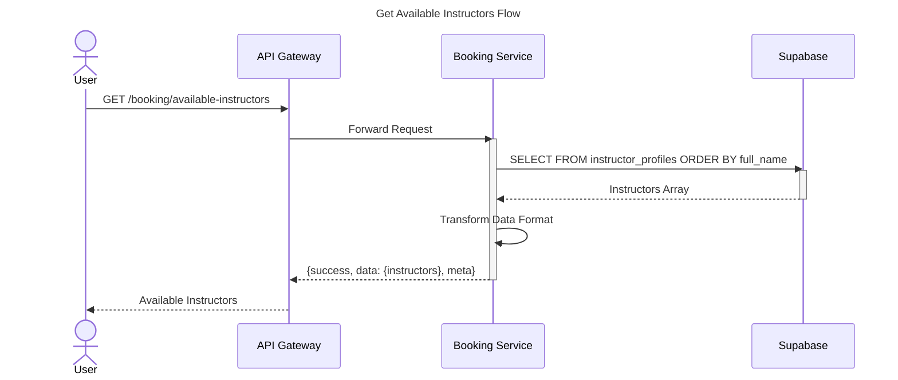
```mermaid
sequenceDiagram
    title Get Available Instructors Flow
    
    actor User
    participant Gateway as API Gateway
    participant BookingSvc as Booking Service
    participant DB as Supabase
    
    User->>Gateway: GET /booking/available-instructors
    Gateway->>BookingSvc: Forward Request
    activate BookingSvc
    
    BookingSvc->>DB: SELECT FROM instructor_profiles ORDER BY full_name
    activate DB
    DB-->>BookingSvc: Instructors Array
    deactivate DB
    
    BookingSvc->>BookingSvc: Transform Data Format
    
    BookingSvc-->>Gateway: {success, data: {instructors}, meta}
    deactivate BookingSvc
    
    Gateway-->>User: Available Instructors
```

## 9. Sequence Diagram - Availability Display

### 9.1 Get Instructor Availability Flow

Diagram ini menunjukkan alur pengambilan ketersediaan instructor.

#### PlantUML

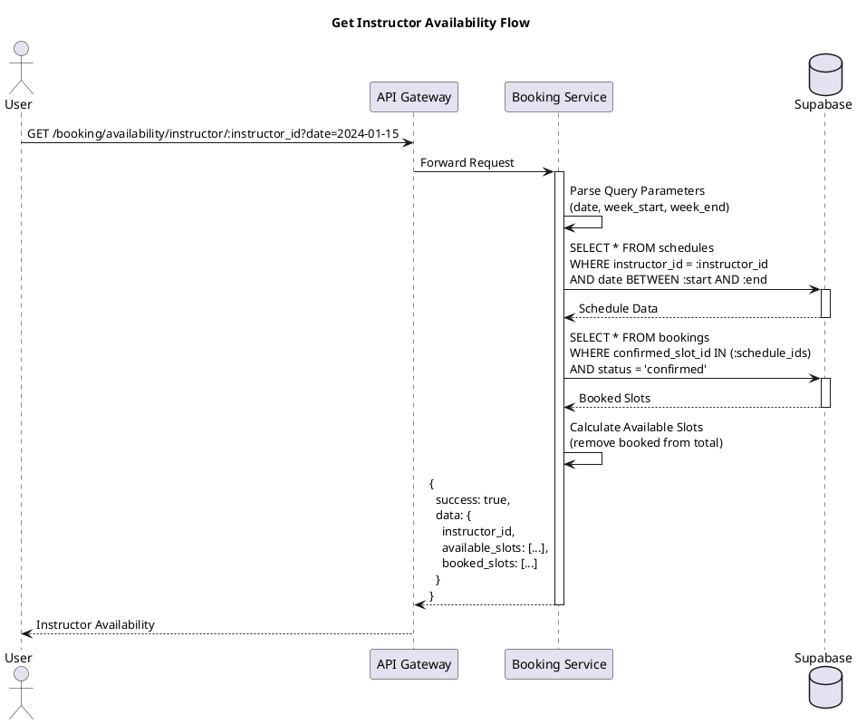
```plantuml
@startuml Instructor_Availability
title Get Instructor Availability Flow

actor User
participant "API Gateway" as Gateway
participant "Booking Service" as BookingSvc
database "Supabase" as DB

User -> Gateway: GET /booking/availability/instructor/:instructor_id?date=2024-01-15
Gateway -> BookingSvc: Forward Request
activate BookingSvc

BookingSvc -> BookingSvc: Parse Query Parameters\n(date, week_start, week_end)

BookingSvc -> DB: SELECT * FROM schedules\nWHERE instructor_id = :instructor_id\nAND date BETWEEN :start AND :end
activate DB
DB --> BookingSvc: Schedule Data
deactivate DB

BookingSvc -> DB: SELECT * FROM bookings\nWHERE confirmed_slot_id IN (:schedule_ids)\nAND status = 'confirmed'
activate DB
DB --> BookingSvc: Booked Slots
deactivate DB

BookingSvc -> BookingSvc: Calculate Available Slots\n(remove booked from total)

BookingSvc --> Gateway: {\n  success: true,\n  data: {\n    instructor_id,\n    available_slots: [...],\n    booked_slots: [...]\n  }\n}
deactivate BookingSvc

Gateway --> User: Instructor Availability

@enduml
```

#### Mermaid

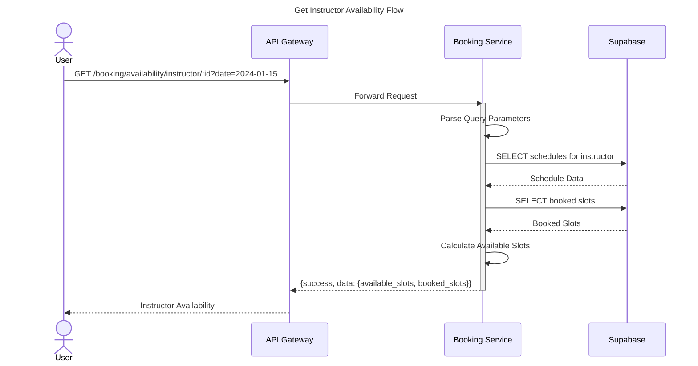
```mermaid
sequenceDiagram
    title Get Instructor Availability Flow
    
    actor User
    participant Gateway as API Gateway
    participant BookingSvc as Booking Service
    participant DB as Supabase
    
    User->>Gateway: GET /booking/availability/instructor/:id?date=2024-01-15
    Gateway->>BookingSvc: Forward Request
    activate BookingSvc
    
    BookingSvc->>BookingSvc: Parse Query Parameters
    
    BookingSvc->>DB: SELECT schedules for instructor
    DB-->>BookingSvc: Schedule Data
    
    BookingSvc->>DB: SELECT booked slots
    DB-->>BookingSvc: Booked Slots
    
    BookingSvc->>BookingSvc: Calculate Available Slots
    
    BookingSvc-->>Gateway: {success, data: {available_slots, booked_slots}}
    deactivate BookingSvc
    
    Gateway-->>User: Instructor Availability
```

### 9.2 Find Available Slots Flow

Diagram ini menunjukkan alur pencarian slot yang tersedia berdasarkan filter.

#### PlantUML

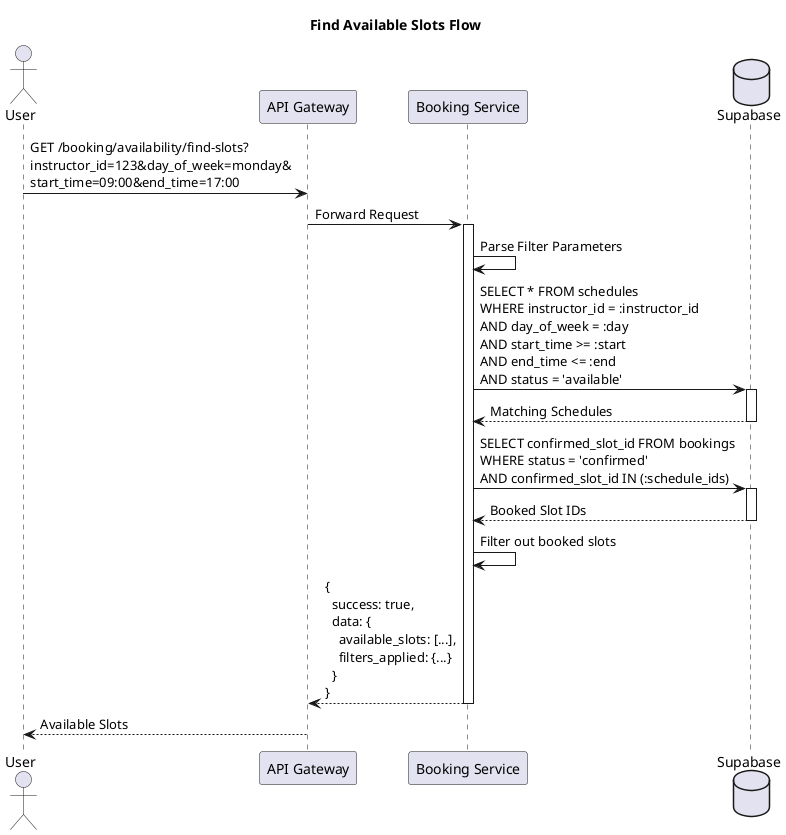
```plantuml
@startuml Find_Available_Slots
title Find Available Slots Flow

actor User
participant "API Gateway" as Gateway
participant "Booking Service" as BookingSvc
database "Supabase" as DB

User -> Gateway: GET /booking/availability/find-slots?\ninstructor_id=123&day_of_week=monday&\nstart_time=09:00&end_time=17:00
Gateway -> BookingSvc: Forward Request
activate BookingSvc

BookingSvc -> BookingSvc: Parse Filter Parameters

BookingSvc -> DB: SELECT * FROM schedules\nWHERE instructor_id = :instructor_id\nAND day_of_week = :day\nAND start_time >= :start\nAND end_time <= :end\nAND status = 'available'
activate DB
DB --> BookingSvc: Matching Schedules
deactivate DB

BookingSvc -> DB: SELECT confirmed_slot_id FROM bookings\nWHERE status = 'confirmed'\nAND confirmed_slot_id IN (:schedule_ids)
activate DB
DB --> BookingSvc: Booked Slot IDs
deactivate DB

BookingSvc -> BookingSvc: Filter out booked slots

BookingSvc --> Gateway: {\n  success: true,\n  data: {\n    available_slots: [...],\n    filters_applied: {...}\n  }\n}
deactivate BookingSvc

Gateway --> User: Available Slots

@enduml
```

#### Mermaid

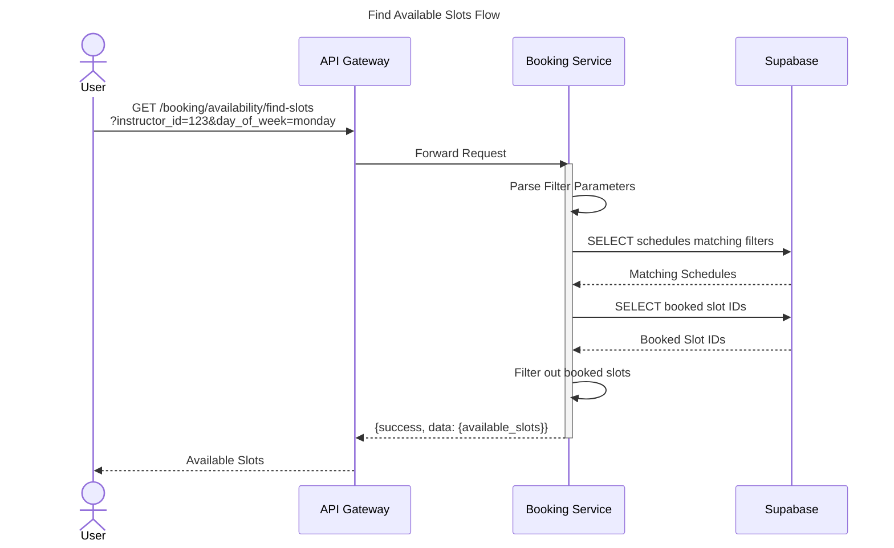
```mermaid
sequenceDiagram
    title Find Available Slots Flow
    
    actor User
    participant Gateway as API Gateway
    participant BookingSvc as Booking Service
    participant DB as Supabase
    
    User->>Gateway: GET /booking/availability/find-slots<br/>?instructor_id=123&day_of_week=monday
    Gateway->>BookingSvc: Forward Request
    activate BookingSvc
    
    BookingSvc->>BookingSvc: Parse Filter Parameters
    
    BookingSvc->>DB: SELECT schedules matching filters
    DB-->>BookingSvc: Matching Schedules
    
    BookingSvc->>DB: SELECT booked slot IDs
    DB-->>BookingSvc: Booked Slot IDs
    
    BookingSvc->>BookingSvc: Filter out booked slots
    
    BookingSvc-->>Gateway: {success, data: {available_slots}}
    deactivate BookingSvc
    
    Gateway-->>User: Available Slots
```

## 10. Sequence Diagram - Validate Preferences

### 10.1 Validate Student Preferences Flow

Diagram ini menunjukkan alur validasi preferensi siswa sebelum registrasi.

#### PlantUML

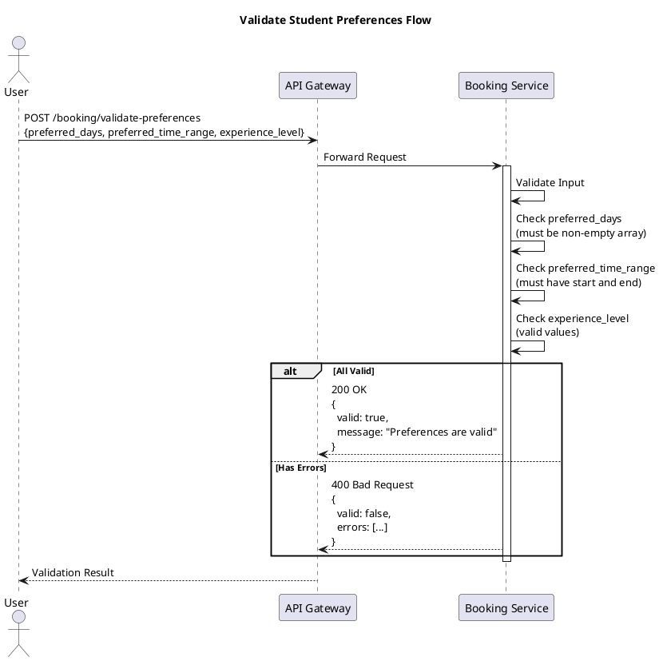
```plantuml
@startuml Validate_Preferences
title Validate Student Preferences Flow

actor User
participant "API Gateway" as Gateway
participant "Booking Service" as BookingSvc

User -> Gateway: POST /booking/validate-preferences\n{preferred_days, preferred_time_range, experience_level}
Gateway -> BookingSvc: Forward Request
activate BookingSvc

BookingSvc -> BookingSvc: Validate Input

BookingSvc -> BookingSvc: Check preferred_days\n(must be non-empty array)

BookingSvc -> BookingSvc: Check preferred_time_range\n(must have start and end)

BookingSvc -> BookingSvc: Check experience_level\n(valid values)

alt All Valid
    BookingSvc --> Gateway: 200 OK\n{\n  valid: true,\n  message: "Preferences are valid"\n}
else Has Errors
    BookingSvc --> Gateway: 400 Bad Request\n{\n  valid: false,\n  errors: [...]\n}
end

deactivate BookingSvc

Gateway --> User: Validation Result

@enduml
```

#### Mermaid

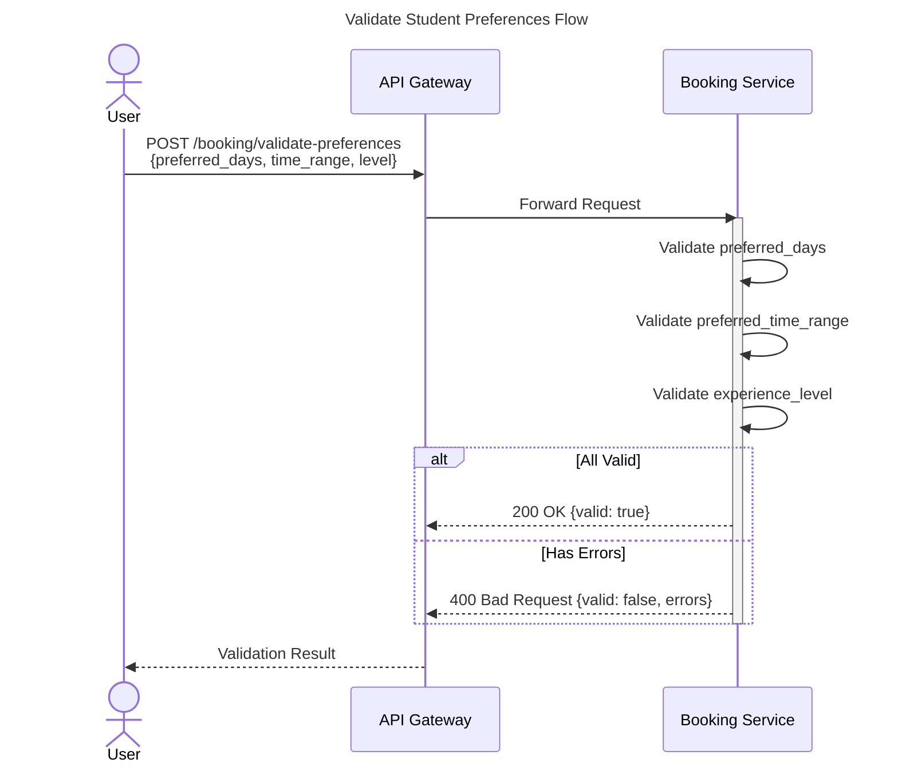
```mermaid
sequenceDiagram
    title Validate Student Preferences Flow
    
    actor User
    participant Gateway as API Gateway
    participant BookingSvc as Booking Service
    
    User->>Gateway: POST /booking/validate-preferences<br/>{preferred_days, time_range, level}
    Gateway->>BookingSvc: Forward Request
    activate BookingSvc
    
    BookingSvc->>BookingSvc: Validate preferred_days
    BookingSvc->>BookingSvc: Validate preferred_time_range
    BookingSvc->>BookingSvc: Validate experience_level
    
    alt All Valid
        BookingSvc-->>Gateway: 200 OK {valid: true}
    else Has Errors
        BookingSvc-->>Gateway: 400 Bad Request {valid: false, errors}
    end
    
    deactivate BookingSvc
    
    Gateway-->>User: Validation Result
```

## 11. Endpoint Summary

### 11.1 Public Endpoints

| Method | Endpoint | Deskripsi |
|--------|----------|-----------|
| POST | /booking/register-course | Registrasi kursus |
| GET | /booking/available-instructors | Daftar instructor |
| POST | /booking/validate-preferences | Validasi preferensi |
| GET | /booking/availability/instructor/:id | Ketersediaan instructor |
| GET | /booking/availability/room/:id | Ketersediaan ruangan |
| GET | /booking/availability/calendar | Kalender ketersediaan |
| GET | /booking/availability/find-slots | Cari slot tersedia |

### 11.2 Protected Endpoints

| Method | Endpoint | Role | Deskripsi |
|--------|----------|------|-----------|
| GET | /booking/bookings | Admin | List semua booking |
| GET | /booking/bookings/:id | User | Detail booking |
| GET | /booking/user/:userId | User | Booking user |
| POST | /booking/:id/confirm | Admin | Konfirmasi booking |
| POST | /booking/:id/cancel | User/Admin | Batalkan booking |
| GET | /booking/admin/bookings/pending | Admin | Booking pending |
| POST | /booking/admin/bookings/:id/assign-slot | Admin | Assign slot |
| POST | /booking/admin/bookings/:id/cancel | Admin | Admin cancel |

## 12. Booking Status Flow

```
pending → confirmed → completed
    ↓         ↓
cancelled  cancelled
```

| Status | Description |
|--------|-------------|
| pending | Menunggu konfirmasi admin |
| confirmed | Dikonfirmasi, menunggu slot |
| completed | Selesai (slot assigned) |
| cancelled | Dibatalkan |
