# Sequence Diagram - Course Service

## 1. Gambaran Umum

Course Service adalah layanan untuk mengelola data kursus musik di sistem Shema Music. Service ini berjalan pada Port 3003 dan bertanggung jawab untuk:

- **Course CRUD**: Operasi Create, Read, Update, Delete untuk kursus
- **Instructor Listing**: Menampilkan daftar instructor
- **Instrument Listing**: Menampilkan daftar instrumen musik
- **Level Listing**: Menampilkan daftar level pembelajaran

## 2. Arsitektur Service

Course Service menggunakan Supabase sebagai database dan mendukung akses public untuk operasi read serta protected access untuk operasi write.

### 2.1 Access Control

| Endpoint | Access | Role Required |
|----------|--------|---------------|
| GET /courses | Public | - |
| GET /courses/:id | Public | - |
| POST /courses | Protected | Admin |
| PUT /courses/:id | Protected | Admin, Instructor |
| DELETE /courses/:id | Protected | Admin |
| GET /instructors | Public | - |
| GET /instruments | Public | - |
| GET /levels | Public | - |

## 3. Sequence Diagram - Get Courses

### 3.1 Get All Courses Flow

Diagram ini menunjukkan alur pengambilan daftar kursus dengan filter.

#### PlantUML

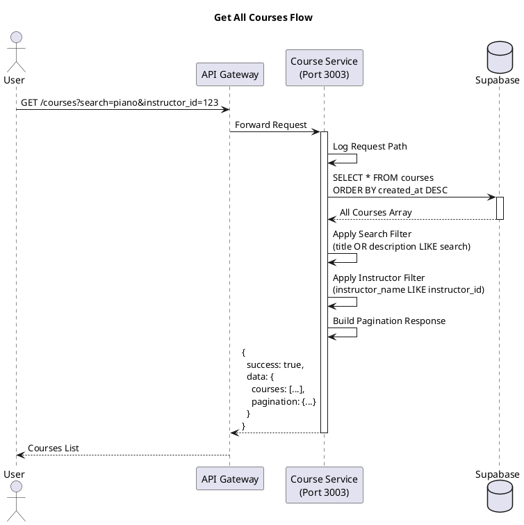

#### Mermaid

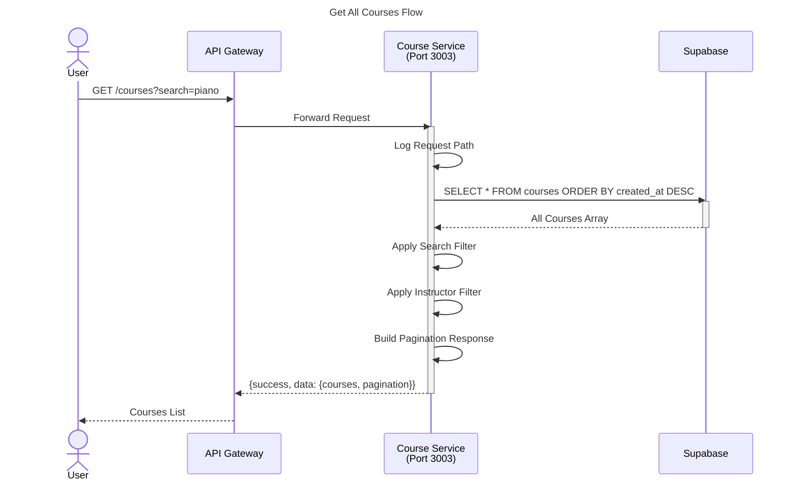

### 3.2 Get Course By ID Flow

Diagram ini menunjukkan alur pengambilan detail kursus berdasarkan ID.

#### PlantUML

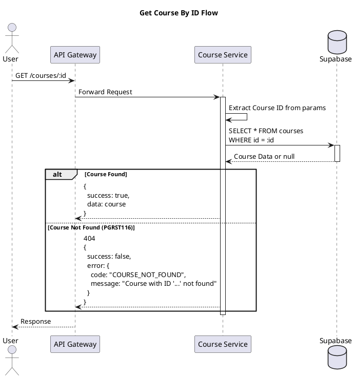

#### Mermaid

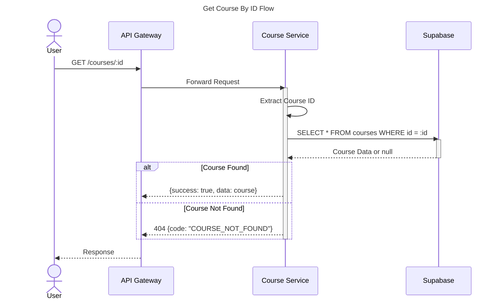

## 4. Sequence Diagram - Create Course

### 4.1 Create Course Flow (Admin Only)

Diagram ini menunjukkan alur pembuatan kursus baru dengan validasi autentikasi.

#### PlantUML

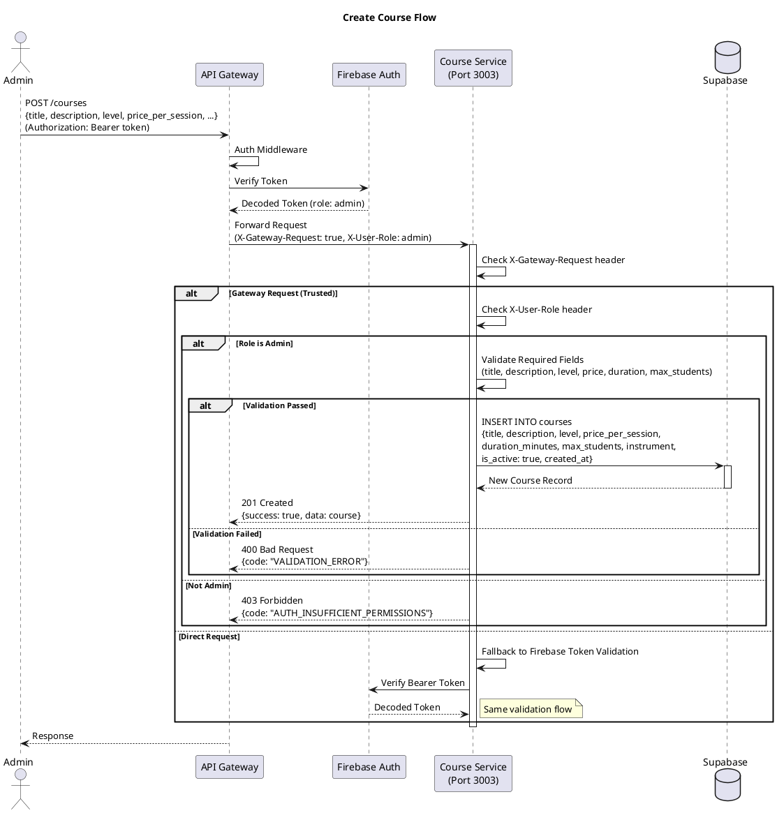

#### Mermaid

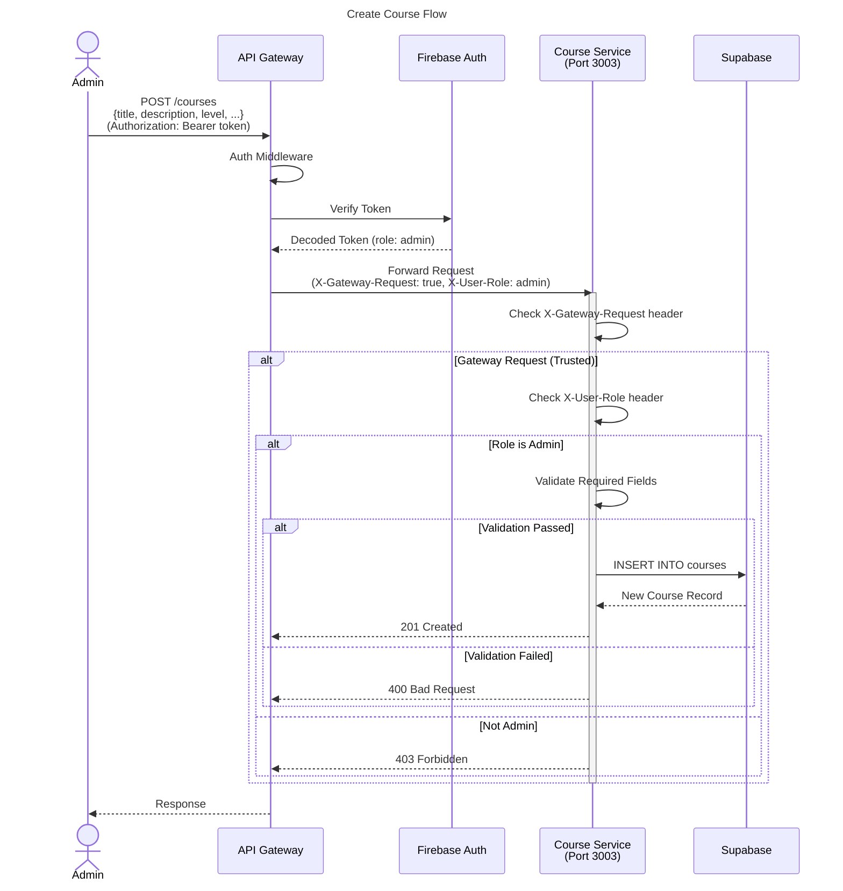

## 5. Sequence Diagram - Update Course

### 5.1 Update Course Flow (Admin/Instructor)

Diagram ini menunjukkan alur update kursus dengan validasi role.

#### PlantUML

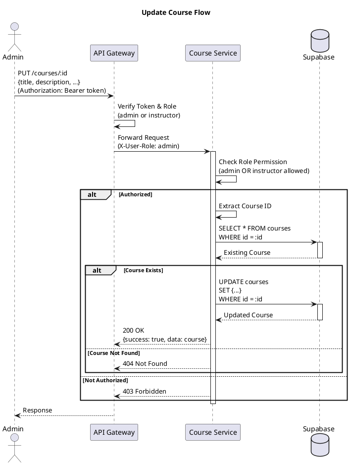

#### Mermaid

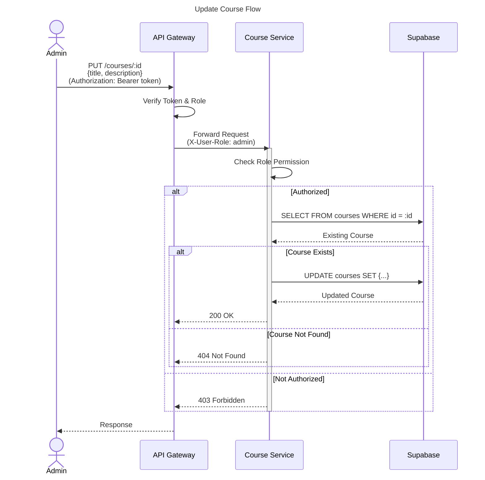

## 6. Sequence Diagram - Delete Course

### 6.1 Delete Course Flow (Admin Only)

Diagram ini menunjukkan alur penghapusan kursus.

#### PlantUML

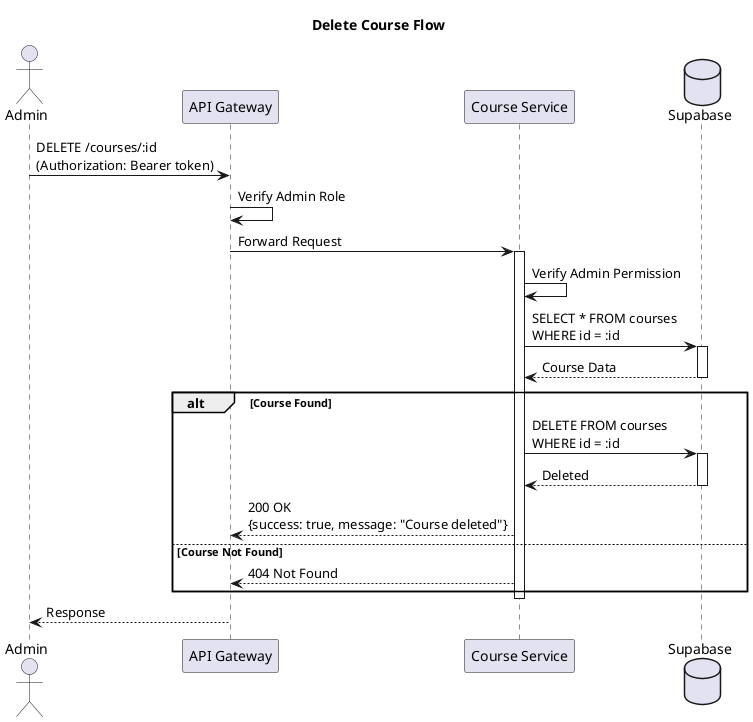

#### Mermaid

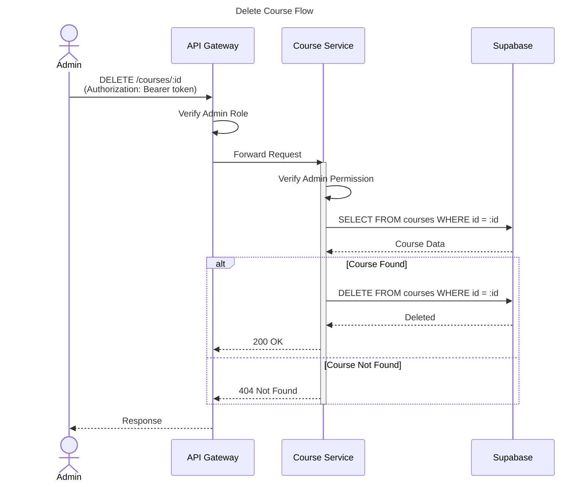

## 7. Sequence Diagram - Get Instructors

### 7.1 Get Instructors List Flow

Diagram ini menunjukkan alur pengambilan daftar instructor (public).

#### PlantUML

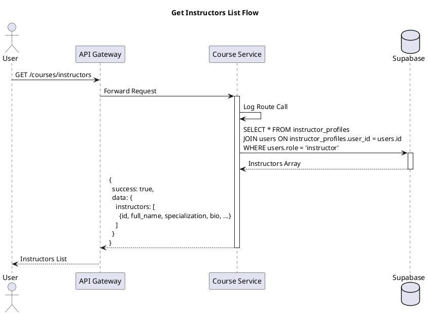

#### Mermaid

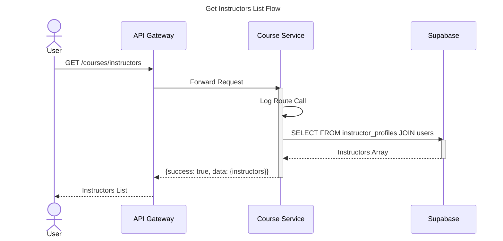

## 8. Sequence Diagram - Get Instruments

### 8.1 Get Instruments List Flow

Diagram ini menunjukkan alur pengambilan daftar instrumen musik.

#### PlantUML

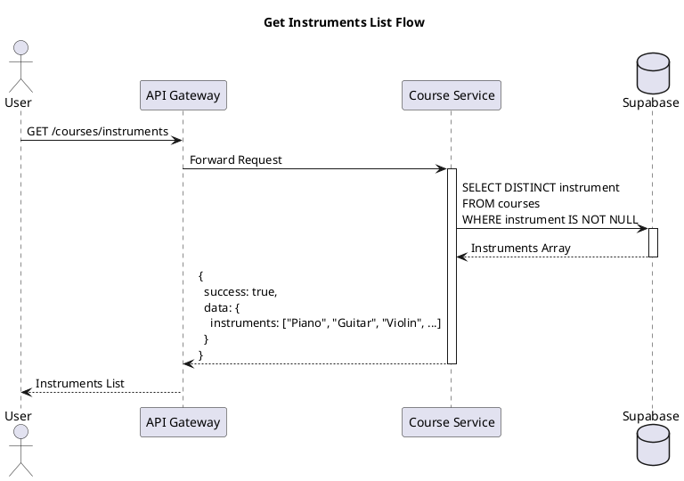

#### Mermaid

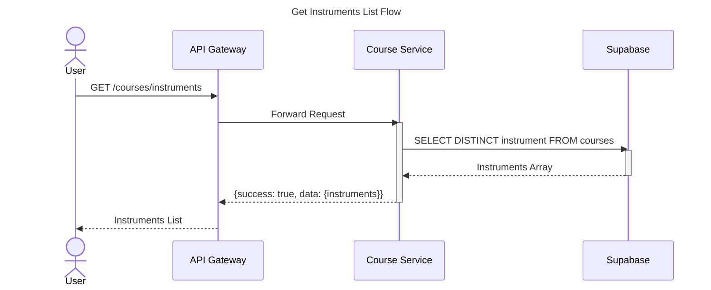

## 9. Sequence Diagram - Get Levels

### 9.1 Get Levels List Flow

Diagram ini menunjukkan alur pengambilan daftar level pembelajaran.

#### PlantUML

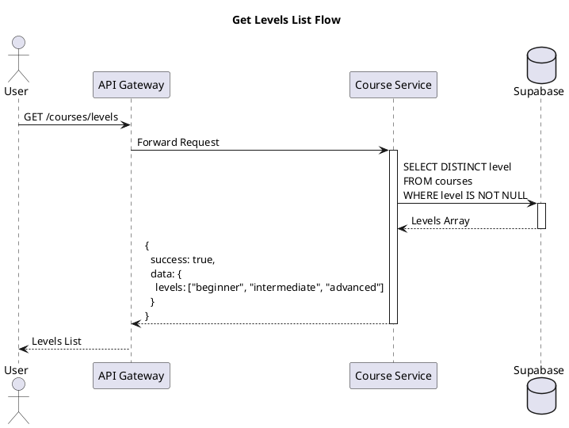

#### Mermaid

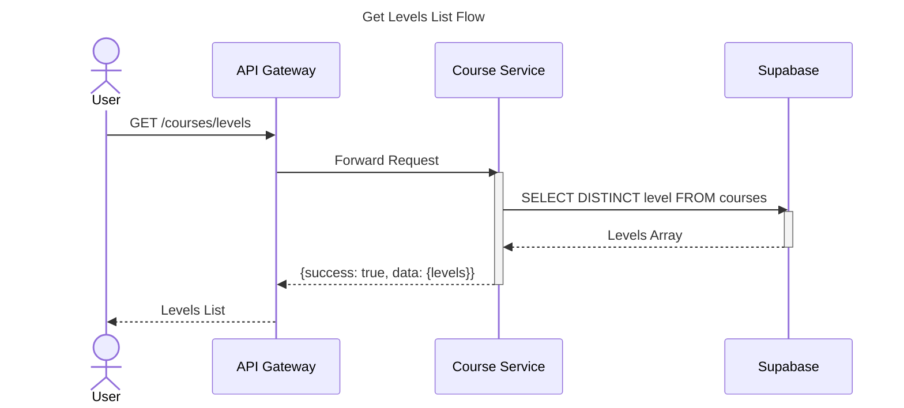

## 10. Error Handling

### 10.1 Error Response Format

Semua error response mengikuti format standar:

```
{
  success: false,
  error: {
    code: "ERROR_CODE",
    message: "Human readable message",
    details: "Optional additional details"
  }
}
```

### 10.2 Error Codes

| Code | HTTP Status | Description |
|------|-------------|-------------|
| COURSE_NOT_FOUND | 404 | Course with specified ID not found |
| VALIDATION_ERROR | 400 | Missing required fields |
| AUTH_MISSING_TOKEN | 401 | Authorization token required |
| AUTH_TOKEN_EXPIRED | 401 | Firebase token expired |
| AUTH_TOKEN_INVALID | 401 | Invalid Firebase token |
| AUTH_INSUFFICIENT_PERMISSIONS | 403 | User role not authorized |
| DATABASE_ERROR | 500 | Database operation failed |
| INTERNAL_SERVER_ERROR | 500 | Unexpected server error |

## 11. Endpoint Summary

### 11.1 Public Endpoints

| Method | Endpoint | Deskripsi |
|--------|----------|-----------|
| GET | /courses | List all courses (with filters) |
| GET | /courses/:id | Get course by ID |
| GET | /courses/instructors | List all instructors |
| GET | /courses/instruments | List all instruments |
| GET | /courses/levels | List all levels |

### 11.2 Protected Endpoints

| Method | Endpoint | Role | Deskripsi |
|--------|----------|------|-----------|
| POST | /courses | Admin | Create new course |
| PUT | /courses/:id | Admin, Instructor | Update course |
| DELETE | /courses/:id | Admin | Delete course |
