# Sequence Diagram - Notification Service

## 1. Gambaran Umum

Notification Service adalah layanan untuk mengelola notifikasi real-time menggunakan WebSocket dan Kafka. Service ini berjalan pada Port 3009 dan bertanggung jawab untuk:

- **WebSocket Management**: Mengelola koneksi WebSocket dari client
- **Kafka Consumption**: Mengkonsumsi event dari berbagai service
- **Event Broadcasting**: Menyiarkan event ke client yang tersubscribe
- **Connection Tracking**: Melacak koneksi aktif dan subscription

## 2. Arsitektur Service

### 2.1 Komponen Utama

| Komponen | Fungsi |
|----------|--------|
| WebSocket Server | Mengelola koneksi client |
| Kafka Consumer | Menerima event dari message broker |
| Connection Manager | Melacak client dan subscription |
| Message Router | Routing pesan ke client yang tepat |

### 2.2 Event-Driven Architecture

Notification Service bertindak sebagai bridge antara internal microservices dan external clients melalui event streaming.

```
┌────────────────────┐    Kafka Topics     ┌───────────────────┐
│   Booking Service  │──────────────────→ │                   │
│   Course Service   │──────────────────→ │ Notification Svc  │
│   Admin Service    │──────────────────→ │                   │
│   Recommendation   │──────────────────→ │                   │
└────────────────────┘                     └────────┬──────────┘
                                                    │ WebSocket
                                                    ↓
                                           ┌───────────────────┐
                                           │   Client Browser  │
                                           └───────────────────┘
```

## 3. Sequence Diagram - WebSocket Connection

### 3.1 Initial Connection Flow

Diagram ini menunjukkan alur koneksi WebSocket awal dari client.

#### PlantUML

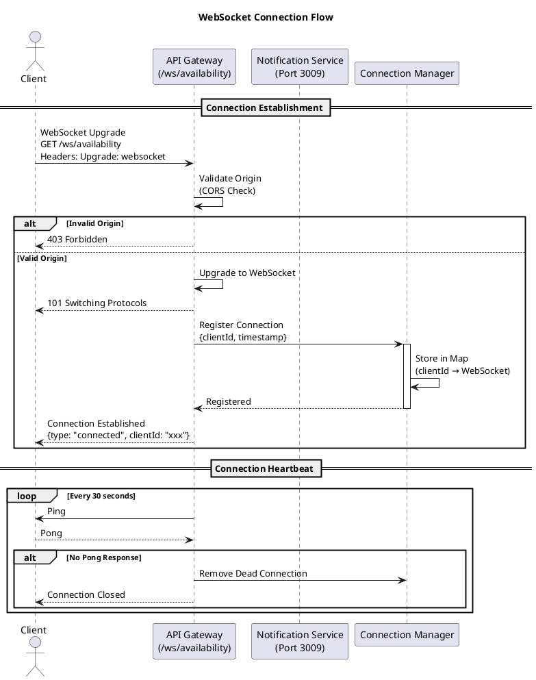

#### Mermaid

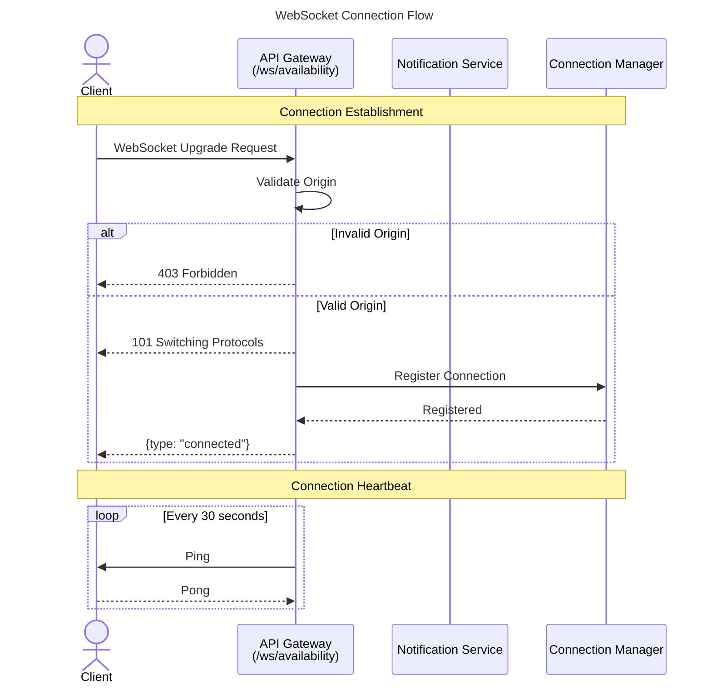

### 3.2 Subscription Flow

Diagram ini menunjukkan alur subscription client ke topik tertentu.

#### PlantUML

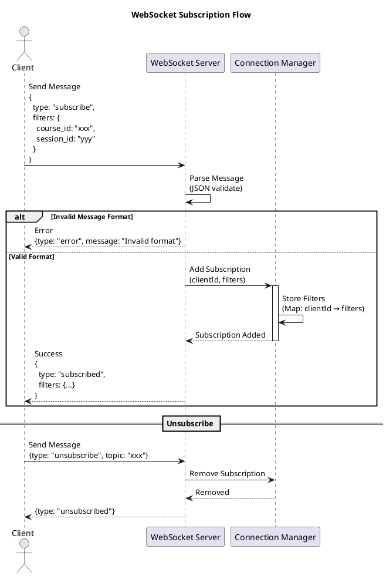

#### Mermaid

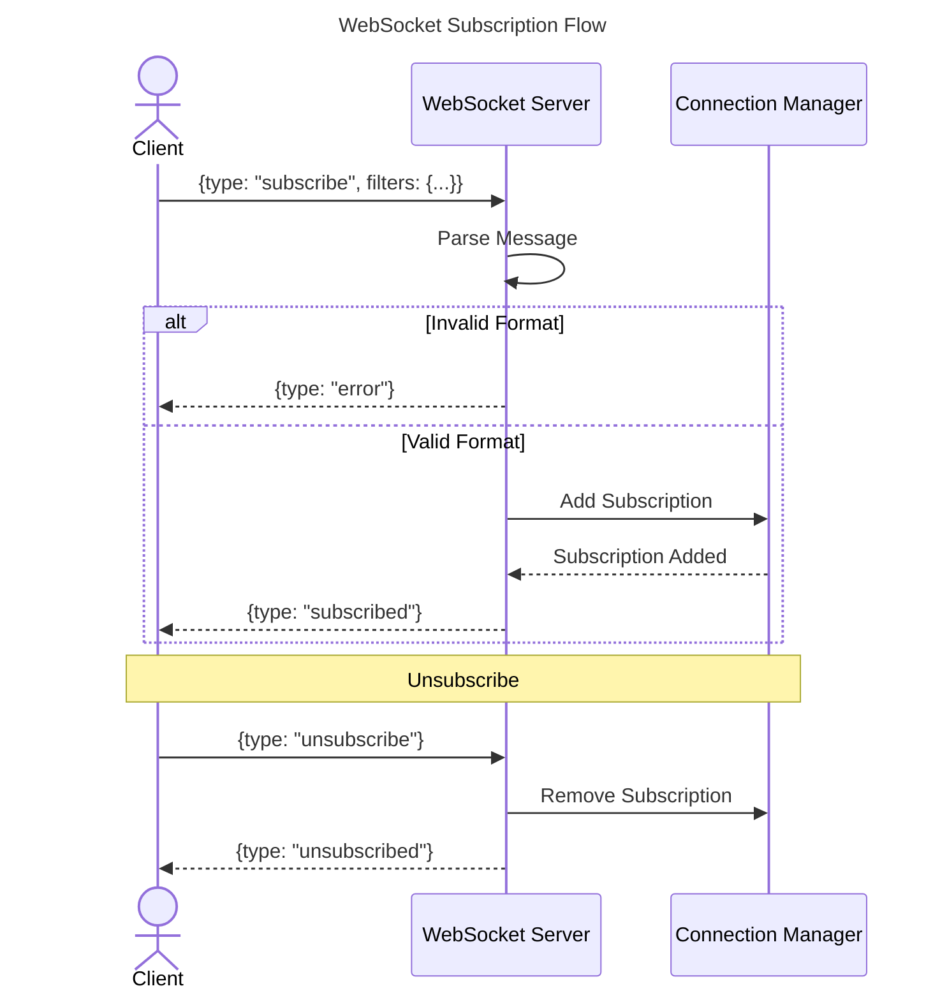

## 4. Sequence Diagram - Kafka Event Consumption

### 4.1 Booking Event Flow

Diagram ini menunjukkan alur konsumsi event booking dan broadcasting ke client.

#### PlantUML

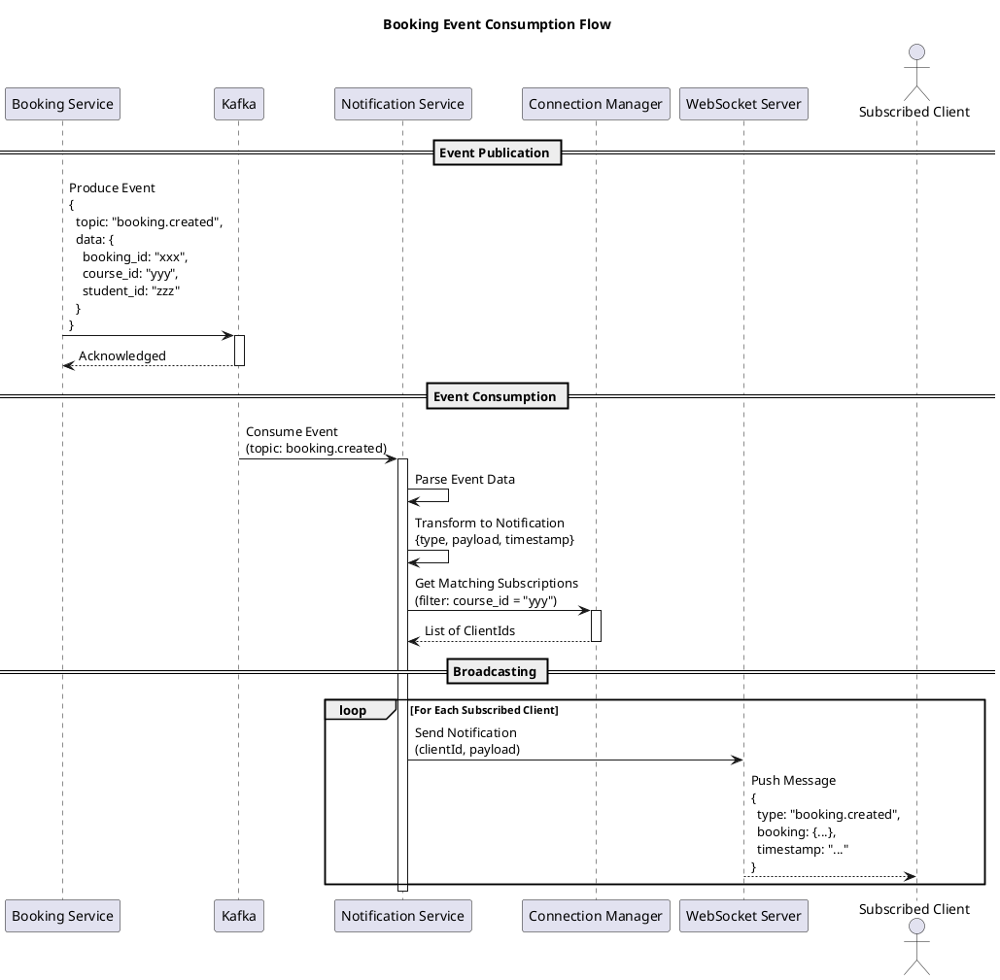

#### Mermaid

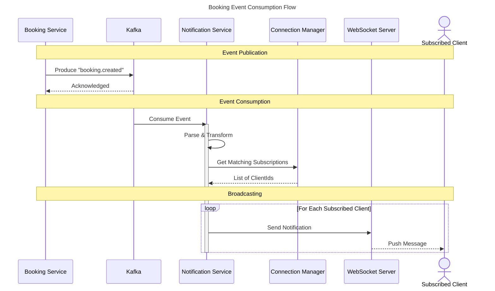

### 4.2 Schedule Update Event Flow

Diagram ini menunjukkan alur notifikasi update jadwal.

#### PlantUML

```plantuml
@startuml Schedule_Update_Flow
title Schedule Update Event Flow

participant "Admin Service" as AdminSvc
participant "Kafka" as Kafka
participant "Notification Service" as NotifSvc
participant "Connection Manager" as ConnMgr
actor "Admin Client" as Admin
actor "Public Client" as Public

AdminSvc -> Kafka: Produce Event\n{\n  topic: "schedule.updated",\n  data: {\n    schedule_id: "xxx",\n    room_id: "yyy",\n    action: "updated"\n  }\n}

Kafka -> NotifSvc: Consume Event
activate NotifSvc

NotifSvc -> NotifSvc: Build Notification Payload

NotifSvc -> ConnMgr: Get Admin Subscriptions\n(role: admin)
ConnMgr --> NotifSvc: Admin ClientIds

NotifSvc -> ConnMgr: Get Public Subscriptions\n(filter: room_id)
ConnMgr --> NotifSvc: Public ClientIds

par Parallel Broadcasting
    NotifSvc ->> Admin: Push to Admin\n{type: "schedule.updated",\nfull_details: {...}}
and
    NotifSvc ->> Public: Push to Public\n{type: "availability.changed",\nsummary: {...}}
end

deactivate NotifSvc

@enduml
```

#### Mermaid

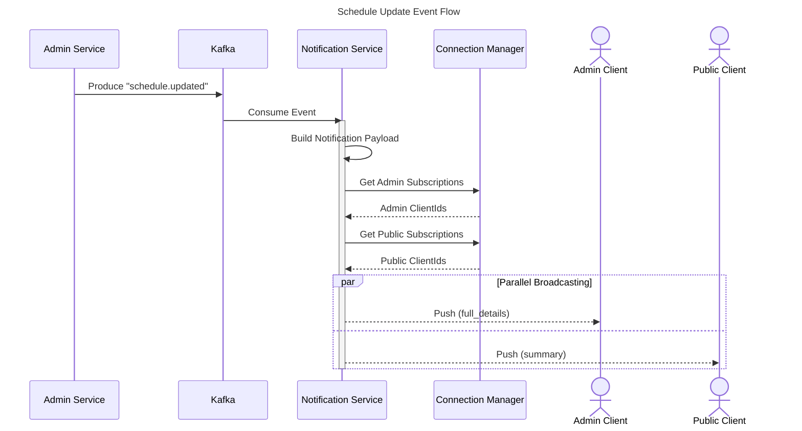

## 5. Sequence Diagram - Admin Notifications

### 5.1 Admin WebSocket Connection

Diagram ini menunjukkan alur koneksi WebSocket khusus untuk admin.

#### PlantUML

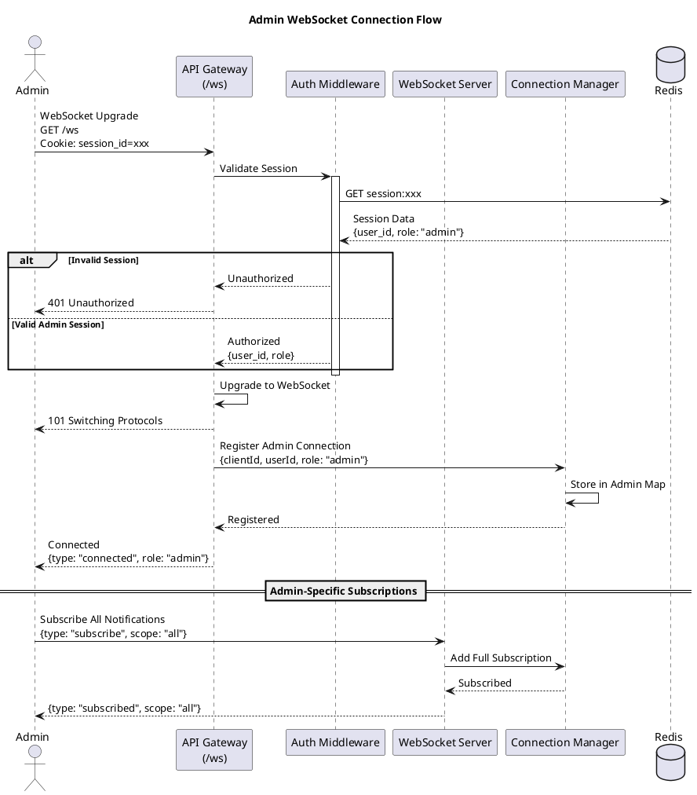

#### Mermaid

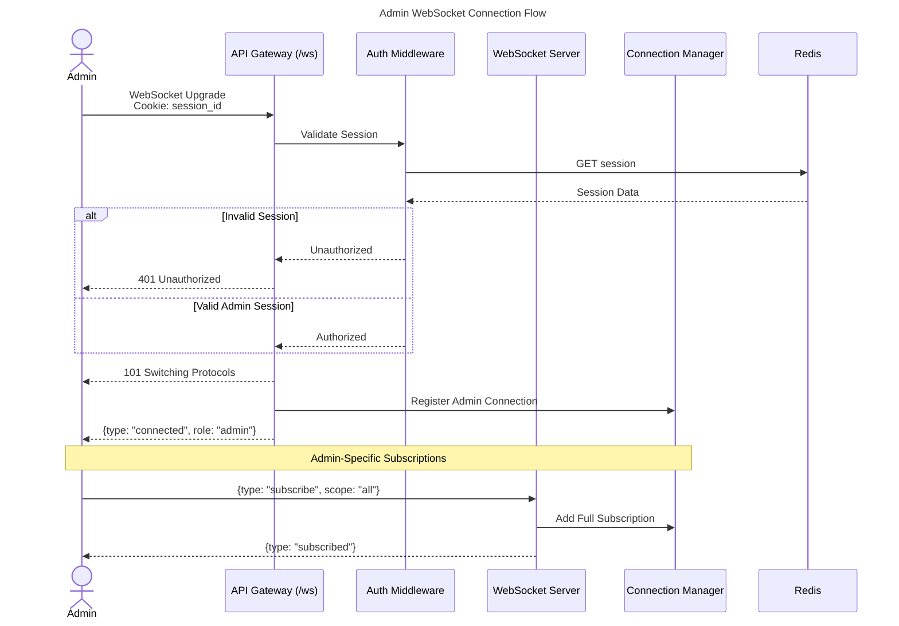

## 6. Sequence Diagram - Availability Updates

### 6.1 Real-time Availability Broadcast

Diagram ini menunjukkan alur broadcast ketersediaan slot jadwal.

#### PlantUML

```plantuml
@startuml Availability_Broadcast
title Real-time Availability Broadcast Flow

participant "Booking Service" as BookingSvc
participant "Kafka" as Kafka
participant "Notification Service" as NotifSvc
participant "WebSocket Server" as WS
actor "Client A\n(viewing course)" as ClientA
actor "Client B\n(viewing course)" as ClientB
actor "Client C\n(different course)" as ClientC

== Slot Booked Event ==
BookingSvc -> Kafka: Produce\n{\n  topic: "booking.created",\n  course_id: "PIANO-101",\n  schedule_id: "sch-123",\n  slots_remaining: 4\n}

Kafka -> NotifSvc: Consume Event
activate NotifSvc

NotifSvc -> NotifSvc: Build Availability Update\n{course_id, schedule_id, slots}

NotifSvc -> WS: Get Subscribed Clients\n(filter: course_id = "PIANO-101")
WS --> NotifSvc: [ClientA, ClientB]

note right of NotifSvc: Client C not included\n(subscribed to different course)

par Broadcast to Matching Clients
    NotifSvc -> ClientA: Push Update\n{type: "availability.updated",\nslots_remaining: 4}
and
    NotifSvc -> ClientB: Push Update\n{type: "availability.updated",\nslots_remaining: 4}
end

deactivate NotifSvc

ClientA -> ClientA: Update UI\n(decrement slot count)
ClientB -> ClientB: Update UI\n(decrement slot count)

@enduml
```

#### Mermaid

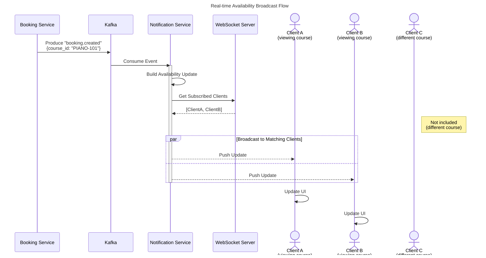

## 7. Sequence Diagram - Connection Management

### 7.1 Connection Cleanup Flow

Diagram ini menunjukkan alur pembersihan koneksi yang terputus.

#### PlantUML

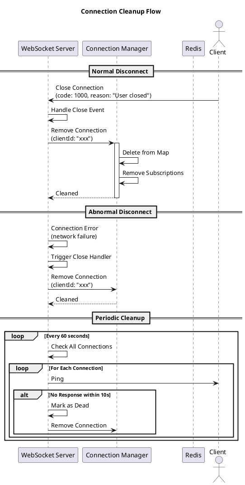

#### Mermaid

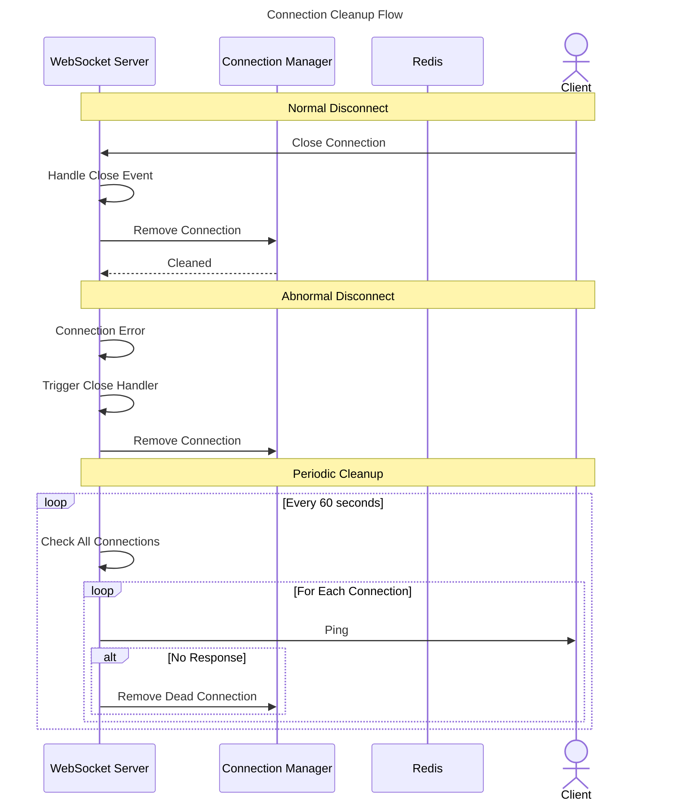

## 8. Kafka Topics

### 8.1 Consumed Topics

| Topic | Publisher | Event Types |
|-------|-----------|-------------|
| booking.created | Booking Service | New booking created |
| booking.cancelled | Booking Service | Booking cancelled |
| booking.confirmed | Booking Service | Booking confirmed |
| schedule.updated | Admin Service | Schedule modified |
| schedule.deleted | Admin Service | Schedule removed |
| admin.notifications | Various | General admin alerts |
| assessment.submitted | Recommendation | New assessment |

### 8.2 Event Payload Structure

```
{
  topic: string,
  timestamp: ISO8601,
  event_type: string,
  payload: {
    id: string,
    action: string,
    data: {...}
  }
}
```

## 9. WebSocket Message Types

### 9.1 Client to Server Messages

| Type | Description | Payload |
|------|-------------|---------|
| subscribe | Subscribe to updates | {filters: {...}} |
| unsubscribe | Unsubscribe from topic | {topic: string} |
| ping | Keep-alive ping | {} |

### 9.2 Server to Client Messages

| Type | Description | Payload |
|------|-------------|---------|
| connected | Connection established | {clientId} |
| subscribed | Subscription confirmed | {filters} |
| availability.updated | Slot availability changed | {course_id, slots} |
| booking.created | New booking notification | {booking} |
| schedule.updated | Schedule change | {schedule} |
| error | Error message | {message, code} |

## 10. Connection Manager Data Structures

### 10.1 Connection Store

```
connections: Map<clientId, {
  ws: WebSocket,
  userId: string | null,
  role: "admin" | "public",
  connectedAt: timestamp,
  lastPing: timestamp
}>
```

### 10.2 Subscription Store

```
subscriptions: Map<clientId, {
  course_id?: string[],
  room_id?: string[],
  session_id?: string,
  scope: "all" | "filtered"
}>
```

## 11. Error Handling

### 11.1 WebSocket Errors

| Error | Action |
|-------|--------|
| Connection failed | Retry with exponential backoff |
| Message parse error | Send error message, maintain connection |
| Authentication failed | Close connection with 4001 code |

### 11.2 Kafka Errors

| Error | Action |
|-------|--------|
| Consumer disconnect | Auto-reconnect with retry |
| Deserialization error | Log and skip message |
| Consumer group rebalance | Handle gracefully |

## 12. Integration Summary

### 12.1 Service Integration

```
┌─────────────────┐     ┌─────────────────┐     ┌─────────────────┐
│ Booking Service │────→│     Kafka       │────→│  Notification   │
└─────────────────┘     └────────┬────────┘     │    Service      │
                                 │              └────────┬────────┘
┌─────────────────┐              │                       │
│  Admin Service  │──────────────┘                       │
└─────────────────┘                                      │
                                                         ↓
┌─────────────────┐                              ┌─────────────────┐
│ Recommendation  │─────────────────────────────→│   WebSocket     │
│    Service      │                              │    Clients      │
└─────────────────┘                              └─────────────────┘
```

### 12.2 Port Configuration

| Service | Port | WebSocket Endpoint |
|---------|------|-------------------|
| API Gateway | 3000 | /ws, /ws/availability |
| Notification | 3009 | Internal WebSocket |

### 12.3 Environment Variables

| Variable | Description |
|----------|-------------|
| KAFKA_BROKERS | Kafka broker addresses |
| KAFKA_GROUP_ID | Consumer group ID |
| WS_PORT | WebSocket server port |
| REDIS_URL | Redis connection URL |
