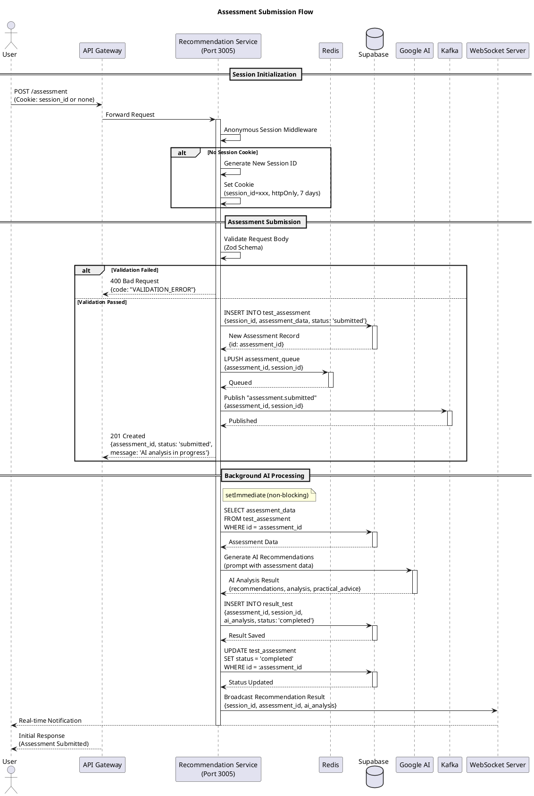
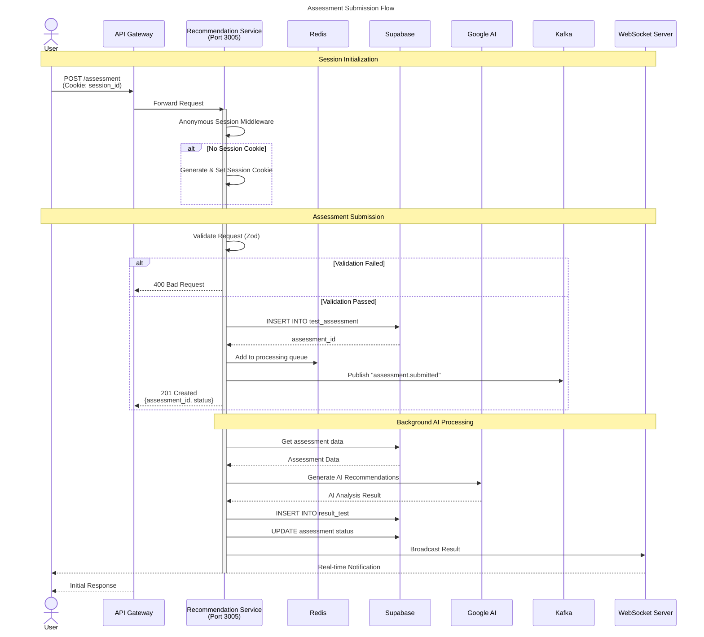
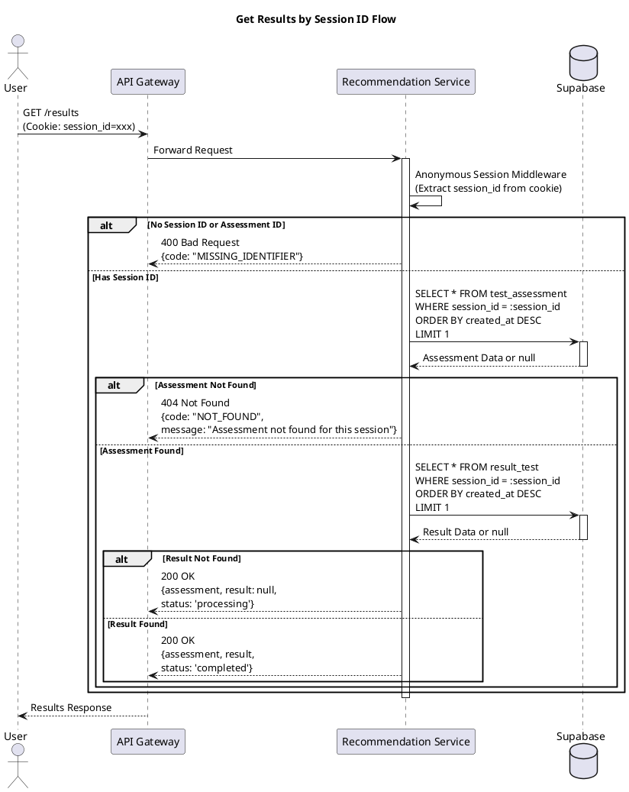
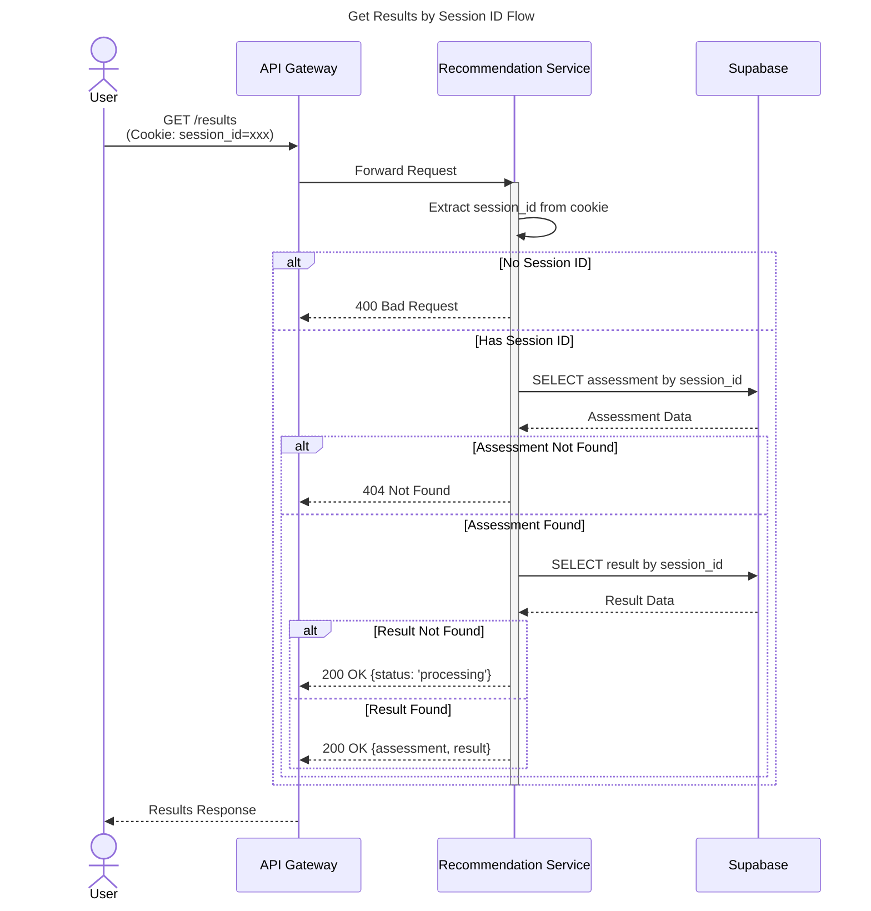
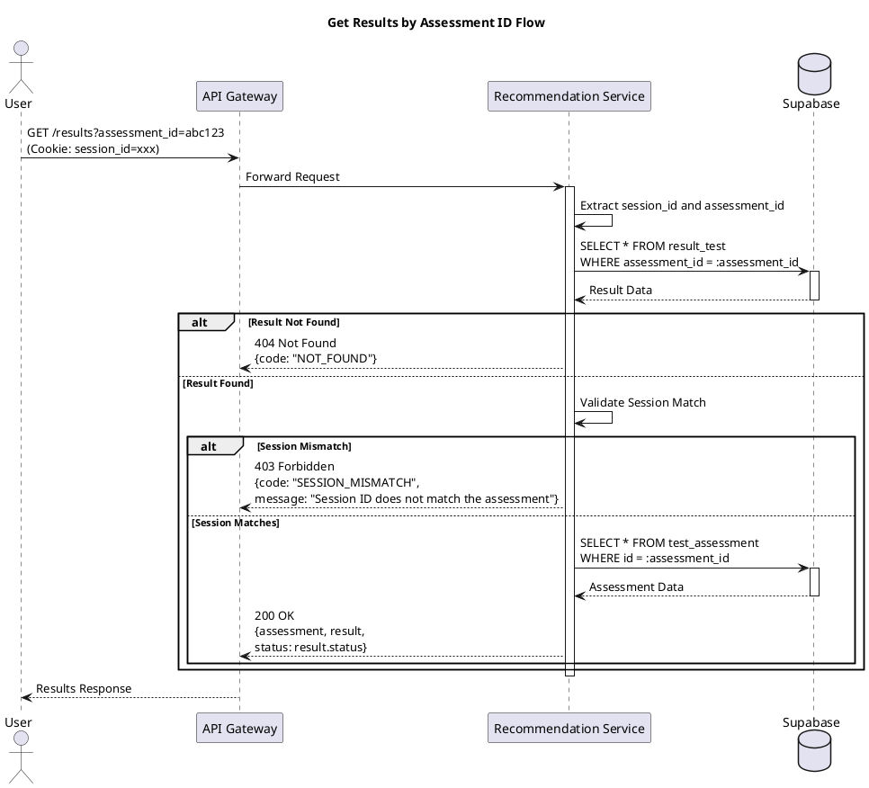
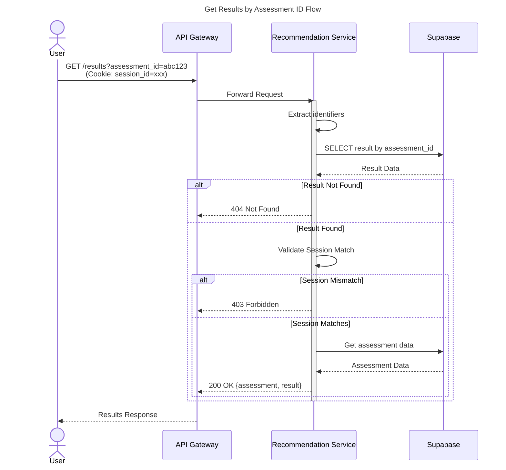
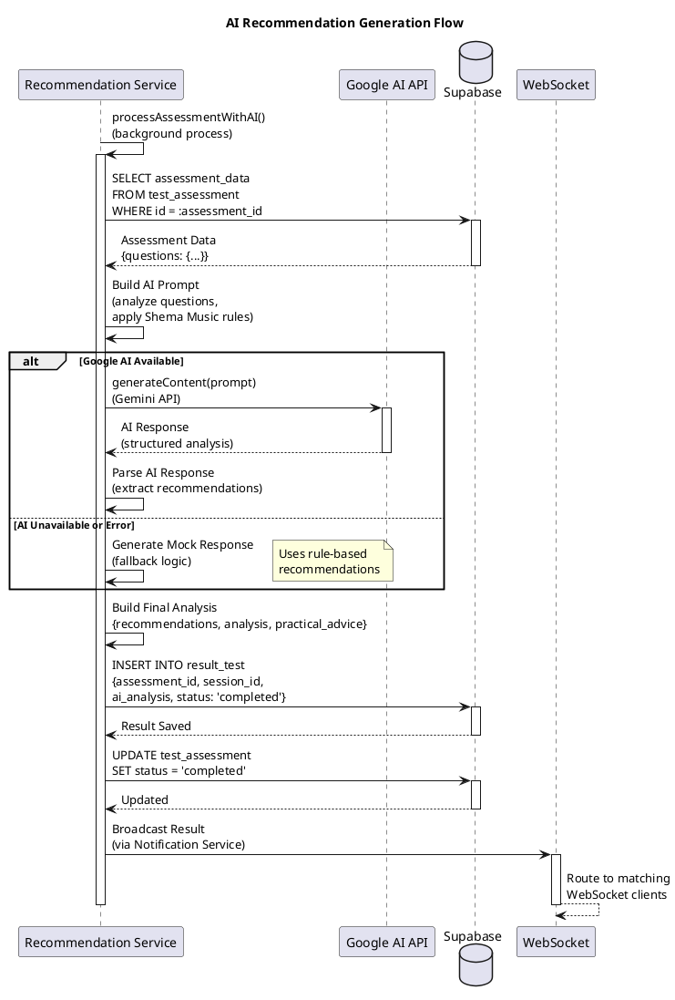
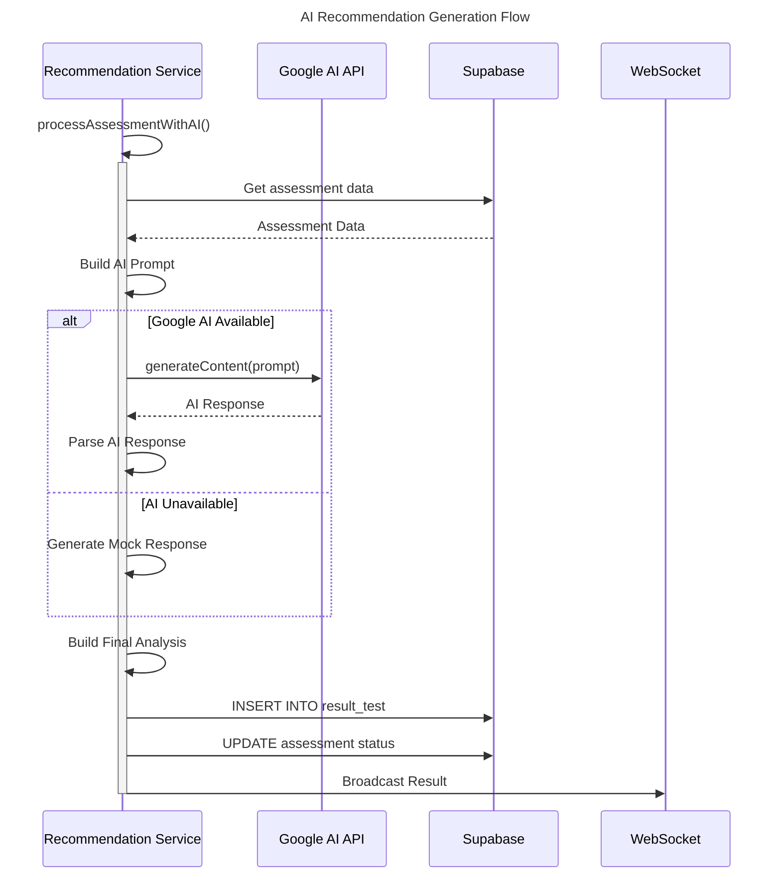
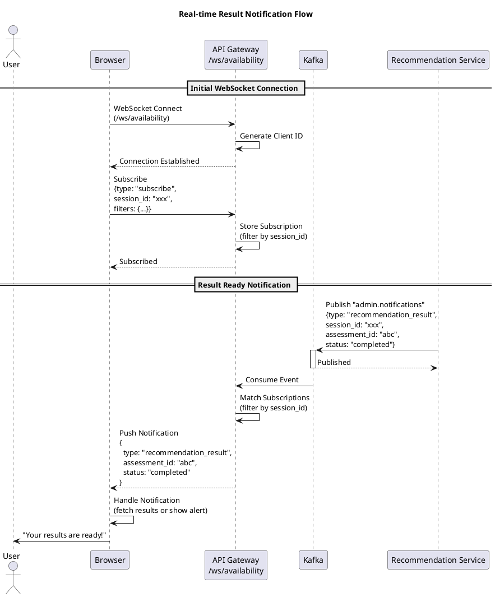
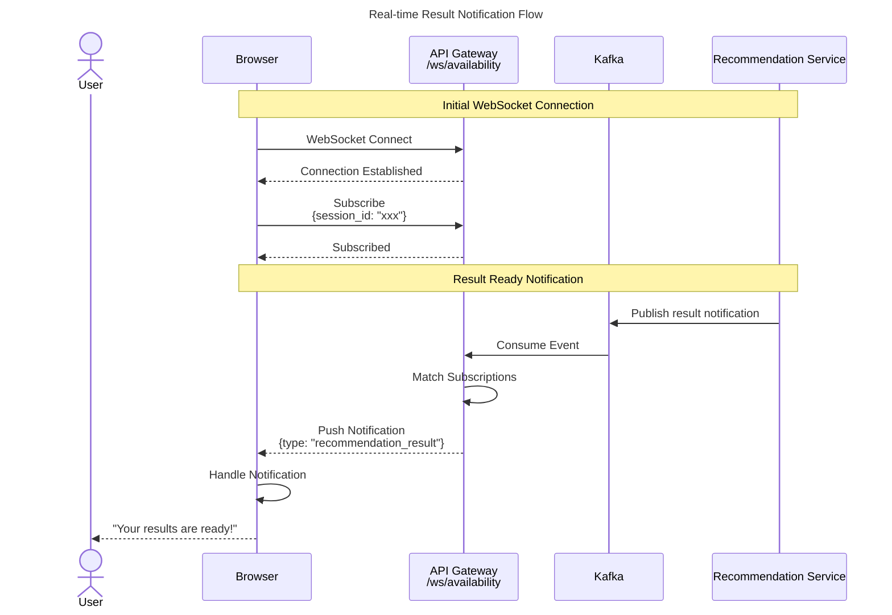

# Sequence Diagram - Recommendation Service

## 1. Gambaran Umum

Recommendation Service adalah layanan untuk memberikan rekomendasi kursus musik berbasis AI. Service ini berjalan pada Port 3005 dan bertanggung jawab untuk:

- **Assessment Submission**: Menerima dan menyimpan data assessment siswa
- **AI Processing**: Memproses assessment menggunakan Google AI API
- **Result Generation**: Menghasilkan rekomendasi kursus, level, dan tipe kelas
- **WebSocket Broadcasting**: Mengirim notifikasi real-time saat hasil siap

## 2. Arsitektur Service

Recommendation Service menggunakan anonymous session untuk mengidentifikasi pengguna tanpa login, Google AI untuk analisis, dan Kafka untuk notifikasi.

### 2.1 Komponen Integrasi

| Komponen | Fungsi |
|----------|--------|
| Supabase | Penyimpanan assessment dan result |
| Redis | Session management, processing queue |
| Google AI API | AI-powered analysis |
| Kafka | Event publishing |
| WebSocket | Real-time result notification |

### 2.2 Session Flow

Pengguna menggunakan anonymous session (cookie-based) untuk tracking assessment tanpa perlu login.

## 3. Sequence Diagram - Submit Assessment

### 3.1 Assessment Submission Flow

Diagram ini menunjukkan alur lengkap submission assessment dan processing AI.

#### PlantUML



#### Mermaid



## 4. Sequence Diagram - Get Results

### 4.1 Get Results by Session ID

Diagram ini menunjukkan alur pengambilan hasil assessment berdasarkan session ID.

#### PlantUML



#### Mermaid



### 4.2 Get Results by Assessment ID

Diagram ini menunjukkan alur pengambilan hasil berdasarkan assessment ID dengan validasi session.

#### PlantUML



#### Mermaid



## 5. Sequence Diagram - AI Processing

### 5.1 AI Recommendation Generation Flow

Diagram ini menunjukkan detail proses AI untuk menghasilkan rekomendasi.

#### PlantUML



#### Mermaid



## 6. Sequence Diagram - WebSocket Notification

### 6.1 Real-time Result Notification Flow

Diagram ini menunjukkan alur notifikasi real-time saat hasil assessment siap.

#### PlantUML



#### Mermaid



## 7. AI Analysis Output Structure

### 7.1 Recommendations Object

```
recommendations: {
  instruments: ["Piano", "Guitar"],
  skill_level: "beginner" | "intermediate" | "advanced",
  class_type: "Kelas Siswa" | "Kelas Karyawan",
  class_style: "Reguler" | "Hobby" | "Ministry",
  learning_path: "Deskripsi path pembelajaran",
  estimated_budget: "300000"
}
```

### 7.2 Analysis Object

```
analysis: {
  instrument_reasoning: "Alasan pemilihan instrument",
  skill_level_reasoning: "Alasan penentuan level",
  class_type_reasoning: "Alasan pemilihan tipe kelas",
  class_style_reasoning: "Alasan pemilihan gaya pembelajaran",
  strengths: ["Kekuatan 1", "Kekuatan 2"],
  areas_for_improvement: ["Area pengembangan 1"],
  potential_challenges: ["Tantangan potensial 1"],
  success_factors: ["Faktor keberhasilan 1"]
}
```

### 7.3 Practical Advice Object

```
practical_advice: {
  practice_routine: "Rekomendasi rutinitas latihan",
  equipment: ["Peralatan 1", "Peralatan 2"],
  next_steps: ["Langkah selanjutnya 1", "Langkah 2"]
}
```

## 8. Assessment Status Flow

```
submitted → processing → completed
              ↓
            failed
```

| Status | Description |
|--------|-------------|
| submitted | Assessment diterima, menunggu processing |
| processing | AI sedang menganalisis |
| completed | Hasil siap |
| failed | AI processing gagal |

## 9. Error Handling

### 9.1 AI Processing Error

Ketika Google AI tidak tersedia atau gagal, sistem menggunakan fallback logic:

- Rule-based recommendations berdasarkan data assessment
- Mock data yang konsisten berdasarkan pertanyaan yang dijawab
- Status tetap "completed" dengan hasil fallback

### 9.2 Error Codes

| Code | HTTP Status | Description |
|------|-------------|-------------|
| VALIDATION_ERROR | 400 | Invalid assessment data |
| MISSING_IDENTIFIER | 400 | No session_id or assessment_id |
| NOT_FOUND | 404 | Assessment/result not found |
| SESSION_MISMATCH | 403 | Session doesn't match assessment |
| DATABASE_ERROR | 500 | Database operation failed |
| INTERNAL_ERROR | 500 | Unexpected server error |

## 10. Endpoint Summary

### 10.1 Session-based Endpoints

| Method | Endpoint | Deskripsi |
|--------|----------|-----------|
| POST | /assessment | Submit assessment data |
| GET | /results | Get assessment results |
| GET | /results?assessment_id=xxx | Get results by assessment ID |

## 11. Integration Points

### 11.1 Event Topics

| Topic | Publisher | Consumer | Description |
|-------|-----------|----------|-------------|
| assessment.submitted | Recommendation | Admin WS | New assessment submitted |
| admin.notifications | Recommendation | WebSocket | Result ready notification |

### 11.2 WebSocket Subscriptions

- `/ws/availability` - Subscribe dengan filter `session_id` untuk mendapat notifikasi hasil
- `/ws` - Admin notifications untuk monitoring semua assessment
