# Arsitektur Sistem Frontend-Backend Shema Music

## 1. Pendahuluan

Dokumen ini menjelaskan arsitektur sistem secara menyeluruh dengan fokus pada interaksi antara komponen Frontend dan Backend dalam aplikasi Shema Music. Sistem ini dirancang untuk menyediakan pengalaman pengguna yang seamless dengan komunikasi real-time dan keamanan yang robust.

## 2. Gambaran Umum Interaksi

Sistem Shema Music terdiri dari dua komponen utama:
- **Frontend**: Aplikasi web yang digunakan oleh pengguna (admin dan siswa)
- **Backend**: Kumpulan microservices yang menyediakan API dan logika bisnis

Kedua komponen berkomunikasi melalui:
- REST API untuk operasi CRUD
- WebSocket untuk notifikasi real-time
- Firebase untuk autentikasi

## 3. Diagram Arsitektur Lengkap

### 3.1 High-Level Architecture

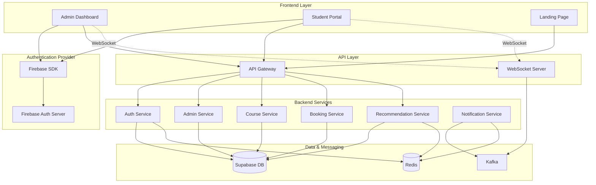

## 4. Alur Komunikasi Frontend-Backend

### 4.1 Authentication Flow

Proses autentikasi melibatkan Frontend, Firebase, dan Backend Auth Service. Berikut adalah alur lengkapnya:

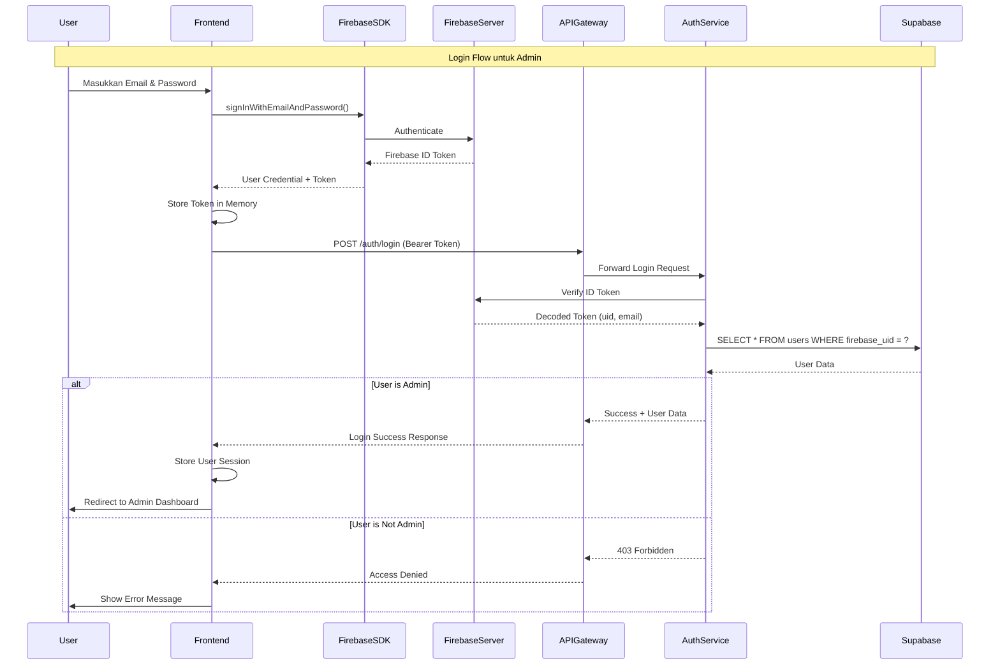

### 4.2 Course Registration Flow (Student)

Alur pendaftaran kursus oleh siswa melibatkan beberapa service dan komunikasi real-time ke admin.

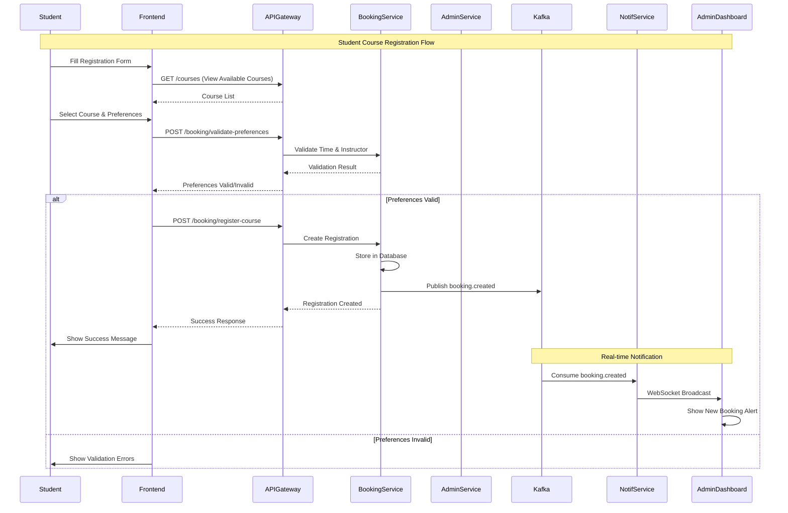

### 4.3 Admin Booking Management Flow

Alur admin dalam mengelola booking yang masuk.

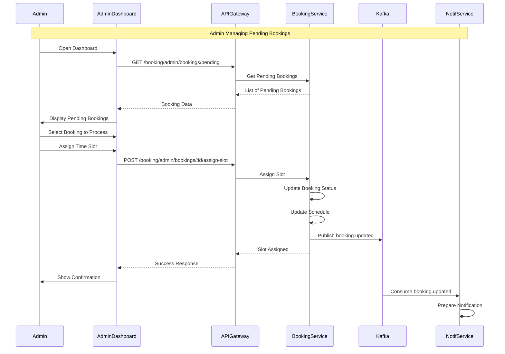

### 4.4 Assessment & AI Recommendation Flow

Alur siswa mengisi assessment dan menerima rekomendasi dari AI.

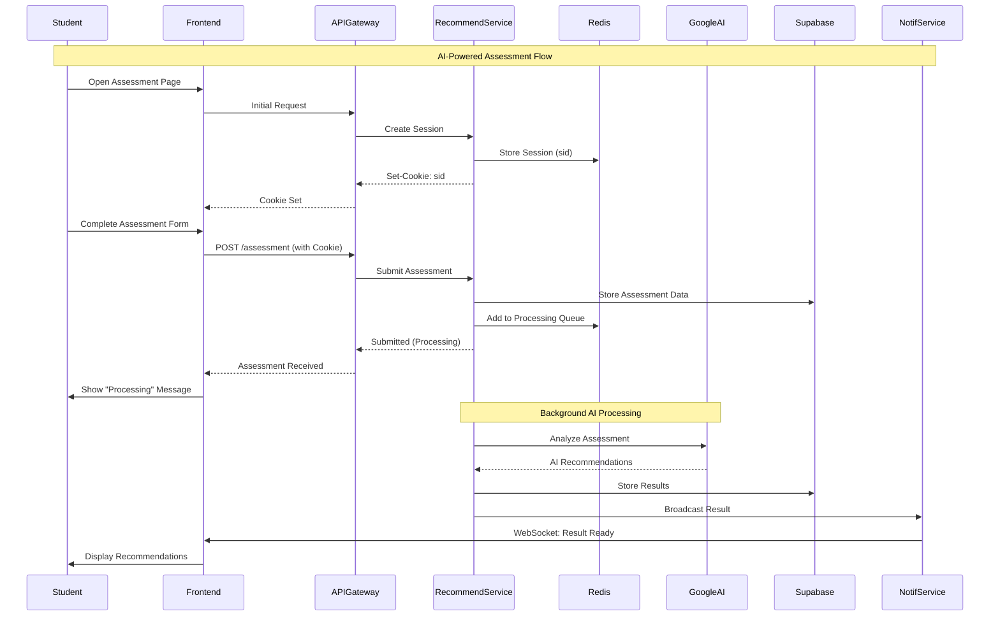

### 4.5 Real-time WebSocket Communication

Alur koneksi dan komunikasi WebSocket antara Frontend dan Backend.

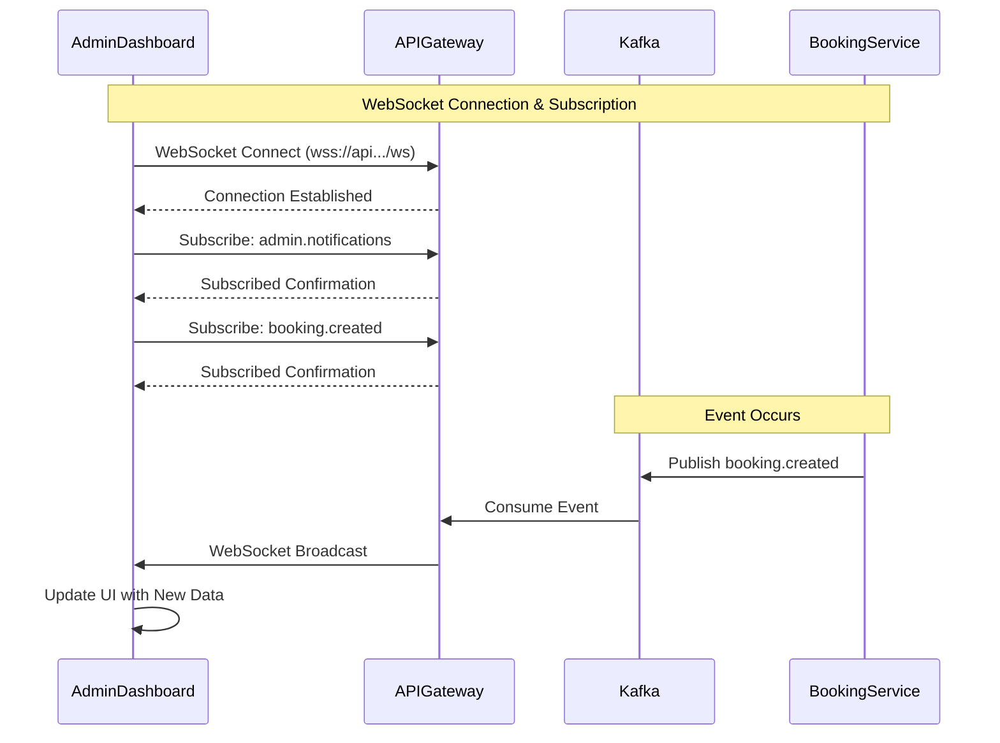

## 5. Frontend Architecture Integration

### 5.1 Frontend Component Structure

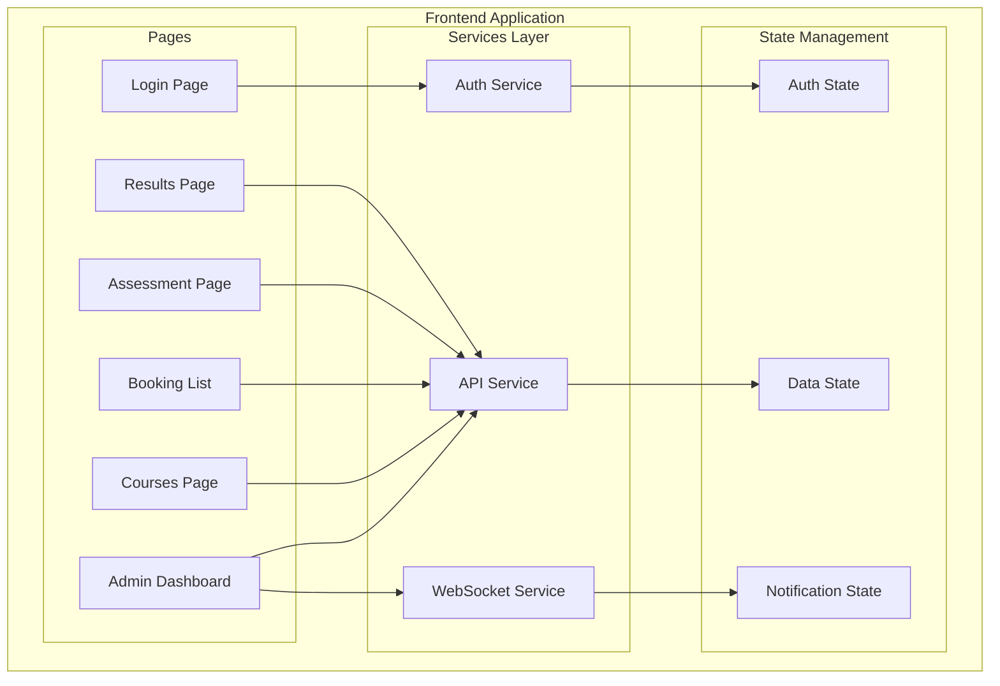

### 5.2 API Integration Pattern

Frontend menggunakan pattern berikut untuk berkomunikasi dengan Backend:

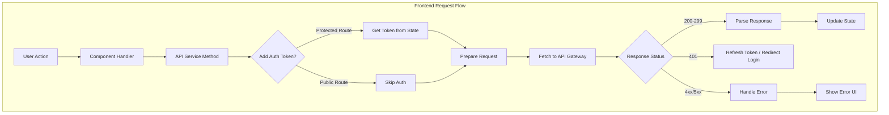

## 6. Scenario-Based Flows

### 6.1 Scenario: Siswa Baru Mendaftar Kursus

Berikut adalah alur lengkap dari sudut pandang siswa baru yang ingin mendaftar kursus:

**Tahap 1: Explorasi**
- Siswa mengakses landing page
- Melihat daftar kursus yang tersedia (tanpa login)
- Memilih kursus yang diminati

**Tahap 2: Pendaftaran**
- Mengisi formulir pendaftaran dengan data diri
- Memilih preferensi waktu dan instruktur
- Sistem memvalidasi ketersediaan

**Tahap 3: Konfirmasi**
- Booking masuk ke sistem dengan status "pending"
- Admin menerima notifikasi real-time
- Siswa menerima konfirmasi bahwa pendaftaran sedang diproses

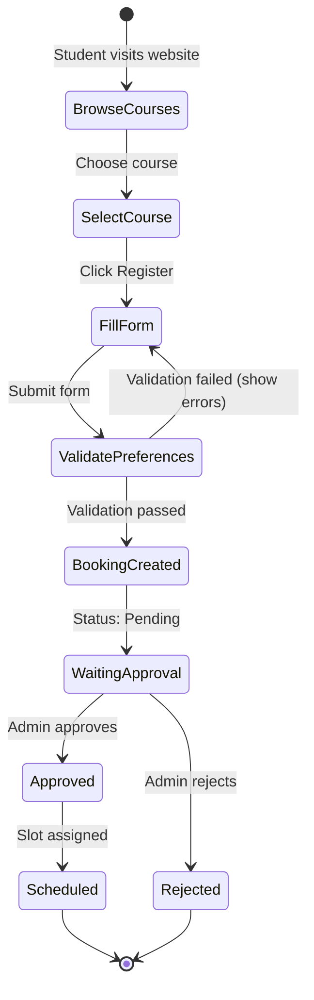

### 6.2 Scenario: Admin Mengelola Booking

Alur admin dalam mengelola pendaftaran kursus yang masuk:

**Tahap 1: Monitoring**
- Admin login ke dashboard
- Melihat daftar booking pending
- Menerima notifikasi real-time untuk booking baru

**Tahap 2: Review**
- Membuka detail booking
- Memeriksa ketersediaan instruktur dan ruangan
- Menentukan slot waktu yang sesuai

**Tahap 3: Assignment**
- Menetapkan jadwal untuk siswa
- Sistem update status booking
- Siswa mendapat notifikasi

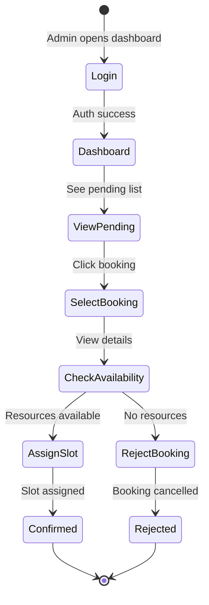

### 6.3 Scenario: Assessment dengan AI

Alur siswa mengisi assessment dan mendapat rekomendasi:

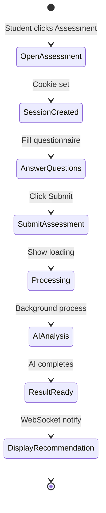

## 7. Data Flow Between Components

### 7.1 Request-Response Data Flow

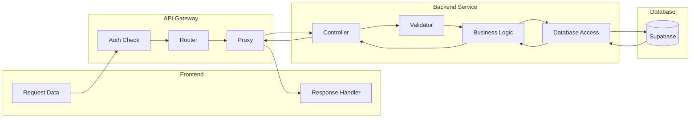

### 7.2 Real-time Event Flow

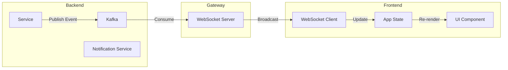

## 8. Security in Frontend-Backend Communication

### 8.1 Token Management

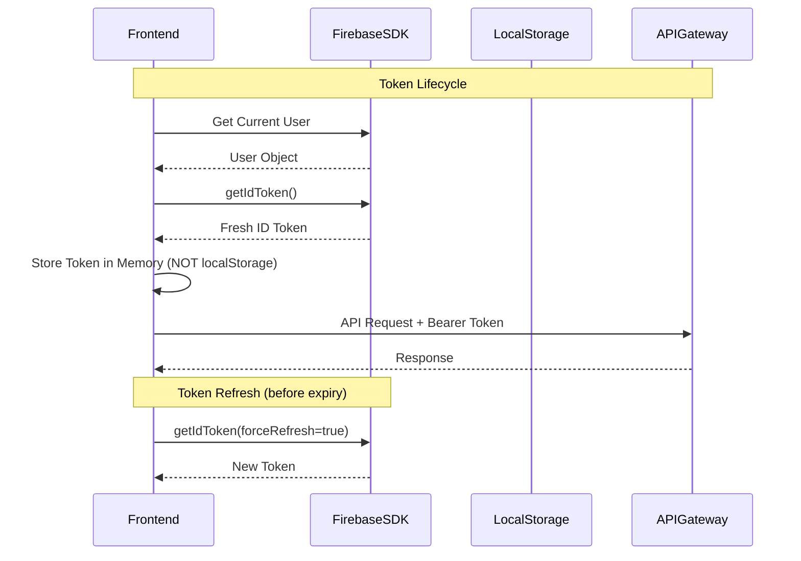

### 8.2 WebSocket Security

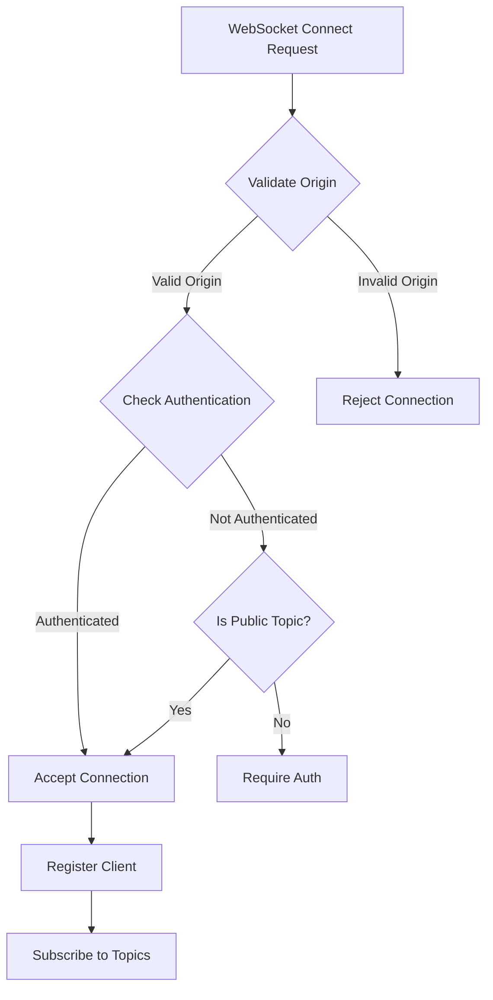

## 9. Error Handling Strategy

### 9.1 Frontend Error Handling

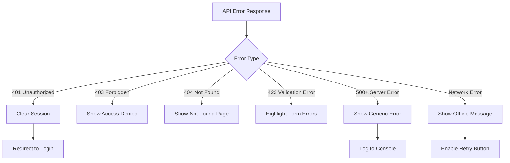

### 9.2 Backend Error Propagation

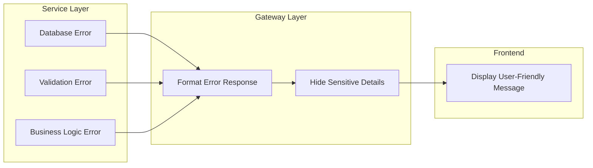

## 10. Integration Points Summary

### 10.1 API Endpoints Used by Frontend

| Feature | Method | Endpoint | Auth Required |
|---------|--------|----------|---------------|
| Login | POST | /auth/login | No |
| Get Courses | GET | /courses | No |
| Register Course | POST | /booking/register-course | No |
| Get Dashboard | GET | /admin/dashboard | Yes (Admin) |
| Get Pending Bookings | GET | /booking/admin/bookings/pending | Yes (Admin) |
| Assign Slot | POST | /booking/admin/bookings/:id/assign-slot | Yes (Admin) |
| Submit Assessment | POST | /assessment | No (Cookie) |
| Get Results | GET | /results | No (Cookie) |

### 10.2 WebSocket Topics

| Topic | Subscriber | Publisher | Purpose |
|-------|------------|-----------|---------|
| admin.notifications | Admin Dashboard | Various Services | General admin alerts |
| booking.created | Admin Dashboard | Booking Service | New booking notification |
| booking.updated | Admin Dashboard | Booking Service | Booking status change |
| availability-updates | Student Portal | Booking Service | Schedule changes |
| schedule-updates | Admin Dashboard | Admin Service | Schedule modifications |

## 11. Kesimpulan

Arsitektur Frontend-Backend Shema Music dirancang dengan prinsip:

1. **Separation of Concerns**: Frontend dan Backend memiliki tanggung jawab yang jelas
2. **Real-time Communication**: WebSocket memungkinkan notifikasi instant
3. **Security First**: Multiple layers of authentication dan authorization
4. **Scalability**: Microservices architecture memungkinkan scaling independen
5. **User Experience**: Responsif dan informatif dengan proper error handling

Integrasi antara Frontend dan Backend menggunakan standard HTTP/REST untuk operasi CRUD dan WebSocket untuk real-time updates, memastikan pengalaman pengguna yang optimal dengan tetap menjaga keamanan sistem.
