# Rancangan Keamanan Sistem Backend Shema Music

## 1. Pendahuluan

Dokumen ini menjelaskan rancangan keamanan (Security Design) yang diimplementasikan dalam sistem backend Shema Music. Sistem ini menggunakan pendekatan **Defense in Depth** dengan multiple layer keamanan untuk melindungi data dan akses ke sistem.

## 2. Gambaran Umum Keamanan

### 2.1 Security Architecture Overview

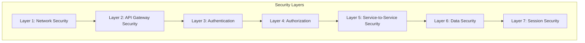

## 3. Layer 1: Network Security

### 3.1 Docker Network Isolation

Semua service berjalan dalam isolated Docker network dengan konfigurasi:

- **Network Name**: `shema-music-network`
- **Driver**: Bridge
- **Subnet**: `172.28.0.0/16`
- **IP Masquerade**: Enabled

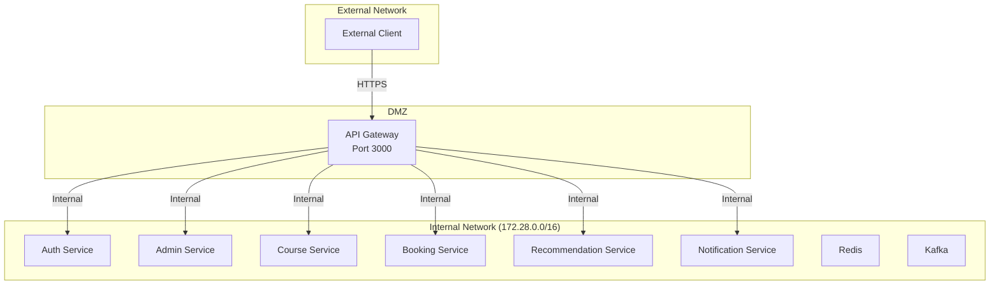

### 3.2 Port Exposure Policy

Hanya API Gateway yang ter-expose ke external network. Service internal hanya dapat diakses melalui Docker internal network.

| Service | External Access | Internal Access |
|---------|-----------------|-----------------|
| API Gateway | ✅ Port 3000 | ✅ |
| Auth Service | ❌ | ✅ Port 3001 |
| Admin Service | ❌ | ✅ Port 3002 |
| Course Service | ❌ | ✅ Port 3003 |
| Booking Service | ❌ | ✅ Port 3008 |
| Recommendation Service | ❌ | ✅ Port 3005 |
| Notification Service | ❌ | ✅ Port 3009 |
| Redis | ❌ | ✅ Port 6379 |
| Kafka | ❌ | ✅ Port 9092 |

## 4. Layer 2: API Gateway Security

### 4.1 CORS (Cross-Origin Resource Sharing)

API Gateway mengimplementasikan CORS policy untuk mengontrol akses dari domain eksternal.

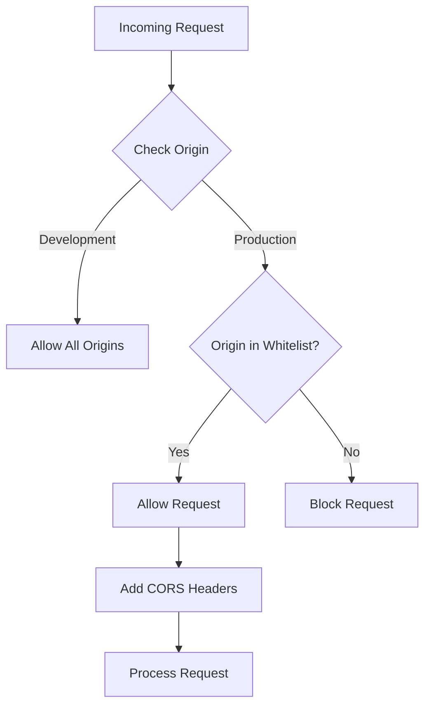

**Konfigurasi CORS:**
- **Allowed Methods**: GET, POST, PUT, DELETE, OPTIONS, PATCH
- **Allowed Headers**: Content-Type, Authorization, X-Requested-With, X-Service-Name
- **Credentials**: Enabled
- **Max Age**: 24 hours (86400 seconds)
- **Exposed Headers**: Content-Length, X-Request-Id

### 4.2 Request Validation

Setiap request melalui API Gateway divalidasi:

1. **Header Validation**: Memastikan headers yang diperlukan ada
2. **Method Validation**: Memastikan HTTP method sesuai dengan endpoint
3. **Path Validation**: Memastikan path request valid

### 4.3 Error Handling

API Gateway menyembunyikan detail internal error pada production:

- Development: Error details terekspos untuk debugging
- Production: Error details disembunyikan, hanya menampilkan pesan generik

## 5. Layer 3: Authentication

### 5.1 Firebase Authentication

Sistem menggunakan Firebase Authentication sebagai identity provider utama.

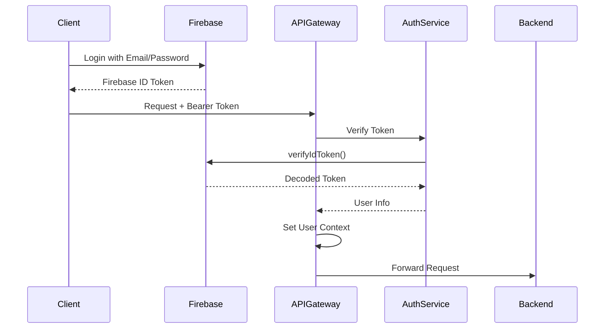

### 5.2 Token Verification Flow

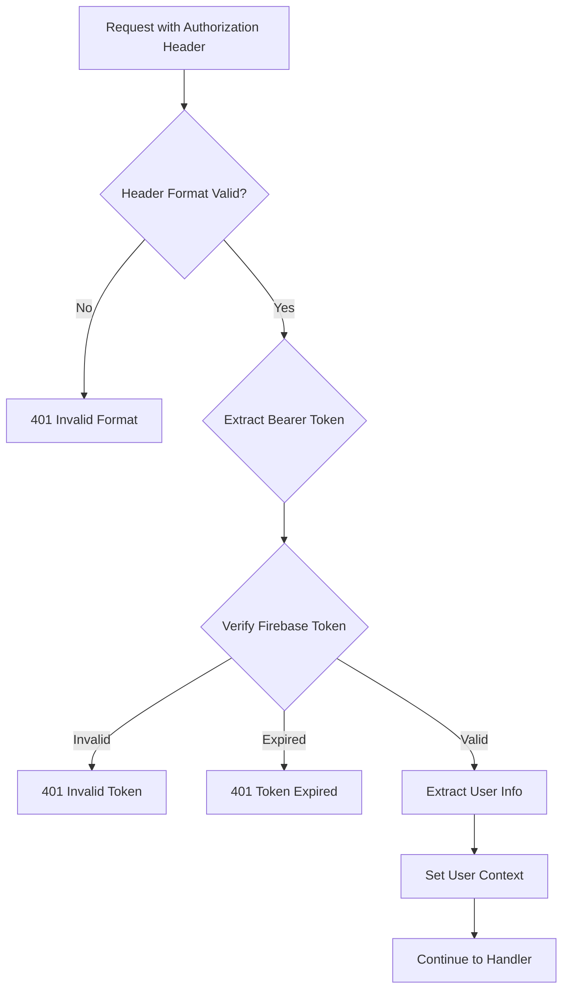

### 5.3 Token Payload Structure

Token yang berhasil diverifikasi mengandung informasi:

| Field | Type | Description |
|-------|------|-------------|
| uid | string | Firebase User ID |
| email | string | User email |
| emailVerified | boolean | Email verification status |
| role | string | Custom claim: user role |
| provider | string | Sign-in provider |

## 6. Layer 4: Authorization (RBAC)

### 6.1 Role-Based Access Control

Sistem mengimplementasikan RBAC dengan role utama:

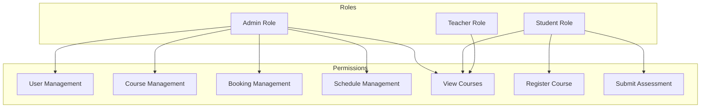

### 6.2 Role Middleware Implementation

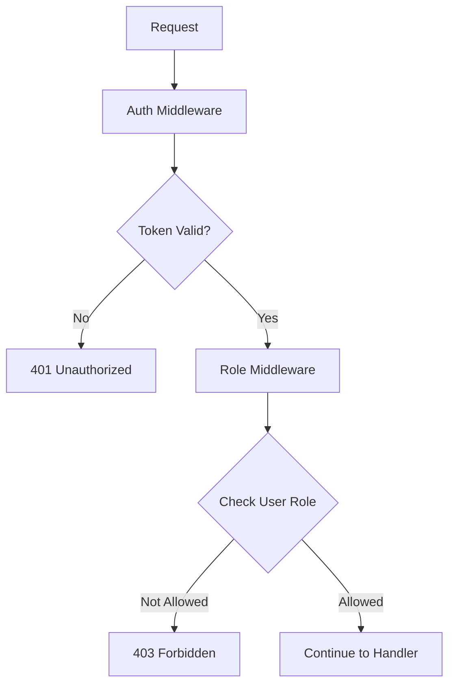

### 6.3 Endpoint Access Matrix

| Endpoint | Public | Student | Teacher | Admin |
|----------|--------|---------|---------|-------|
| GET /courses | ✅ | ✅ | ✅ | ✅ |
| POST /courses | ❌ | ❌ | ❌ | ✅ |
| POST /booking/register-course | ✅ | ✅ | ✅ | ✅ |
| GET /booking/bookings | ❌ | ❌ | ❌ | ✅ |
| POST /admin/instructor | ❌ | ❌ | ❌ | ✅ |
| GET /admin/dashboard | ❌ | ❌ | ❌ | ✅ |
| POST /assessment | ✅ | ✅ | ✅ | ✅ |
| GET /admin/users | ❌ | ❌ | ❌ | ✅ |

## 7. Layer 5: Service-to-Service Security

### 7.1 Internal Service Authentication

Komunikasi antar service menggunakan JWT token terpisah (SERVICE_JWT_SECRET).

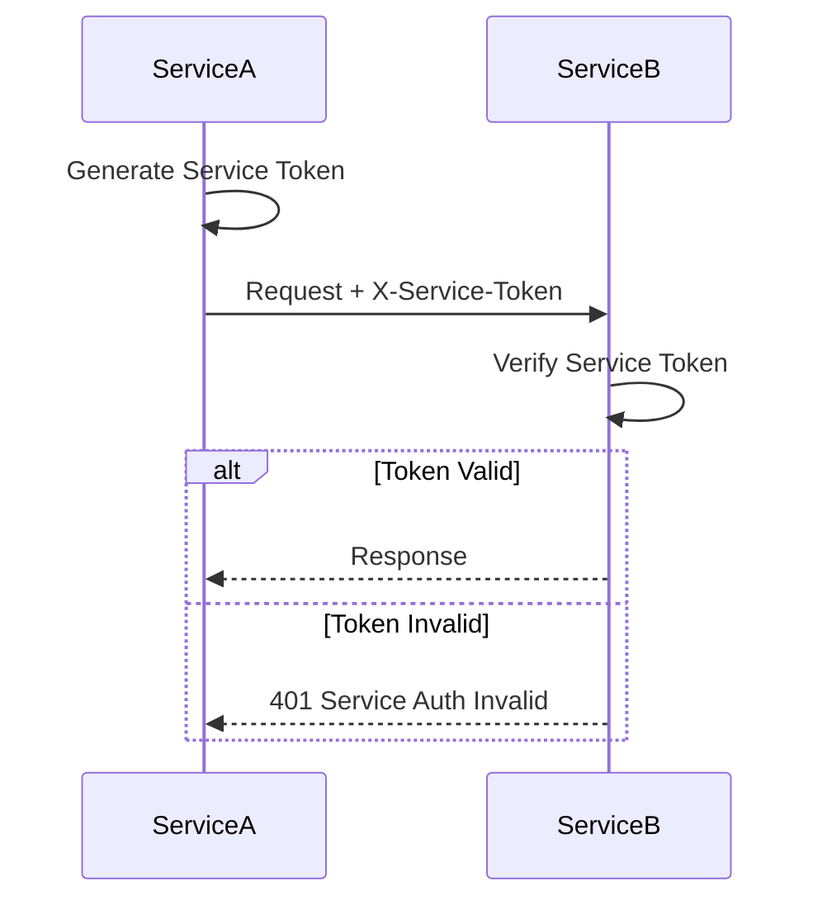

### 7.2 Service Token Headers

| Header | Description |
|--------|-------------|
| X-Service-Token | JWT token untuk service authentication |
| X-Service-Name | Nama service yang melakukan request |
| X-Gateway-Request | Flag dari API Gateway |
| X-User-Id | User ID yang diteruskan dari gateway |
| X-User-Role | User role yang diteruskan dari gateway |
| X-User-Email | User email yang diteruskan dari gateway |

### 7.3 Request Forwarding Security

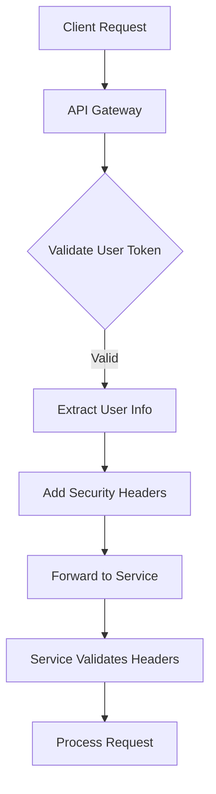

## 8. Layer 6: Data Security

### 8.1 Input Validation

Semua input divalidasi menggunakan Zod schema sebelum diproses.

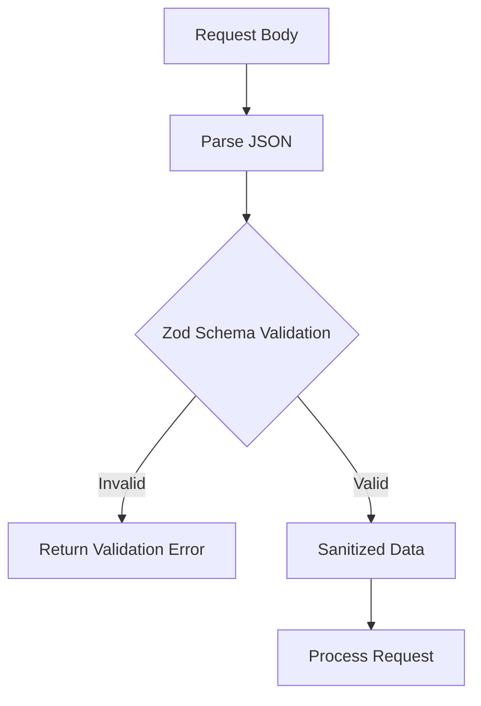

**Contoh Validasi:**
- Email format validation
- Phone number format validation
- String length constraints
- Enum value validation
- Required field validation

### 8.2 Password Security

Untuk operasi yang memerlukan password (jika ada):

- Hashing menggunakan algoritma yang aman
- Password strength validation
- Tidak menyimpan password dalam plain text

### 8.3 Database Security

- **Supabase Service Role Key**: Hanya digunakan di backend
- **Supabase Anon Key**: Untuk operasi publik terbatas
- **Row Level Security (RLS)**: Diterapkan pada tabel sensitif
- **Schema Separation**: Data terpisah per domain (auth.*, course.*, booking.*)

## 9. Layer 7: Session Security

### 9.1 Anonymous Session Management

Untuk fitur yang tidak memerlukan login (seperti assessment), sistem menggunakan anonymous session.

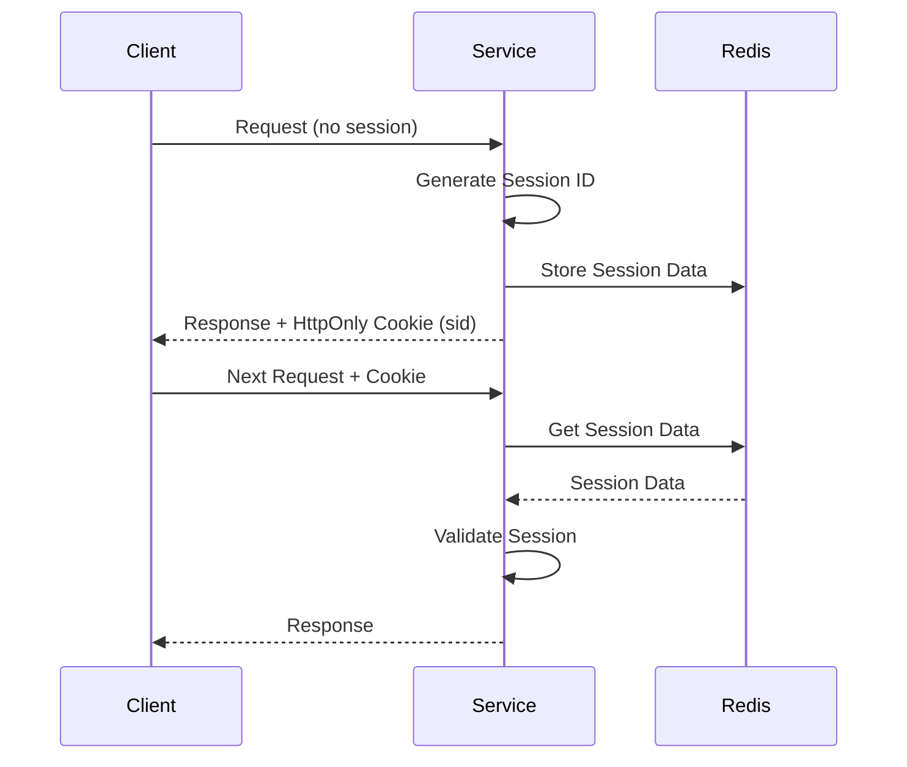

### 9.2 Session Cookie Security

| Attribute | Value | Purpose |
|-----------|-------|---------|
| httpOnly | true | Mencegah akses JavaScript |
| secure | true (production) | Hanya HTTPS |
| sameSite | lax | CSRF protection |
| maxAge | 1800 (30 menit) | Session timeout |
| path | / | Scope cookie |

### 9.3 Session Abuse Detection

Sistem mendeteksi potensi abuse session:

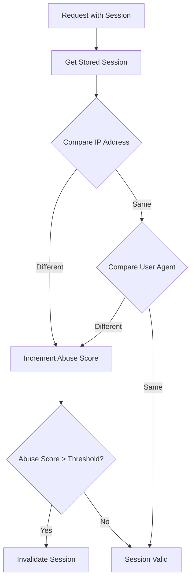

## 10. Security Events & Monitoring

### 10.1 Event Publishing

Security-related events dipublikasikan ke Kafka untuk monitoring:

| Event | Topic | Trigger |
|-------|-------|---------|
| User Registration | user.registered | Registrasi berhasil |
| User Login | user.logged_in | Login berhasil |
| Booking Created | booking.created | Booking baru |
| Session Created | session.created | Session baru |

### 10.2 Health Check Security

Setiap service memiliki health check endpoint yang tidak memerlukan authentication:

- `/health` - Status service
- `/services/health` - Status semua service (gateway only)

Health check tidak mengekspos data sensitif.

## 11. Security Flow Diagrams

### 11.1 Complete Authentication Flow

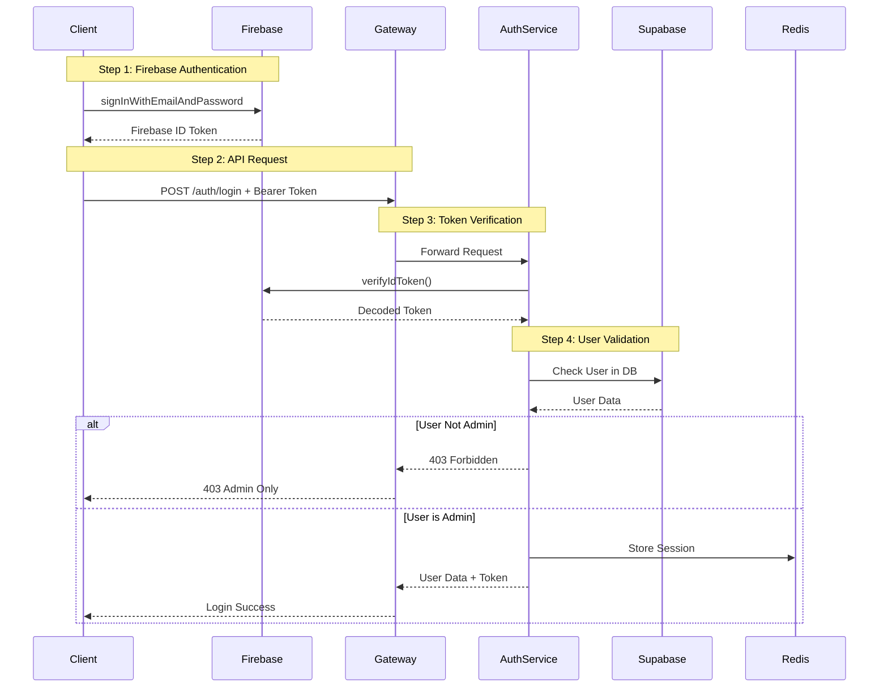

### 11.2 Protected Endpoint Access Flow

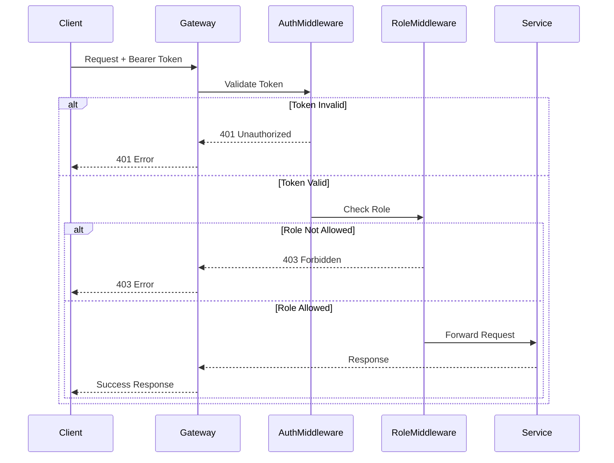

## 12. Security Best Practices Implemented

### 12.1 Checklist Keamanan

| Category | Practice | Status |
|----------|----------|--------|
| Authentication | Firebase Token Verification | ✅ |
| Authentication | Token Expiration Check | ✅ |
| Authorization | Role-Based Access Control | ✅ |
| Authorization | Endpoint Protection | ✅ |
| Data | Input Validation (Zod) | ✅ |
| Data | SQL Injection Prevention (Supabase) | ✅ |
| Network | CORS Configuration | ✅ |
| Network | Docker Network Isolation | ✅ |
| Session | HttpOnly Cookies | ✅ |
| Session | Secure Flag (Production) | ✅ |
| Session | SameSite Protection | ✅ |
| Communication | Service-to-Service JWT | ✅ |
| Error Handling | Error Detail Hiding (Production) | ✅ |
| Environment | Secrets in Environment Variables | ✅ |

### 12.2 Environment Variables Security

Sensitive data disimpan dalam environment variables:

| Variable | Purpose | Security Level |
|----------|---------|----------------|
| JWT_SECRET | User JWT signing | Critical |
| SERVICE_JWT_SECRET | Service-to-service auth | Critical |
| SUPABASE_SERVICE_ROLE_KEY | Database admin access | Critical |
| GOOGLE_AI_API_KEY | AI service access | High |
| REDIS_URL | Cache connection | Medium |
| KAFKA_BROKER_URL | Message broker | Medium |

## 13. Threat Mitigation

### 13.1 Common Threats & Mitigations

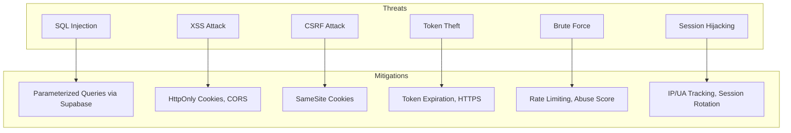

## 14. Kesimpulan

Rancangan keamanan backend Shema Music mengimplementasikan multiple layers of security:

1. **Network Isolation**: Docker network dengan port exposure terbatas
2. **Gateway Protection**: CORS, request validation, error masking
3. **Authentication**: Firebase token-based authentication
4. **Authorization**: Role-based access control
5. **Service Security**: Service-to-service JWT authentication
6. **Data Protection**: Input validation, secure database access
7. **Session Security**: HttpOnly cookies, abuse detection

Dengan pendekatan Defense in Depth ini, sistem memiliki multiple barrier untuk melindungi dari berbagai jenis serangan keamanan.
